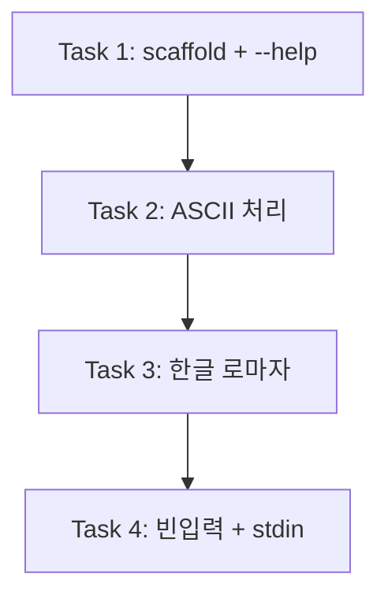

<!-- FID: 20260425-slug-cli -->
<!-- OWNER_COMMAND: /tasks -->
<!-- MUTABLE_BY: /implement (상태 마킹만) -->
<!-- layer: Lifecycle-Artifact -->

# URL Slug CLI 태스크 목록 — 20260425-slug-cli

> 각 태스크는 TDD 5 스텝(RED → 검증 → GREEN → 검증 → COMMIT)을 따릅니다.

**관련 플랜**: `.specops/20260425-slug-cli/plan.md`
**관련 AC**: AC-1~AC-8

## AC → Task 매핑

| AC | must/should | Task(s) |
|---|---|---|
| AC-1 한글 음절 로마자 변환 | must | Task 3 |
| AC-2 영문 대소문자 정규화 | must | Task 2 |
| AC-3 한글/영문 혼합 입력 | must | Task 3 |
| AC-4 연속 구분자 및 앞뒤 정리 | must | Task 2 |
| AC-5 stdin 입력 지원 | must | Task 4 |
| AC-6 --help 플래그 | should | Task 1 |
| AC-7 특수문자 처리 | must | Task 2 |
| AC-8 빈 입력 처리 | must | Task 4 |

**must AC 커버리지**: 7/7 (100%)

---

## 태스크 1: scaffold + --help

**파일**:
- Create: `scripts/slug.sh`
- Create: `scripts/tests/test-slug.sh`

**관련 AC**: AC-6

- [x] **스텝 1: RED — 실패하는 테스트 작성**

`scripts/tests/test-slug.sh` 를 아래 내용으로 생성:

```bash
#!/usr/bin/env bash
set -u
PASS=0; FAIL=0
PLUGIN=$(cd "$(dirname "${BASH_SOURCE[0]}")/../.." && pwd)
SCRIPT="$PLUGIN/scripts/slug.sh"

# T1.a --help → exit 0 + "Usage" 출력
out=$("$SCRIPT" --help 2>&1); rc=$?
if [ "$rc" -eq 0 ] && printf '%s' "$out" | grep -q "Usage"; then
  PASS=$((PASS+1)); echo "PASS T1.a --help"
else
  FAIL=$((FAIL+1)); echo "FAIL T1.a (rc=$rc out=$out)"
fi

echo "--- SUMMARY ---"
echo "PASS=$PASS FAIL=$FAIL"
exit $FAIL
```

- [x] **스텝 2: FAIL 검증**

```bash
chmod +x scripts/tests/test-slug.sh
bash scripts/tests/test-slug.sh
```

예상: `FAIL T1.a` (slug.sh 미존재 → 실행 오류)

- [x] **스텝 3: GREEN — 최소 구현**

`scripts/slug.sh` 를 아래 내용으로 생성:

```bash
#!/usr/bin/env bash
set -u

usage() {
  printf 'Usage: slug.sh [STRING]\n'
  printf '       echo STRING | slug.sh\n\n'
  printf 'Convert Korean/English string to URL slug.\n'
  printf '  - Korean syllables: romanized (국립국어원 revised romanization)\n'
  printf '  - Uppercase: lowercased\n'
  printf '  - Non-alphanumeric: replaced with -\n'
}

if [ $# -ge 1 ] && [ "$1" = "--help" ]; then
  usage; exit 0
fi
```

```bash
chmod +x scripts/slug.sh
```

- [x] **스텝 4: PASS 검증**

```bash
bash scripts/tests/test-slug.sh
```

예상: `PASS T1.a`, `PASS=1 FAIL=0`

- [x] **스텝 5: COMMIT**

```bash
git add scripts/slug.sh scripts/tests/test-slug.sh
git commit -m "feat(slug): scaffold + --help (AC-6)"
```

---

## 태스크 2: ASCII 처리 (소문자·구분자·후처리)

**파일**:
- Modify: `scripts/slug.sh` (`to_slug()` 함수 추가 + 메인 dispatch 추가)
- Modify: `scripts/tests/test-slug.sh` (T2.a~T2.c 추가)

**관련 AC**: AC-2, AC-4, AC-7

- [x] **스텝 1: RED — 실패하는 테스트 작성**

`scripts/tests/test-slug.sh` 의 `echo "--- SUMMARY ---"` 바로 위에 아래 블록 삽입:

```bash
# T2.a "Hello World" → "hello-world"
out=$("$SCRIPT" "Hello World"); rc=$?
if [ "$rc" -eq 0 ] && [ "$out" = "hello-world" ]; then
  PASS=$((PASS+1)); echo "PASS T2.a uppercase"
else
  FAIL=$((FAIL+1)); echo "FAIL T2.a (got='$out')"
fi

# T2.b "  hello   world  " → "hello-world" (연속 공백 + 앞뒤 공백)
out=$("$SCRIPT" "  hello   world  "); rc=$?
if [ "$rc" -eq 0 ] && [ "$out" = "hello-world" ]; then
  PASS=$((PASS+1)); echo "PASS T2.b spaces"
else
  FAIL=$((FAIL+1)); echo "FAIL T2.b (got='$out')"
fi

# T2.c "hello!@#world" → "hello-world" (특수문자)
out=$("$SCRIPT" "hello!@#world"); rc=$?
if [ "$rc" -eq 0 ] && [ "$out" = "hello-world" ]; then
  PASS=$((PASS+1)); echo "PASS T2.c special-chars"
else
  FAIL=$((FAIL+1)); echo "FAIL T2.c (got='$out')"
fi
```

- [x] **스텝 2: FAIL 검증**

```bash
bash scripts/tests/test-slug.sh
```

예상: T1.a PASS, T2.a/T2.b/T2.c FAIL (slug.sh에 to_slug 미구현)

- [x] **스텝 3: GREEN — 최소 구현**

`scripts/slug.sh` 전체를 아래로 교체 (usage() 유지, to_slug 추가, 메인 dispatch 추가):

```bash
#!/usr/bin/env bash
set -u

usage() {
  printf 'Usage: slug.sh [STRING]\n'
  printf '       echo STRING | slug.sh\n\n'
  printf 'Convert Korean/English string to URL slug.\n'
  printf '  - Korean syllables: romanized (국립국어원 revised romanization)\n'
  printf '  - Uppercase: lowercased\n'
  printf '  - Non-alphanumeric: replaced with -\n'
}

to_slug() {
  local input="$1"
  local result=""
  local bytes i n b1 new_byte
  bytes=($(printf '%s' "$input" | od -An -tu1))
  i=0
  n=${#bytes[@]}

  while [ "$i" -lt "$n" ]; do
    b1=${bytes[$i]}

    if [ "$b1" -lt 128 ]; then
      if [ "$b1" -ge 65 ] && [ "$b1" -le 90 ]; then
        # A-Z → a-z (ASCII 코드 +32)
        new_byte=$((b1 + 32))
        result="${result}$(printf "\\$(printf '%03o' "$new_byte")")"
      elif { [ "$b1" -ge 97 ] && [ "$b1" -le 122 ]; } || \
           { [ "$b1" -ge 48 ] && [ "$b1" -le 57 ]; }; then
        # a-z 또는 0-9 → 그대로
        result="${result}$(printf "\\$(printf '%03o' "$b1")")"
      else
        # 기타 ASCII → dash
        result="${result}-"
      fi
      i=$((i + 1))
    else
      # 비ASCII (한글 포함) — Task 3에서 구현. 현재는 dash
      result="${result}-"
      i=$((i + 1))
    fi
  done

  # 연속 dash 축약 + 앞뒤 dash 제거
  result=$(printf '%s' "$result" | tr -s '-')
  result="${result#-}"
  result="${result%-}"
  printf '%s\n' "$result"
}

if [ $# -ge 1 ]; then
  if [ "$1" = "--help" ]; then
    usage; exit 0
  fi
  to_slug "$1"
else
  input=$(cat)
  to_slug "$input"
fi
```

- [x] **스텝 4: PASS 검증**

```bash
bash scripts/tests/test-slug.sh
```

예상: `PASS=4 FAIL=0` (T1.a, T2.a, T2.b, T2.c 모두 PASS)

- [x] **스텝 5: COMMIT**

```bash
git add scripts/slug.sh scripts/tests/test-slug.sh
git commit -m "feat(slug): ASCII 소문자화·특수문자→dash·후처리 (AC-2·4·7)"
```

---

## 태스크 3: 한글 로마자 변환

**파일**:
- Modify: `scripts/slug.sh` (`to_slug()` 전체 교체 — 3-byte UTF-8 파싱 + 한글 매핑 테이블 추가)
- Modify: `scripts/tests/test-slug.sh` (T3.a~T3.c 추가)

**관련 AC**: AC-1, AC-3

- [x] **스텝 1: RED — 실패하는 테스트 작성**

`scripts/tests/test-slug.sh` 의 `echo "--- SUMMARY ---"` 바로 위에 삽입:

```bash
# T3.a "안녕" → "annyeong" (한글 only)
out=$("$SCRIPT" "안녕"); rc=$?
if [ "$rc" -eq 0 ] && [ "$out" = "annyeong" ]; then
  PASS=$((PASS+1)); echo "PASS T3.a 한글-only"
else
  FAIL=$((FAIL+1)); echo "FAIL T3.a (got='$out')"
fi

# T3.b "안녕 World 2024" → "annyeong-world-2024" (혼합)
out=$("$SCRIPT" "안녕 World 2024"); rc=$?
if [ "$rc" -eq 0 ] && [ "$out" = "annyeong-world-2024" ]; then
  PASS=$((PASS+1)); echo "PASS T3.b 혼합"
else
  FAIL=$((FAIL+1)); echo "FAIL T3.b (got='$out')"
fi

# T3.c "Hello 세계" → "hello-segye"
out=$("$SCRIPT" "Hello 세계"); rc=$?
if [ "$rc" -eq 0 ] && [ "$out" = "hello-segye" ]; then
  PASS=$((PASS+1)); echo "PASS T3.c 영문+한글"
else
  FAIL=$((FAIL+1)); echo "FAIL T3.c (got='$out')"
fi
```

- [x] **스텝 2: FAIL 검증**

```bash
bash scripts/tests/test-slug.sh
```

예상: T1.a·T2.a~c PASS, T3.a~c FAIL (한글이 `-`로 치환되므로)

- [x] **스텝 3: GREEN — 최소 구현**

`scripts/slug.sh` 전체를 아래로 교체 (to_slug에 CHO/JUNG/JONG 테이블 + 3-byte UTF-8 파싱 추가):

```bash
#!/usr/bin/env bash
set -u

usage() {
  printf 'Usage: slug.sh [STRING]\n'
  printf '       echo STRING | slug.sh\n\n'
  printf 'Convert Korean/English string to URL slug.\n'
  printf '  - Korean syllables: romanized (국립국어원 revised romanization)\n'
  printf '  - Uppercase: lowercased\n'
  printf '  - Non-alphanumeric: replaced with -\n'
}

to_slug() {
  local input="$1"
  # 국립국어원 개정 로마자 표기법 고정 매핑
  # 초성 (19): ㄱ ㄲ ㄴ ㄷ ㄸ ㄹ ㅁ ㅂ ㅃ ㅅ ㅆ ㅇ ㅈ ㅉ ㅊ ㅋ ㅌ ㅍ ㅎ
  local CHO JUNG JONG
  CHO=("g" "kk" "n" "d" "tt" "r" "m" "b" "pp" "s" "ss" "" "j" "jj" "ch" "k" "t" "p" "h")
  # 중성 (21): ㅏ ㅐ ㅑ ㅒ ㅓ ㅔ ㅕ ㅖ ㅗ ㅘ ㅙ ㅚ ㅛ ㅜ ㅝ ㅞ ㅟ ㅠ ㅡ ㅢ ㅣ
  JUNG=("a" "ae" "ya" "yae" "eo" "e" "yeo" "ye" "o" "wa" "wae" "oe" "yo" "u" "wo" "we" "wi" "yu" "eu" "ui" "i")
  # 종성 (28, 0=없음): ㄱ ㄲ ㄳ ㄴ ㄵ ㄶ ㄷ ㄹ ㄺ ㄻ ㄼ ㄽ ㄾ ㄿ ㅀ ㅁ ㅂ ㅄ ㅅ ㅆ ㅇ ㅈ ㅊ ㅋ ㅌ ㅍ ㅎ
  JONG=("" "k" "kk" "ks" "n" "nj" "nh" "t" "l" "lk" "lm" "lb" "ls" "lt" "lp" "lh" "m" "p" "ps" "s" "ss" "ng" "j" "ch" "k" "t" "p" "h")

  local result=""
  local bytes i n b1 b2 b3 new_byte cp idx cho_i jung_i jong_i
  bytes=($(printf '%s' "$input" | od -An -tu1))
  i=0
  n=${#bytes[@]}

  while [ "$i" -lt "$n" ]; do
    b1=${bytes[$i]}

    if [ "$b1" -lt 128 ]; then
      # ASCII
      if [ "$b1" -ge 65 ] && [ "$b1" -le 90 ]; then
        new_byte=$((b1 + 32))
        result="${result}$(printf "\\$(printf '%03o' "$new_byte")")"
      elif { [ "$b1" -ge 97 ] && [ "$b1" -le 122 ]; } || \
           { [ "$b1" -ge 48 ] && [ "$b1" -le 57 ]; }; then
        result="${result}$(printf "\\$(printf '%03o' "$b1")")"
      else
        result="${result}-"
      fi
      i=$((i + 1))

    elif [ "$b1" -ge 224 ] && [ "$b1" -le 239 ]; then
      # 3-byte UTF-8 (BMP U+0800..U+FFFF)
      if [ $((i + 2)) -lt "$n" ]; then
        b2=${bytes[$((i+1))]}
        b3=${bytes[$((i+2))]}
        cp=$(( ((b1 & 15) << 12) | ((b2 & 63) << 6) | (b3 & 63) ))
        if [ "$cp" -ge 44032 ] && [ "$cp" -le 55203 ]; then
          # 한글 음절 U+AC00..U+D7A3
          idx=$((cp - 44032))
          cho_i=$((idx / 588))
          jung_i=$(( (idx % 588) / 28 ))
          jong_i=$((idx % 28))
          result="${result}${CHO[$cho_i]}${JUNG[$jung_i]}${JONG[$jong_i]}"
        else
          result="${result}-"
        fi
      else
        result="${result}-"
      fi
      i=$((i + 3))

    elif [ "$b1" -ge 192 ] && [ "$b1" -le 223 ]; then
      # 2-byte UTF-8
      result="${result}-"
      i=$((i + 2))

    elif [ "$b1" -ge 240 ]; then
      # 4-byte UTF-8 (emoji 등)
      result="${result}-"
      i=$((i + 4))

    else
      # continuation byte 또는 invalid
      i=$((i + 1))
    fi
  done

  result=$(printf '%s' "$result" | tr -s '-')
  result="${result#-}"
  result="${result%-}"
  printf '%s\n' "$result"
}

if [ $# -ge 1 ]; then
  if [ "$1" = "--help" ]; then
    usage; exit 0
  fi
  to_slug "$1"
else
  input=$(cat)
  to_slug "$input"
fi
```

- [x] **스텝 4: PASS 검증**

```bash
bash scripts/tests/test-slug.sh
```

예상: `PASS=7 FAIL=0` (T1.a, T2.a~c, T3.a~c 모두 PASS)

- [x] **스텝 5: COMMIT**

```bash
git add scripts/slug.sh scripts/tests/test-slug.sh
git commit -m "feat(slug): 한글 로마자 변환 (3-byte UTF-8 + 초/중/종성 배열 매핑) (AC-1·3)"
```

---

## 태스크 4: 빈 입력 + stdin 지원 검증

**파일**:
- Modify: `scripts/tests/test-slug.sh` (T4.a~T4.b 추가)

**관련 AC**: AC-5, AC-8

> 이 태스크는 Task 2~3 구현이 이미 처리하는 동작을 검증합니다. RED 단계가 PASS하면 스텝 3 픽스 없이 COMMIT으로 직행합니다.

- [x] **스텝 1: RED — 실패하는 테스트 작성**

`scripts/tests/test-slug.sh` 의 `echo "--- SUMMARY ---"` 바로 위에 삽입:

```bash
# T4.a 빈 문자열 → 빈 출력 + exit 0
out=$("$SCRIPT" ""); rc=$?
if [ "$rc" -eq 0 ] && [ "$out" = "" ]; then
  PASS=$((PASS+1)); echo "PASS T4.a 빈-입력"
else
  FAIL=$((FAIL+1)); echo "FAIL T4.a (rc=$rc got='$out')"
fi

# T4.b stdin 파이프: echo "Hello 세계" | slug.sh → "hello-segye"
out=$(printf '%s' "Hello 세계" | "$SCRIPT"); rc=$?
if [ "$rc" -eq 0 ] && [ "$out" = "hello-segye" ]; then
  PASS=$((PASS+1)); echo "PASS T4.b stdin-pipe"
else
  FAIL=$((FAIL+1)); echo "FAIL T4.b (rc=$rc got='$out')"
fi
```

- [x] **스텝 2: FAIL 검증**

```bash
bash scripts/tests/test-slug.sh
```

예상: T4.a·T4.b PASS (Task 2~3 구현이 이미 처리) → `PASS=9 FAIL=0`
실패 시: Step 3으로 진행

- [x] **스텝 3: 픽스 (필요 시만)**

T4.a FAIL 시 — 빈 입력 분기 확인:

`scripts/slug.sh` 끝의 dispatch 블록을 아래로 수정:

```bash
if [ $# -ge 1 ]; then
  if [ "$1" = "--help" ]; then
    usage; exit 0
  fi
  to_slug "$1"
else
  input=$(cat)
  to_slug "$input"
fi
```

(이미 이 형태이면 픽스 불필요. 빈 배열 `n=0` 이면 while 루프 즉시 종료 → `result=""` → `printf '%s\n' ""` 출력)

- [x] **스텝 4: PASS 검증**

```bash
bash scripts/tests/test-slug.sh
```

예상: `PASS=9 FAIL=0`

- [x] **스텝 5: COMMIT**

```bash
git add scripts/tests/test-slug.sh
git commit -m "test(slug): 빈 입력·stdin 파이프 검증 추가 (AC-5·8)"
```

---

## 진행 상태

총 태스크 수: 4
완료: 4 / 4
차단: 0

## 의존 그래프 (DAG)

| Task | input 파일 | output 파일 | depends_on |
|---|---|---|---|
| Task 1 | (없음) | `scripts/slug.sh`, `scripts/tests/test-slug.sh` | (none) |
| Task 2 | `scripts/slug.sh`, `scripts/tests/test-slug.sh` | 두 파일 확장 | Task 1 |
| Task 3 | `scripts/slug.sh`, `scripts/tests/test-slug.sh` | 두 파일 확장 | Task 2 |
| Task 4 | `scripts/tests/test-slug.sh` | 테스트 파일 확장 | Task 3 |

Edges:
- Task 1 → Task 2 → Task 3 → Task 4



**독립 leaf**: 없음 — 모든 태스크가 동일 파일 순차 의존.

## 참조

- `skills/tdd-ko/SKILL.md` — TDD 5 스텝
- `.specops/20260425-slug-cli/plan.md` — 구현 플랜
- `.specops/20260425-slug-cli/acceptance-criteria.md` — 수락 기준

---

*작성: kohaedong · 2026-04-25 · FID: 20260425-slug-cli · 생성 커맨드: /tasks*
