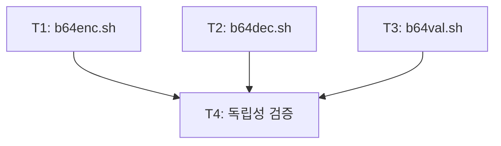

<!-- FID: 20260426-b64-cli -->
<!-- OWNER_COMMAND: /tasks -->
<!-- MUTABLE_BY: /implement (상태 마킹만) -->
<!-- reference_upstream: github/spec-kit tasks-template.md + obra/superpowers writing-plans -->
<!-- layer: Lifecycle-Artifact -->

# Base64 CLI 3종 태스크 목록 — 20260426-b64-cli

> 각 태스크는 TDD 5 스텝(RED → 검증 → GREEN → 검증 → COMMIT)을 따릅니다. `/implement`가 체크박스를 마킹합니다.

**관련 플랜**: `.specops/20260426-b64-cli/plan.md`
**관련 AC**: AC-1~AC-12

---

## AC → Task 매핑

| AC | must/should | Task(s) |
|---|---|---|
| AC-1 | must | T1 |
| AC-2 | must | T1 |
| AC-3 | must | T1 |
| AC-4 | must | T2 |
| AC-5 | must | T2 |
| AC-6 | must | T2 |
| AC-7 | must | T3 |
| AC-8 | must | T3 |
| AC-9 | must | T3 |
| AC-10 | must | T4 |
| AC-11 | should | T1 |
| AC-12 | should | T3 |

**must AC 커버리지**: 10/10 (100%) ✓

---

## 태스크 T1: b64enc.sh — Base64 인코더

**AC 매핑**: AC-1, AC-2, AC-3, AC-11
**파일**:
- Create: `scripts/b64enc.sh`
- Test: `scripts/tests/test-b64enc.sh`

- [ ] **스텝 1: RED — 실패 테스트 작성**

`scripts/tests/test-b64enc.sh` 를 아래 내용으로 생성 후 `chmod +x` 부여:

```bash
#!/usr/bin/env bash
set -u
PASS=0; FAIL=0
PLUGIN=$(cd "$(dirname "${BASH_SOURCE[0]}")/../.." && pwd)
SCRIPT="$PLUGIN/scripts/b64enc.sh"

ok()   { PASS=$((PASS+1)); echo "PASS $1"; }
fail() { FAIL=$((FAIL+1)); echo "FAIL $1"; }

# T1.a: 인자 인코딩 "hello" → "aGVsbG8=" (AC-1)
out=$("$SCRIPT" "hello"); rc=$?
[ "$rc" -eq 0 ] && [ "$out" = "aGVsbG8=" ] \
  && ok "T1.a 인자 인코딩" || fail "T1.a (rc=$rc out='$out')"

# T1.b: stdin 인코딩 (AC-2)
out=$(printf '%s' "hello" | "$SCRIPT"); rc=$?
[ "$rc" -eq 0 ] && [ "$out" = "aGVsbG8=" ] \
  && ok "T1.b stdin 인코딩" || fail "T1.b (rc=$rc out='$out')"

# T1.c: --help → exit 0 + "Usage" 포함 (AC-3 usage 출력 커버)
out=$("$SCRIPT" --help 2>&1); rc=$?
[ "$rc" -eq 0 ] && printf '%s' "$out" | grep -q "Usage" \
  && ok "T1.c --help usage" || fail "T1.c (rc=$rc out='$out')"

# T1.d: 빈 인자 → 빈 출력 exit 0 (AC-11)
out=$("$SCRIPT" ""); rc=$?
[ "$rc" -eq 0 ] && [ "$out" = "" ] \
  && ok "T1.d 빈 문자열 exit 0" || fail "T1.d (rc=$rc out='$out')"

# T1.e: 공백 포함 문자열 (AC-1 확장)
expected=$(printf '%s' "hello world" | base64 | tr -d '\n')
out=$("$SCRIPT" "hello world"); rc=$?
[ "$rc" -eq 0 ] && [ "$out" = "$expected" ] \
  && ok "T1.e 공백 포함 인코딩" || fail "T1.e (rc=$rc out='$out' expected='$expected')"

echo "--- SUMMARY ---"
echo "PASS=$PASS FAIL=$FAIL"
exit $FAIL
```

```bash
chmod +x scripts/tests/test-b64enc.sh
```

- [ ] **스텝 2: FAIL 검증**

```bash
bash scripts/tests/test-b64enc.sh
```

기대: `FAIL T1.a` ~ `FAIL T1.e` (스크립트 미존재 → command not found)

- [ ] **스텝 3: GREEN — b64enc.sh 구현**

`scripts/b64enc.sh` 를 아래 내용으로 생성 후 `chmod +x` 부여:

```bash
#!/usr/bin/env bash
set -u

usage() {
  printf 'Usage: b64enc.sh [STRING]\n'
  printf '       echo STRING | b64enc.sh\n\n'
  printf 'Base64 encode a string (single-line output, no line wrapping).\n'
}

encode() {
  printf '%s' "$1" | base64 | tr -d '\n'
  printf '\n'
}

if [ $# -ge 1 ]; then
  case "$1" in
    --help) usage; exit 0 ;;
    *)      encode "$1" ;;
  esac
elif [ -t 0 ]; then
  usage; exit 1
else
  input=$(cat)
  encode "$input"
fi
```

```bash
chmod +x scripts/b64enc.sh
```

- [ ] **스텝 4: PASS 검증**

```bash
bash scripts/tests/test-b64enc.sh
```

기대: `PASS=5 FAIL=0`

- [ ] **스텝 5: COMMIT**

```bash
git add scripts/b64enc.sh scripts/tests/test-b64enc.sh
git commit -m "feat(b64enc): Base64 인코더 CLI

인자+stdin 겸용, 한 줄 출력(줄바꿈 없음), --help.
빈 문자열 인코딩 exit 0.

관련 AC: AC-1, AC-2, AC-3, AC-11"
```

---

## 태스크 T2: b64dec.sh — Base64 디코더

**AC 매핑**: AC-4, AC-5, AC-6
**파일**:
- Create: `scripts/b64dec.sh`
- Test: `scripts/tests/test-b64dec.sh`

- [ ] **스텝 1: RED — 실패 테스트 작성**

`scripts/tests/test-b64dec.sh` 를 아래 내용으로 생성 후 `chmod +x` 부여:

```bash
#!/usr/bin/env bash
set -u
PASS=0; FAIL=0
PLUGIN=$(cd "$(dirname "${BASH_SOURCE[0]}")/../.." && pwd)
SCRIPT="$PLUGIN/scripts/b64dec.sh"

ok()   { PASS=$((PASS+1)); echo "PASS $1"; }
fail() { FAIL=$((FAIL+1)); echo "FAIL $1"; }

# T2.a: 인자 디코딩 "aGVsbG8=" → "hello" (AC-4)
out=$("$SCRIPT" "aGVsbG8="); rc=$?
[ "$rc" -eq 0 ] && [ "$out" = "hello" ] \
  && ok "T2.a 인자 디코딩" || fail "T2.a (rc=$rc out='$out')"

# T2.b: stdin 디코딩 (AC-5)
out=$(printf '%s' "aGVsbG8=" | "$SCRIPT"); rc=$?
[ "$rc" -eq 0 ] && [ "$out" = "hello" ] \
  && ok "T2.b stdin 디코딩" || fail "T2.b (rc=$rc out='$out')"

# T2.c: 잘못된 입력 → stderr 에러 + exit 1 (AC-6)
err=$("$SCRIPT" "!!!invalid!!!" 2>&1 1>/dev/null); rc=$?
[ "$rc" -ne 0 ] && [ -n "$err" ] \
  && ok "T2.c 잘못된 입력 exit 1 + stderr" || fail "T2.c (rc=$rc err='$err')"

# T2.d: --help → exit 0 + "Usage" 포함
out=$("$SCRIPT" --help 2>&1); rc=$?
[ "$rc" -eq 0 ] && printf '%s' "$out" | grep -q "Usage" \
  && ok "T2.d --help" || fail "T2.d (rc=$rc out='$out')"

# T2.e: 패딩 2개 "dGVzdA==" → "test" (AC-4 확장)
out=$("$SCRIPT" "dGVzdA=="); rc=$?
[ "$rc" -eq 0 ] && [ "$out" = "test" ] \
  && ok "T2.e 패딩 2개 디코딩" || fail "T2.e (rc=$rc out='$out')"

echo "--- SUMMARY ---"
echo "PASS=$PASS FAIL=$FAIL"
exit $FAIL
```

```bash
chmod +x scripts/tests/test-b64dec.sh
```

- [ ] **스텝 2: FAIL 검증**

```bash
bash scripts/tests/test-b64dec.sh
```

기대: `FAIL T2.a` ~ `FAIL T2.e` (스크립트 미존재)

- [ ] **스텝 3: GREEN — b64dec.sh 구현**

`scripts/b64dec.sh` 를 아래 내용으로 생성 후 `chmod +x` 부여:

```bash
#!/usr/bin/env bash
set -u

usage() {
  printf 'Usage: b64dec.sh [BASE64_STRING]\n'
  printf '       echo BASE64_STRING | b64dec.sh\n\n'
  printf 'Base64 decode a string.\n'
}

decode() {
  local input="$1"
  local flag="-d"
  [ "$(uname)" = "Darwin" ] && flag="-D"
  if ! printf '%s' "$input" | base64 "$flag" 2>/dev/null; then
    printf 'Error: decode failed — input is not valid base64\n' >&2
    return 1
  fi
}

if [ $# -ge 1 ]; then
  case "$1" in
    --help) usage; exit 0 ;;
    *)      decode "$1" || exit 1 ;;
  esac
elif [ -t 0 ]; then
  usage; exit 1
else
  input=$(cat)
  decode "$input" || exit 1
fi
```

```bash
chmod +x scripts/b64dec.sh
```

> **주의 — macOS lenient decode**: T2.c FAIL 시 macOS `base64 -D`가 `!!!` 를 무시하고 exit 0 반환한 것. 이 경우 `decode()` 함수 앞에 inline 문자셋 검사를 추가한다:
>
> ```bash
> decode() {
>   local input="$1"
>   # 허용 문자셋 외 입력은 직접 거부
>   if printf '%s' "$input" | grep -qE '[^A-Za-z0-9+/=]'; then
>     printf 'Error: decode failed — input is not valid base64\n' >&2
>     return 1
>   fi
>   local flag="-d"
>   [ "$(uname)" = "Darwin" ] && flag="-D"
>   if ! printf '%s' "$input" | base64 "$flag" 2>/dev/null; then
>     printf 'Error: decode failed — input is not valid base64\n' >&2
>     return 1
>   fi
> }
> ```

- [ ] **스텝 4: PASS 검증**

```bash
bash scripts/tests/test-b64dec.sh
```

기대: `PASS=5 FAIL=0`

- [ ] **스텝 5: COMMIT**

```bash
git add scripts/b64dec.sh scripts/tests/test-b64dec.sh
git commit -m "feat(b64dec): Base64 디코더 CLI

인자+stdin 겸용, macOS/Linux base64 플래그 자동 감지.
잘못된 입력 시 stderr 에러 + exit 1.

관련 AC: AC-4, AC-5, AC-6"
```

---

## 태스크 T3: b64val.sh — Base64 검증기

**AC 매핑**: AC-7, AC-8, AC-9, AC-12
**파일**:
- Create: `scripts/b64val.sh`
- Test: `scripts/tests/test-b64val.sh`

- [ ] **스텝 1: RED — 실패 테스트 작성**

`scripts/tests/test-b64val.sh` 를 아래 내용으로 생성 후 `chmod +x` 부여:

```bash
#!/usr/bin/env bash
set -u
PASS=0; FAIL=0
PLUGIN=$(cd "$(dirname "${BASH_SOURCE[0]}")/../.." && pwd)
SCRIPT="$PLUGIN/scripts/b64val.sh"

ok()   { PASS=$((PASS+1)); echo "PASS $1"; }
fail() { FAIL=$((FAIL+1)); echo "FAIL $1"; }

# T3.a: 유효한 base64 "aGVsbG8=" → "valid" exit 0 (AC-7)
out=$("$SCRIPT" "aGVsbG8="); rc=$?
[ "$rc" -eq 0 ] && [ "$out" = "valid" ] \
  && ok "T3.a valid base64" || fail "T3.a (rc=$rc out='$out')"

# T3.b: 허용 안 되는 문자 "hello!" → "invalid: invalid characters" (AC-8)
out=$("$SCRIPT" "hello!"); rc=$?
[ "$rc" -ne 0 ] && [ "$out" = "invalid: invalid characters" ] \
  && ok "T3.b invalid characters" || fail "T3.b (rc=$rc out='$out')"

# T3.c: 패딩 누락 "aGVsbG8" (길이 7) → "invalid: invalid padding" (AC-9)
out=$("$SCRIPT" "aGVsbG8"); rc=$?
[ "$rc" -ne 0 ] && [ "$out" = "invalid: invalid padding" ] \
  && ok "T3.c invalid padding" || fail "T3.c (rc=$rc out='$out')"

# T3.d: 빈 문자열 → "invalid: empty input" exit 1 (AC-12)
out=$("$SCRIPT" ""); rc=$?
[ "$rc" -ne 0 ] && [ "$out" = "invalid: empty input" ] \
  && ok "T3.d empty input" || fail "T3.d (rc=$rc out='$out')"

# T3.e: 중간에 = 포함 "aG=sbG8=" → "invalid: invalid padding"
out=$("$SCRIPT" "aG=sbG8="); rc=$?
[ "$rc" -ne 0 ] && [ "$out" = "invalid: invalid padding" ] \
  && ok "T3.e = in middle" || fail "T3.e (rc=$rc out='$out')"

# T3.f: stdin 유효 입력 "dGVzdA==" → "valid" exit 0 (AC-7 stdin)
out=$(printf '%s' "dGVzdA==" | "$SCRIPT"); rc=$?
[ "$rc" -eq 0 ] && [ "$out" = "valid" ] \
  && ok "T3.f stdin valid" || fail "T3.f (rc=$rc out='$out')"

# T3.g: 패딩 3개 "aGVs===" → "invalid: invalid padding"
out=$("$SCRIPT" "aGVs==="); rc=$?
[ "$rc" -ne 0 ] && [ "$out" = "invalid: invalid padding" ] \
  && ok "T3.g triple padding" || fail "T3.g (rc=$rc out='$out')"

echo "--- SUMMARY ---"
echo "PASS=$PASS FAIL=$FAIL"
exit $FAIL
```

```bash
chmod +x scripts/tests/test-b64val.sh
```

- [ ] **스텝 2: FAIL 검증**

```bash
bash scripts/tests/test-b64val.sh
```

기대: `FAIL T3.a` ~ `FAIL T3.g` (스크립트 미존재)

- [ ] **스텝 3: GREEN — b64val.sh 구현**

`scripts/b64val.sh` 를 아래 내용으로 생성 후 `chmod +x` 부여:

```bash
#!/usr/bin/env bash
set -u

usage() {
  printf 'Usage: b64val.sh [BASE64_STRING]\n'
  printf '       echo BASE64_STRING | b64val.sh\n\n'
  printf 'Validate a base64 string (charset + padding rules).\n'
  printf '  Exit 0 + "valid":   valid base64\n'
  printf '  Exit 1 + "invalid: <reason>": invalid\n'
}

validate() {
  local input="$1"

  if [ -z "$input" ]; then
    printf 'invalid: empty input\n'
    return 1
  fi

  if printf '%s' "$input" | grep -qE '[^A-Za-z0-9+/=]'; then
    printf 'invalid: invalid characters\n'
    return 1
  fi

  if ! printf '%s' "$input" | grep -qE '^[A-Za-z0-9+/]*={0,2}$'; then
    printf 'invalid: invalid padding\n'
    return 1
  fi

  local len=${#input}
  if [ $((len % 4)) -ne 0 ]; then
    printf 'invalid: invalid padding\n'
    return 1
  fi

  printf 'valid\n'
  return 0
}

if [ $# -ge 1 ]; then
  case "$1" in
    --help) usage; exit 0 ;;
    *)      validate "$1"; exit $? ;;
  esac
elif [ -t 0 ]; then
  usage; exit 1
else
  input=$(cat)
  validate "$input"; exit $?
fi
```

```bash
chmod +x scripts/b64val.sh
```

- [ ] **스텝 4: PASS 검증**

```bash
bash scripts/tests/test-b64val.sh
```

기대: `PASS=7 FAIL=0`

- [ ] **스텝 5: COMMIT**

```bash
git add scripts/b64val.sh scripts/tests/test-b64val.sh
git commit -m "feat(b64val): Base64 검증기 CLI

문자셋([A-Za-z0-9+/=]) + 패딩 규칙(길이 4배수, = 끝에만 최대 2개) 검사.
빈 문자열 거부, stdin 겸용.

관련 AC: AC-7, AC-8, AC-9, AC-12"
```

---

## 태스크 T4: 독립성 검증

**AC 매핑**: AC-10
**파일**: 수정 없음 (T1·T2·T3 산출물 검증만)

- [ ] **스텝 1: RED — 독립성 위반 여부 확인**

T1·T2·T3 완료 후 실행:

```bash
result=$(grep -rn 'source\|b64enc\|b64dec\|b64val' \
  scripts/b64enc.sh scripts/b64dec.sh scripts/b64val.sh 2>/dev/null)
echo "교차 참조: '${result}'"
```

기대: 출력 없음 (교차 참조 없음 = AC-10 충족)

- [ ] **스텝 2: 위반 없음 확인**

위 명령의 출력이 비어 있으면 AC-10 PASS. 출력이 있으면 해당 라인을 제거하고 T4 재실행.

- [ ] **스텝 3: 전체 테스트 스위트 실행**

```bash
bash scripts/tests/test-b64enc.sh
bash scripts/tests/test-b64dec.sh
bash scripts/tests/test-b64val.sh
```

기대:
```
PASS=5 FAIL=0   # b64enc
PASS=5 FAIL=0   # b64dec
PASS=7 FAIL=0   # b64val
```

- [ ] **스텝 4: PASS 확인**

3종 모두 `FAIL=0` 이면 T4 완료. `FAIL>0` 이 있으면 해당 태스크로 돌아가 픽스.

- [ ] **스텝 5: COMMIT**

변경이 있을 경우에만:

```bash
git add -p
git commit -m "chore(b64): 독립성 검증 완료 (AC-10)"
```

변경이 없으면 커밋 생략.

---

## 의존 그래프



```yaml
tasks:
  - id: T1
    depends_on: []
    inputs: []
    outputs: [scripts/b64enc.sh, scripts/tests/test-b64enc.sh]
    ac: [AC-1, AC-2, AC-3, AC-11]
  - id: T2
    depends_on: []
    inputs: []
    outputs: [scripts/b64dec.sh, scripts/tests/test-b64dec.sh]
    ac: [AC-4, AC-5, AC-6]
  - id: T3
    depends_on: []
    inputs: []
    outputs: [scripts/b64val.sh, scripts/tests/test-b64val.sh]
    ac: [AC-7, AC-8, AC-9, AC-12]
  - id: T4
    depends_on: [T1, T2, T3]
    inputs: [scripts/b64enc.sh, scripts/b64dec.sh, scripts/b64val.sh]
    outputs: []
    ac: [AC-10]
```

---

*작성: kohaedong · 2026-04-26 · FID: 20260426-b64-cli · 생성 커맨드: /tasks*
