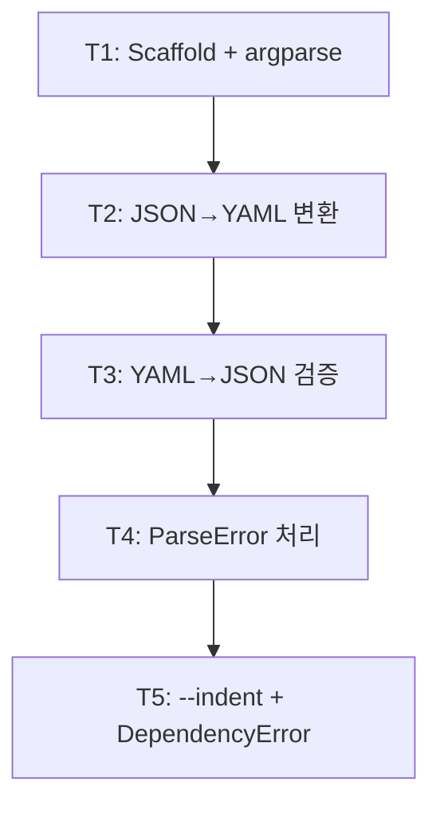

<!-- FID: 20260426-cvt-cli -->
<!-- OWNER_COMMAND: /tasks -->
<!-- MUTABLE_BY: /implement (상태 마킹만) -->
<!-- layer: Lifecycle-Artifact -->

# cvt — JSON ↔ YAML 양방향 변환 CLI 태스크 목록 — 20260426-cvt-cli

> 각 태스크는 TDD 5 스텝(RED → 검증 → GREEN → 검증 → COMMIT)을 따릅니다. `/implement`가 체크박스를 마킹합니다.

**관련 플랜**: `.specops/20260426-cvt-cli/plan.md`
**관련 AC**: AC-1, AC-2, AC-3, AC-4, AC-5, AC-6, AC-7, AC-8, AC-9, AC-10

---

## 태스크 1: Scaffold + argparse (AC-5)

**파일**:
- Create: `scripts/cvt.py`
- Create: `scripts/tests/test-cvt.sh`

**관련 AC**: AC-5

- [x] **스텝 1: RED — 실패하는 테스트 작성**

`scripts/tests/test-cvt.sh` 신규 생성 (전체 파일):

```bash
#!/usr/bin/env bash
set -u
PASS=0; FAIL=0
PLUGIN=$(cd "$(dirname "${BASH_SOURCE[0]}")/../.." && pwd)
CVT="$PLUGIN/scripts/cvt.py"

ok()   { PASS=$((PASS+1)); echo "PASS $1"; }
fail() { FAIL=$((FAIL+1)); echo "FAIL $1"; }

TMP=$(mktemp -d /tmp/cvt-test-XXXXXX)
trap 'rm -rf "$TMP"' EXIT

echo '{"name":"Alice","age":30}' > "$TMP/valid.json"
printf 'name: Alice\nage: 30\n'  > "$TMP/valid.yaml"
echo 'not { valid json'          > "$TMP/bad.json"

# T1.a: --to 누락 → exit 2 (AC-5)
python3 "$CVT" "$TMP/valid.json" > /dev/null 2>&1; CODE=$?
[ "$CODE" -eq 2 ] && ok "T1.a --to 누락 exit 2" || fail "T1.a (expected 2, got $CODE)"

echo "--- SUMMARY ---"
echo "PASS=$PASS FAIL=$FAIL"
exit $FAIL
```

```bash
mkdir -p scripts/tests
chmod +x scripts/tests/test-cvt.sh
```

- [x] **스텝 2: FAIL 검증**

```bash
bash scripts/tests/test-cvt.sh
```

예상: `FAIL T1.a (expected 2, got 127)` (cvt.py 미존재) / `PASS=0 FAIL=1`

- [x] **스텝 3: GREEN — 최소 구현**

`scripts/cvt.py` 신규 생성 (전체 파일):

```python
#!/usr/bin/env python3
import sys
import json
import argparse

try:
    import yaml
except ImportError:
    print("DependencyError: pyyaml 미설치. pip install pyyaml", file=sys.stderr)
    sys.exit(1)


def main():
    parser = argparse.ArgumentParser(prog="cvt", description="JSON ↔ YAML 양방향 변환")
    parser.add_argument("--to", required=True, choices=["json", "yaml"],
                        help="출력 포맷")
    parser.add_argument("--indent", type=int, default=2,
                        help="JSON 출력 들여쓰기 (기본 2)")
    parser.add_argument("input", nargs="?", help="입력 파일 (생략 시 stdin)")
    args = parser.parse_args()


if __name__ == "__main__":
    main()
```

```bash
chmod +x scripts/cvt.py
```

- [x] **스텝 4: PASS 검증**

```bash
bash scripts/tests/test-cvt.sh
```

예상: `PASS T1.a --to 누락 exit 2` / `PASS=1 FAIL=0`

- [x] **스텝 5: COMMIT**

```bash
git add scripts/cvt.py scripts/tests/test-cvt.sh
git commit -m "feat(cvt T1): scaffold + argparse, AC-5 --to 누락 exit 2"
```

---

## 태스크 2: JSON → YAML 변환 (AC-1, AC-3, AC-8)

**파일**:
- Modify: `scripts/cvt.py` — main() 에 입력 읽기·변환·에러 처리 추가
- Modify: `scripts/tests/test-cvt.sh` — T2.a~T2.d 추가

**관련 AC**: AC-1, AC-3, AC-8

- [x] **스텝 1: RED — 실패하는 테스트 추가**

`scripts/tests/test-cvt.sh`의 `T1.a` 블록 **아래**, `echo "--- SUMMARY ---"` **위**에 삽입:

```bash
# T2.a: 파일 인자 JSON → YAML exit 0 (AC-1)
OUT=$(python3 "$CVT" --to yaml "$TMP/valid.json" 2>/dev/null); CODE=$?
[ "$CODE" -eq 0 ] && ok "T2.a exit 0" || fail "T2.a (expected 0, got $CODE)"

# T2.b: stdout 이 유효한 YAML (AC-1)
echo "$OUT" | python3 -c "import sys,yaml; yaml.safe_load(sys.stdin)" 2>/dev/null \
  && ok "T2.b stdout valid YAML" || fail "T2.b stdout not valid YAML"

# T2.c: stdin 파이프 JSON → YAML (AC-3)
OUT_PIPE=$(python3 "$CVT" --to yaml < "$TMP/valid.json" 2>/dev/null); CODE=$?
[ "$CODE" -eq 0 ] && ok "T2.c stdin pipe exit 0" || fail "T2.c stdin (expected 0, got $CODE)"

# T2.d: 정상 변환 시 stderr 없음 (AC-8)
ERR=$(python3 "$CVT" --to yaml "$TMP/valid.json" 2>&1 1>/dev/null)
[ -z "$ERR" ] && ok "T2.d stderr empty" || fail "T2.d stderr not empty: $ERR"
```

- [x] **스텝 2: FAIL 검증**

```bash
bash scripts/tests/test-cvt.sh
```

예상: `PASS T1.a` · `FAIL T2.a~T2.d` / `PASS=1 FAIL=4`

- [x] **스텝 3: GREEN — 최소 구현**

`scripts/cvt.py`의 `args = parser.parse_args()` 줄 **아래**에 추가 (함수 끝까지):

```python
    # 입력 읽기
    try:
        if args.input:
            with open(args.input, encoding="utf-8") as f:
                text = f.read()
        else:
            text = sys.stdin.read()
    except FileNotFoundError:
        print(f"FileNotFoundError: {args.input}", file=sys.stderr)
        sys.exit(1)

    # 빈 입력 → ParseError (JSON·YAML 양방향 공통)
    if not text.strip():
        print("ParseError: 빈 입력", file=sys.stderr)
        sys.exit(1)

    # Parse + Format
    try:
        if args.to == "yaml":
            data = json.loads(text)
            sys.stdout.write(yaml.dump(data, allow_unicode=True, default_flow_style=False))
        else:
            data = yaml.safe_load(text)
            print(json.dumps(data, indent=args.indent, ensure_ascii=False))
    except json.JSONDecodeError as e:
        print(f"ParseError: {e}", file=sys.stderr)
        sys.exit(1)
    except yaml.YAMLError as e:
        print(f"ParseError: {e}", file=sys.stderr)
        sys.exit(1)
```

- [x] **스텝 4: PASS 검증**

```bash
bash scripts/tests/test-cvt.sh
```

예상: `PASS=5 FAIL=0` (T1.a + T2.a~T2.d)

- [x] **스텝 5: COMMIT**

```bash
git add scripts/cvt.py scripts/tests/test-cvt.sh
git commit -m "feat(cvt T2): JSON→YAML 변환 + stdin 파이프, AC-1·AC-3·AC-8"
```

---

## 태스크 3: YAML → JSON 변환 검증 (AC-2)

**파일**:
- Modify: `scripts/tests/test-cvt.sh` — T3.a·T3.b 추가
- (cvt.py yaml→json 분기는 태스크 2에서 구현 완료 — 코드 수정 없음)

**관련 AC**: AC-2

- [x] **스텝 1: RED — 실패하는 테스트 추가**

`scripts/tests/test-cvt.sh`의 `T2.d` 블록 **아래**, `echo "--- SUMMARY ---"` **위**에 삽입:

```bash
# T3.a: 파일 인자 YAML → JSON exit 0 (AC-2)
OUT=$(python3 "$CVT" --to json "$TMP/valid.yaml" 2>/dev/null); CODE=$?
[ "$CODE" -eq 0 ] && ok "T3.a YAML→JSON exit 0" || fail "T3.a (expected 0, got $CODE)"

# T3.b: stdout 이 유효한 JSON (AC-2)
echo "$OUT" | python3 -c "import sys,json; json.load(sys.stdin)" 2>/dev/null \
  && ok "T3.b stdout valid JSON" || fail "T3.b stdout not valid JSON"
```

- [x] **스텝 2: FAIL 검증**

```bash
bash scripts/tests/test-cvt.sh
```

예상: 태스크 2 구현이 yaml→json 분기를 포함하므로 T3.a·T3.b 즉시 PASS 가능.
`PASS=7 FAIL=0` 이면 스텝 3 없이 스텝 5로 이동.

- [x] **스텝 3: GREEN — 확인 (코드 수정 없음)**

태스크 2 `cvt.py` 의 `else` 분기 (`yaml.safe_load → json.dumps`) 가 YAML→JSON을 처리함. 별도 수정 불필요.

- [x] **스텝 4: PASS 검증**

```bash
bash scripts/tests/test-cvt.sh
```

예상: `PASS=7 FAIL=0`

- [x] **스텝 5: COMMIT**

```bash
git add scripts/tests/test-cvt.sh
git commit -m "feat(cvt T3): YAML→JSON 변환 검증, AC-2"
```

---

## 태스크 4: ParseError 처리 (AC-4, AC-6, AC-9)

**파일**:
- Modify: `scripts/tests/test-cvt.sh` — T4.a~T4.f 추가
- Modify: `scripts/cvt.py` — 빈 입력 체크 위치 확인 (태스크 2 구현 확인)

**관련 AC**: AC-4, AC-6, AC-9

- [x] **스텝 1: RED — 실패하는 테스트 추가**

`scripts/tests/test-cvt.sh`의 `T3.b` 블록 **아래**, `echo "--- SUMMARY ---"` **위**에 삽입:

```bash
# T4.a: 깨진 JSON → exit 1 (AC-4)
python3 "$CVT" --to yaml "$TMP/bad.json" > /dev/null 2>&1; CODE=$?
[ "$CODE" -eq 1 ] && ok "T4.a bad JSON exit 1" || fail "T4.a (expected 1, got $CODE)"

# T4.b: 깨진 JSON → stderr 'ParseError:' (AC-4)
ERR=$(python3 "$CVT" --to yaml "$TMP/bad.json" 2>&1 1>/dev/null)
echo "$ERR" | grep -q "^ParseError:" && ok "T4.b stderr ParseError:" || fail "T4.b: $ERR"

# T4.c: 빈 JSON 입력 → exit 1 (AC-6)
echo -n "" | python3 "$CVT" --to yaml > /dev/null 2>&1; CODE=$?
[ "$CODE" -eq 1 ] && ok "T4.c empty JSON→YAML exit 1" || fail "T4.c (expected 1, got $CODE)"

# T4.d: 빈 JSON 입력 → stderr 'ParseError:' (AC-6)
ERR=$(echo -n "" | python3 "$CVT" --to yaml 2>&1 1>/dev/null)
echo "$ERR" | grep -q "^ParseError:" && ok "T4.d stderr ParseError:" || fail "T4.d: $ERR"

# T4.e: 빈 YAML 입력 → JSON → exit 1 (AC-9)
echo -n "" | python3 "$CVT" --to json > /dev/null 2>&1; CODE=$?
[ "$CODE" -eq 1 ] && ok "T4.e empty YAML→JSON exit 1" || fail "T4.e (expected 1, got $CODE)"

# T4.f: 빈 YAML 입력 → JSON → stderr 'ParseError:' (AC-9)
ERR=$(echo -n "" | python3 "$CVT" --to json 2>&1 1>/dev/null)
echo "$ERR" | grep -q "^ParseError:" && ok "T4.f stderr ParseError:" || fail "T4.f: $ERR"
```

- [x] **스텝 2: FAIL 검증**

```bash
bash scripts/tests/test-cvt.sh
```

예상: T4.a·T4.b·T4.c~T4.f 태스크 2 구현으로 대부분 PASS.
`PASS=13 FAIL=0` 이면 스텝 3 없이 스텝 5로.

- [x] **스텝 3: GREEN — 빈 입력 체크 위치 확인**

`scripts/cvt.py`에서 아래 코드 블록이 `args.to` 분기 **전**에 위치하는지 확인:

```python
    # 빈 입력 → ParseError (JSON·YAML 양방향 공통)
    if not text.strip():
        print("ParseError: 빈 입력", file=sys.stderr)
        sys.exit(1)
```

위치가 올바르지 않으면 `yaml.safe_load` 분기 **앞**으로 이동.

- [x] **스텝 4: PASS 검증**

```bash
bash scripts/tests/test-cvt.sh
```

예상: `PASS=13 FAIL=0`

- [x] **스텝 5: COMMIT**

```bash
git add scripts/cvt.py scripts/tests/test-cvt.sh
git commit -m "feat(cvt T4): ParseError 처리 검증, AC-4·AC-6·AC-9"
```

---

## 태스크 5: --indent 플래그 + DependencyError (AC-7, AC-10)

**파일**:
- Modify: `scripts/tests/test-cvt.sh` — T5.a·T5.b 추가
- (--indent 는 태스크 1 argparse + 태스크 2 json.dumps 에서 구현 완료)

**관련 AC**: AC-7 (should), AC-10 (nice-to-have)

- [x] **스텝 1: RED — 실패하는 테스트 추가**

`scripts/tests/test-cvt.sh`의 `T4.f` 블록 **아래**, `echo "--- SUMMARY ---"` **위**에 삽입:

```bash
# T5.a: --indent 4 적용 확인 (AC-7, should)
OUT=$(python3 "$CVT" --to json --indent 4 "$TMP/valid.yaml" 2>/dev/null)
SECOND=$(printf '%s\n' "$OUT" | sed -n '2p')
case "$SECOND" in
    "    "*) ok "T5.a --indent 4 applied" ;;
    *) fail "T5.a indent not 4: '$SECOND'" ;;
esac

# T5.b: --indent 4 출력이 유효한 JSON
echo "$OUT" | python3 -c "import sys,json; json.load(sys.stdin)" 2>/dev/null \
  && ok "T5.b --indent 4 valid JSON" || fail "T5.b not valid JSON"
```

- [x] **스텝 2: FAIL 검증**

```bash
bash scripts/tests/test-cvt.sh
```

예상: T5.a·T5.b 태스크 1~2 구현으로 즉시 PASS 가능.
`PASS=15 FAIL=0` 이면 스텝 3 없이 스텝 5로.

- [x] **스텝 3: GREEN — DependencyError 코드 확인**

`scripts/cvt.py` 상단 ImportError 처리 블록이 올바른지 확인:

```python
try:
    import yaml
except ImportError:
    print("DependencyError: pyyaml 미설치. pip install pyyaml", file=sys.stderr)
    sys.exit(1)
```

이 블록이 없거나 메시지가 다르면 수정.

- [x] **스텝 4: PASS 검증**

```bash
bash scripts/tests/test-cvt.sh
```

예상: `PASS=15 FAIL=0`

- [x] **스텝 5: COMMIT**

```bash
git add scripts/cvt.py scripts/tests/test-cvt.sh
git commit -m "feat(cvt T5): --indent + DependencyError 완료, AC-7·AC-10"
```

---

## 진행 상태

총 태스크 수: 5
완료: 5 / 5
차단: 0

## AC → Task 매핑

| AC | must/should | Task(s) |
|---|---|---|
| AC-1 JSON→YAML 파일 | must | Task 2 |
| AC-2 YAML→JSON 파일 | must | Task 3 |
| AC-3 stdin 파이프 | must | Task 2 |
| AC-4 깨진 JSON ParseError | must | Task 4 |
| AC-5 --to 누락 exit 2 | must | Task 1 |
| AC-6 빈 JSON→YAML ParseError | must | Task 4 |
| AC-7 --indent 플래그 | should | Task 5 |
| AC-8 정상 시 stderr 없음 | must | Task 2 |
| AC-9 빈 YAML→JSON ParseError | must | Task 4 |
| AC-10 DependencyError | nice-to-have | Task 5 |

**must AC 커버리지**: 8/8 (100%)

## 의존 그래프

> `decomposing-ko` 가 작성. `implementing-ko` 가 본 섹션을 파싱해 leaf 자동 라우팅.
> Mermaid (사람용) + YAML (기계용 단일 소스 진실) 병기. 충돌 시 YAML 우선.



```yaml
tasks:
  - id: T1
    depends_on: []
    inputs: []
    outputs: [scripts/cvt.py, scripts/tests/test-cvt.sh]
    ac: [AC-5]
  - id: T2
    depends_on: [T1]
    inputs: [scripts/cvt.py, scripts/tests/test-cvt.sh]
    outputs: [scripts/cvt.py, scripts/tests/test-cvt.sh]
    ac: [AC-1, AC-3, AC-8]
  - id: T3
    depends_on: [T2]
    inputs: [scripts/cvt.py, scripts/tests/test-cvt.sh]
    outputs: [scripts/tests/test-cvt.sh]
    ac: [AC-2]
  - id: T4
    depends_on: [T3]
    inputs: [scripts/cvt.py, scripts/tests/test-cvt.sh]
    outputs: [scripts/cvt.py, scripts/tests/test-cvt.sh]
    ac: [AC-4, AC-6, AC-9]
  - id: T5
    depends_on: [T4]
    inputs: [scripts/cvt.py, scripts/tests/test-cvt.sh]
    outputs: [scripts/tests/test-cvt.sh]
    ac: [AC-7, AC-10]
```

## 참조

- `skills/tdd-ko/SKILL.md` — TDD 5 스텝
- `skills/sprint-contracts-ko/SKILL.md` — AC 매핑
- `skills/decomposing-ko/SKILL.md` — 본 템플릿 작성 책임
- `scripts/dag/parse-dag.sh` — DAG 파서

---

*작성: kohaedong · 2026-04-26 · FID: 20260426-cvt-cli · 생성 커맨드: /tasks*
