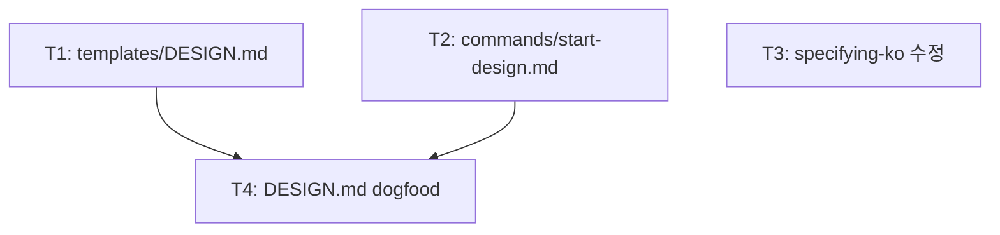

<!-- FID: 20260427-design-md -->
<!-- OWNER_COMMAND: /tasks -->
<!-- MUTABLE_BY: /implement (상태 마킹만) -->
<!-- reference_upstream: github/spec-kit tasks-template.md + obra/superpowers writing-plans -->
<!-- layer: Lifecycle-Artifact -->

# awesome-design-md 통합 태스크 목록 — 20260427-design-md

> 각 태스크는 TDD 5 스텝(RED → 검증 → GREEN → 검증 → COMMIT)을 따릅니다.

**관련 플랜**: `.specops/20260427-design-md/plan.md`
**관련 AC**: AC-1, AC-2, AC-3, AC-4, AC-5, AC-6

---

## AC → Task 매핑

| AC | must/should | Task(s) |
|---|---|---|
| AC-1 | must | T2 |
| AC-2 | must | T1 |
| AC-3 | must | T3 |
| AC-4 | must | T3 |
| AC-5 | should | T2 |
| AC-6 | should | T4 |

**must AC 커버리지**: 4/4 (100%)

---

## 태스크 1: templates/DESIGN.md — awesome-design-md 포맷 템플릿

**파일**:
- Create: `templates/DESIGN.md`

**관련 AC**: AC-2

- [ ] **스텝 1: RED — 검증 명령 정의**

```bash
# 아래 명령이 PASS를 반환해야 한다 (스텝 4 기준)
ls templates/DESIGN.md              # exit 0
grep -c "^## " templates/DESIGN.md  # 기대: 6 이상
grep "AI Usage" templates/DESIGN.md # 기대: 1줄 이상
```

- [ ] **스텝 2: FAIL 검증**

```bash
ls templates/DESIGN.md
```
예상: `ls: cannot access 'templates/DESIGN.md': No such file or directory` (exit 1)

- [ ] **스텝 3: GREEN — 파일 생성**

`templates/DESIGN.md` 전문:

```markdown
<!-- reference: https://github.com/VoltAgent/awesome-design-md -->
<!-- layer: Template -->

# DESIGN.md — [Project Name]

> AI 에이전트용 디자인 시스템 문서. UI 컴포넌트 생성 시 이 파일을 읽고 일관된 스타일을 유지한다.
> (awesome-design-md 포맷 기반 — https://getdesign.md/)

## 1. Color System

| Role | Value | Usage |
|---|---|---|
| Primary | `#______` | 주요 버튼, 링크, 강조 |
| Secondary | `#______` | 보조 액션, 배지 |
| Background | `#______` | 페이지 배경 |
| Surface | `#______` | 카드, 모달, 패널 |
| Text Primary | `#______` | 본문 텍스트 |
| Text Secondary | `#______` | 보조 텍스트, 레이블 |
| Error | `#______` | 에러 상태 |
| Success | `#______` | 성공 상태 |

**Gradient**: `linear-gradient(135deg, #______, #______)`

**Dark Mode**: [다크 모드 색상 변형 또는 "Not applicable"]

## 2. Typography

| Role | Font | Size | Weight | Usage |
|---|---|---|---|---|
| Heading 1 | [font], system-ui | 2rem | 700 | 페이지 제목 |
| Heading 2 | [font], system-ui | 1.5rem | 600 | 섹션 제목 |
| Body | [font], system-ui | 1rem | 400 | 본문 |
| Caption | [font], system-ui | 0.875rem | 400 | 보조 텍스트 |
| Code | [monospace] | 0.875rem | 400 | 코드 블록 |

**Font Stack**: `[primary], -apple-system, BlinkMacSystemFont, 'Segoe UI', sans-serif`

## 3. Spacing & Layout

- **Base Unit**: `[N]px` (예: 4px 또는 8px)
- **Spacing Scale**: `4, 8, 12, 16, 24, 32, 48, 64px`
- **Max Content Width**: `[N]px`
- **Grid**: `12-column, [N]px gutter`
- **Border Radius**: `[N]px` (default), `[N]px` (large), `9999px` (pill)

## 4. Components

### Button

```
Primary:   bg=[primary], text=white, radius=[N]px, padding=[N]px [N]px
Secondary: bg=transparent, border=1px solid [primary], text=[primary]
Disabled:  opacity=0.5, cursor=not-allowed
```

### Input

```
Border:     1px solid [border-color]
Focus:      border=[primary], ring=[primary]/20
Error:      border=[error]
Radius:     [N]px
Background: [surface]
```

### Card

```
Background: [surface]
Border:     1px solid [border-color]
Radius:     [N]px
Shadow:     [shadow-definition]
Padding:    [N]px
```

## 5. Design Principles

1. **[원칙 1]**: [설명]
2. **[원칙 2]**: [설명]
3. **[원칙 3]**: [설명]

**Anti-patterns** (피해야 할 것):
- [금지 패턴 1]
- [금지 패턴 2]

## 6. AI Usage Guidelines

> 이 섹션을 AI 에이전트가 직접 읽어 일관된 UI를 생성한다.

**컬러 사용**:
- Primary 색상은 CTA(Call-to-Action) 요소에만 사용. 배경 전체에 남용 금지.
- [추가 컬러 지침]

**타이포그래피**:
- Heading은 최대 2단계(H1, H2)만 사용.
- [추가 타이포 지침]

**컴포넌트 생성 시**:
- 항상 §4 Components 스펙 참조. 커스텀 스타일 추가 전 기존 variant 확인.
- [프레임워크별 지침 — 예: "Tailwind 사용 시 CSS 변수 우선"]
```

- [ ] **스텝 4: PASS 검증**

```bash
ls templates/DESIGN.md
grep -c "^## " templates/DESIGN.md
```
예상: `6` (1.Color, 2.Typography, 3.Spacing, 4.Components, 5.Principles, 6.AI Usage)

```bash
grep "AI Usage" templates/DESIGN.md
```
예상: `## 6. AI Usage Guidelines` 줄 출력

- [ ] **스텝 5: COMMIT**

```bash
git add templates/DESIGN.md
git commit -m "feat(design-md): DESIGN.md 템플릿 추가 (awesome-design-md 포맷, AC-2)"
```

---

## 태스크 2: commands/start-design.md — /start-design 슬래시 커맨드

**파일**:
- Create: `commands/start-design.md`

**관련 AC**: AC-1, AC-5

- [ ] **스텝 1: RED — 검증 명령 정의**

```bash
ls commands/start-design.md
grep -c "Stripe" commands/start-design.md           # 기대: 1 이상
grep -c "덮어" commands/start-design.md             # 기대: 1 이상 (AC-5)
grep -c "git commit" commands/start-design.md       # 기대: 1 이상
```

- [ ] **스텝 2: FAIL 검증**

```bash
ls commands/start-design.md
```
예상: `No such file or directory` (exit 1)

- [ ] **스텝 3: GREEN — 파일 생성**

`commands/start-design.md` 전문:

```markdown
---
name: start-design
description: 프로젝트 루트에 DESIGN.md(awesome-design-md 포맷) 생성 — 프로젝트 최초 1회 실행
triggers:
  - "/start-design"
mode: ask
specops_version: 0.0.0
specops_layer: Lifecycle-Tool
reference_upstream: VoltAgent/awesome-design-md
---

# /start-design

## 목적

프로젝트 루트에 `DESIGN.md`를 생성한다. awesome-design-md 포맷 기반. **프로젝트당 1회**. 이후 specifying-ko가 DESIGN.md를 자동 감지해 spec.md §참조에 포함한다.

## Process

### Step 1: 기존 DESIGN.md 확인

프로젝트 루트에 `DESIGN.md`가 존재하는지 확인:

```bash
ls DESIGN.md
```

- **존재하면**: 사용자에게 확인 요청:
  > "이미 `DESIGN.md`가 존재합니다. 덮어쓸까요? [y/n]"
  - `n` → 중단. "기존 DESIGN.md를 유지합니다."
  - `y` → Step 2 진행

- **없으면**: Step 2 바로 진행

### Step 2: 브랜드 선택

다음 질문을 제시:

> "어떤 디자인 시스템을 참고할까요?
>
> **(1) Stripe** — 단순·보라 그라디언트·개발자 친화 ← 추천
> **(2) Notion** — 미니멀·중립·화이트 베이스
> **(3) Linear** — 기술적·다크모드·선명한 인디고
> **(4) Claude** — AI 친화·보라 계열·다크 퍼스트
> **(5) 직접 입력** — 브랜드명 또는 색상/폰트 직접 명시"

### Step 3: DESIGN.md 생성

선택된 브랜드 스타일을 `templates/DESIGN.md` 기반으로 채워 프로젝트 루트 `DESIGN.md`를 생성한다.

**브랜드별 핵심 스타일 레퍼런스**:

| 브랜드 | Primary | Font | 무드 |
|---|---|---|---|
| Stripe | `#635BFF` | Sohne (fallback: system-ui) | 보라 그라디언트, weight-300 우아함 |
| Notion | `#000000` | Inter | 미니멀, 화이트 기반 |
| Linear | `#5E6AD2` | Inter | 다크, 선명한 인디고 |
| Claude | `#7C3AED` | Inter | 다크 퍼스트, AI-native |

### Step 4: git commit

```bash
git add DESIGN.md
git commit -m "feat(design): DESIGN.md 초기 생성 ([브랜드] 스타일)"
```

## 사용 예

```
/start-design
→ "어떤 디자인 시스템을 참고할까요?"
→ 사용자: "1"  (Stripe)
→ Stripe 스타일 DESIGN.md 생성
→ git commit
→ 완료
```

## 참조

- `templates/DESIGN.md` — 생성 기반 템플릿
- `skills/specifying-ko/SKILL.md` — DESIGN.md 자동 감지
- https://github.com/VoltAgent/awesome-design-md — 브랜드 레퍼런스 원본

---

*specops-auto-ko · 2026-04-26 · FID: 20260427-design-md*
```

- [ ] **스텝 4: PASS 검증**

```bash
ls commands/start-design.md
grep -c "Stripe" commands/start-design.md
grep -c "덮어" commands/start-design.md
grep -c "git commit" commands/start-design.md
```
예상: 각각 `1` 이상

- [ ] **스텝 5: COMMIT**

```bash
git add commands/start-design.md
git commit -m "feat(design-md): /start-design 커맨드 추가 (브랜드 선택+덮어쓰기 방지, AC-1,AC-5)"
```

---

## 태스크 3: skills/specifying-ko/SKILL.md — DESIGN.md 감지 스텝 추가

**파일**:
- Modify: `skills/specifying-ko/SKILL.md`

**관련 AC**: AC-3, AC-4

- [ ] **스텝 1: RED — 검증 명령 정의**

```bash
grep -c "DESIGN.md" skills/specifying-ko/SKILL.md
```
예상: `3` 이상

```bash
grep "spec.md.*참조\|디자인 시스템 준수" skills/specifying-ko/SKILL.md
```
예상: 1줄 이상 출력

- [ ] **스텝 2: FAIL 검증**

```bash
grep -c "DESIGN.md" skills/specifying-ko/SKILL.md
```
예상: `0` (현재 DESIGN.md 언급 없음)

- [ ] **스텝 3: GREEN — SKILL.md 수정**

`skills/specifying-ko/SKILL.md` 에서 다음 줄을 찾아:

```
1. **프로젝트 맥락 탐색** — 파일·문서·최근 커밋 확인
```

다음으로 교체:

```
1. **프로젝트 맥락 탐색** — 파일·문서·최근 커밋 확인
   - 프로젝트 루트 `DESIGN.md` 존재 확인 (`ls DESIGN.md`)
     → **있으면**: 생성하는 `spec.md` §참조에 "`DESIGN.md` 디자인 시스템 준수" 포함
     → **없으면**: UI 컴포넌트 포함 기능이면 `/start-design` 실행 안내
```

- [ ] **스텝 4: PASS 검증**

```bash
grep -c "DESIGN.md" skills/specifying-ko/SKILL.md
```
예상: `3` 이상

```bash
grep "디자인 시스템 준수" skills/specifying-ko/SKILL.md
```
예상: 1줄 출력

- [ ] **스텝 5: COMMIT**

```bash
git add skills/specifying-ko/SKILL.md
git commit -m "feat(design-md): specifying-ko DESIGN.md 자동 감지+참조 주입 추가 (AC-3,AC-4)"
```

---

## 태스크 4: DESIGN.md — specops-auto-ko dogfood (Claude 브랜드)

**파일**:
- Create: `DESIGN.md` (프로젝트 루트)

**관련 AC**: AC-6
**전제**: T1(templates/DESIGN.md), T2(commands/start-design.md) 완료 후 진행

- [ ] **스텝 1: RED — 검증 명령 정의**

```bash
ls DESIGN.md
grep -c "^## " DESIGN.md          # 기대: 6 이상
grep "specops-auto-ko" DESIGN.md  # 기대: 1줄 이상
grep "7C3AED" DESIGN.md           # 기대: 1줄 이상 (Claude 브랜드 색상)
```

- [ ] **스텝 2: FAIL 검증**

```bash
ls DESIGN.md
```
예상: `No such file or directory` (exit 1)

- [ ] **스텝 3: GREEN — 파일 생성**

`DESIGN.md` 전문 (Claude 브랜드):

```markdown
<!-- reference: https://github.com/VoltAgent/awesome-design-md -->
<!-- brand: Claude (AI-native, dark-first) -->

# DESIGN.md — specops-auto-ko

> AI 에이전트용 디자인 시스템 문서. Claude 브랜드 스타일 기반.
> UI 컴포넌트 생성 시 이 파일을 읽고 일관된 스타일을 유지한다.

## 1. Color System

| Role | Value | Usage |
|---|---|---|
| Primary | `#7C3AED` | 주요 버튼, 링크, 강조 (Claude purple) |
| Secondary | `#A78BFA` | 보조 액션, 배지 |
| Background | `#0F0F10` | 페이지 배경 (다크 퍼스트) |
| Surface | `#1A1A1F` | 카드, 모달, 패널 |
| Text Primary | `#F9FAFB` | 본문 텍스트 |
| Text Secondary | `#9CA3AF` | 보조 텍스트, 레이블 |
| Error | `#EF4444` | 에러 상태 |
| Success | `#10B981` | 성공 상태 |
| Accent | `#E0C9FF` | 강조 텍스트, 하이라이트 |

**Gradient**: `linear-gradient(135deg, #7C3AED, #5B21B6)`

**Dark Mode**: 기본값이 다크. 라이트 모드 시 Background=`#FFFFFF`, Surface=`#F9FAFB`, Text Primary=`#111827`.

## 2. Typography

| Role | Font | Size | Weight | Usage |
|---|---|---|---|---|
| Heading 1 | Inter, system-ui | 2rem | 700 | 페이지 제목 |
| Heading 2 | Inter, system-ui | 1.5rem | 600 | 섹션 제목 |
| Body | Inter, system-ui | 1rem | 400 | 본문 |
| Caption | Inter, system-ui | 0.875rem | 400 | 보조 텍스트 |
| Code | JetBrains Mono, monospace | 0.875rem | 400 | 코드 블록, 인라인 코드 |

**Font Stack**: `Inter, -apple-system, BlinkMacSystemFont, 'Segoe UI', sans-serif`

## 3. Spacing & Layout

- **Base Unit**: 4px
- **Spacing Scale**: 4, 8, 12, 16, 24, 32, 48, 64px
- **Max Content Width**: 1200px
- **Grid**: 12-column, 24px gutter
- **Border Radius**: 8px (default), 12px (large), 9999px (pill)

## 4. Components

### Button

```
Primary:   bg=#7C3AED, text=white, radius=8px, padding=8px 16px, hover=bg-#6D28D9
Secondary: bg=transparent, border=1px solid #7C3AED, text=#7C3AED, hover=bg-#7C3AED/10
Ghost:     bg=transparent, text=#9CA3AF, hover=text-#F9FAFB
Disabled:  opacity=0.5, cursor=not-allowed
```

### Input

```
Background: #1A1A1F
Border:     1px solid #374151
Focus:      border=#7C3AED, ring=2px #7C3AED/20
Error:      border=#EF4444
Radius:     8px
Text:       #F9FAFB, placeholder=#6B7280
```

### Card

```
Background: #1A1A1F
Border:     1px solid #374151
Radius:     12px
Shadow:     0 4px 6px -1px rgba(0,0,0,0.3)
Padding:    24px
```

### Badge

```
Default:   bg=#374151, text=#F9FAFB, radius=9999px, padding=2px 8px
Primary:   bg=#7C3AED/20, text=#A78BFA
Success:   bg=#10B981/20, text=#34D399
Error:     bg=#EF4444/20, text=#F87171
```

## 5. Design Principles

1. **AI-native 명확성**: 정보 계층을 명확히. 사용자가 AI 응답을 빠르게 스캔할 수 있게.
2. **미니멀리즘**: 장식 없이 기능에 집중. 여백이 콘텐츠. 불필요한 그래픽 요소 제거.
3. **다크 퍼스트**: 다크 모드가 기본. Claude 사용자의 야간·집중 작업 환경 최적화.

**Anti-patterns**:
- 밝은 배경(#FFFFFF) 남용 — 다크 퍼스트 원칙 위반
- 복잡한 그라디언트 배경 — Primary 그라디언트는 hero/CTA에만
- 14px 미만 본문 폰트
- 3개 이상 Primary 색상 동시 사용

## 6. AI Usage Guidelines

> specops-auto-ko UI 컴포넌트 생성 시 이 지침을 따른다.

**컬러 사용**:
- Primary(`#7C3AED`)는 interactive 요소(버튼, 링크, 포커스 링)에만. 배경 전체 금지.
- 배경은 항상 `#0F0F10` 또는 `#1A1A1F`. 순백(#FFFFFF) 배경 금지.
- 에러/성공 색상은 아이콘+텍스트 조합으로. 배경색만 사용 금지.

**타이포그래피**:
- Heading은 최대 2단계(H1, H2)만. H3 이하는 bold body로 대체.
- 코드 블록은 반드시 JetBrains Mono + 신택스 하이라이팅.

**컴포넌트 생성 시**:
- §4 Components 스펙 먼저 확인. 커스텀 스타일 추가 전 기존 variant 재사용.
- Tailwind CSS 사용 시: `violet-700`(Primary), `gray-900`(Background), `gray-800`(Surface).
- React 컴포넌트는 다크 모드 className 포함 (`dark:` prefix).
```

- [ ] **스텝 4: PASS 검증**

```bash
ls DESIGN.md && grep -c "^## " DESIGN.md
```
예상: `6` 이상

```bash
grep "specops-auto-ko" DESIGN.md && grep "7C3AED" DESIGN.md
```
예상: 각 1줄 이상 출력

- [ ] **스텝 5: COMMIT**

```bash
git add DESIGN.md
git commit -m "feat(design-md): specops-auto-ko DESIGN.md dogfood 생성 (Claude 브랜드, AC-6)"
```

---

## 진행 상태

총 태스크 수: 4
완료: 0 / 4
차단: 0

---

## 의존 그래프

> `decomposing-ko` 작성. T1·T2·T3 독립 병렬, T4는 T1+T2 완료 후.



```yaml
tasks:
  - id: T1
    depends_on: []
    inputs: []
    outputs: [templates/DESIGN.md]
    ac: [AC-2]
  - id: T2
    depends_on: []
    inputs: [commands/start.md]
    outputs: [commands/start-design.md]
    ac: [AC-1, AC-5]
  - id: T3
    depends_on: []
    inputs: [skills/specifying-ko/SKILL.md]
    outputs: [skills/specifying-ko/SKILL.md]
    ac: [AC-3, AC-4]
  - id: T4
    depends_on: [T1, T2]
    inputs: [templates/DESIGN.md, commands/start-design.md]
    outputs: [DESIGN.md]
    ac: [AC-6]
```

## 참조

- `skills/tdd-ko/SKILL.md` — TDD 5 스텝
- `.specops/20260427-design-md/plan.md` — 구현 플랜
- `.specops/20260427-design-md/acceptance-criteria.md` — AC 계약
- `scripts/dag/parse-dag.sh` — DAG 파서

---

*작성: specops-auto-ko · 2026-04-26 · FID: 20260427-design-md · 생성 커맨드: /tasks*
