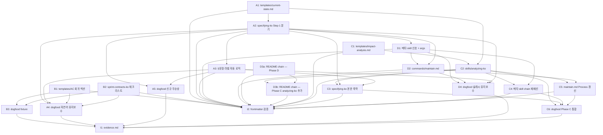

<!-- FID: 20260427-maintenance-lifecycle -->
<!-- OWNER_COMMAND: /tasks -->
<!-- MUTABLE_BY: /implement (상태 마킹만) -->
<!-- reference_upstream: github/spec-kit tasks-template.md + obra/superpowers@v5.0.7 writing-plans -->
<!-- layer: Lifecycle-Artifact -->

# 유지보수 Lifecycle 보강 (B+A+D+C) 태스크 목록 — 20260427-maintenance-lifecycle

> 각 태스크는 TDD 5 스텝(RED → 검증 → GREEN → 검증 → COMMIT)을 따릅니다. Markdown 편집 작업이라 RED = 검증 grep/test 명령, GREEN = 파일 편집 패턴 (기존 FID `20260427-screen-design` 패턴 답습). dogfood task 는 `.specops/<test-FID>/` 산출물 + chain 재현 검증.

**관련 플랜**: `.specops/20260427-maintenance-lifecycle/plan.md`
**관련 AC**: AC-1 ~ AC-15 (15 건 — must 12 + should 3)

---

## AC → Task 매핑

| AC | must/should | Task(s) | 비고 |
|---|---|---|---|
| AC-1 | must | B1, B2, B3 | 회귀 AC 누락 BLOCK |
| AC-2 | must | B3 | 회귀 AC 포함 PASS |
| AC-3 | must | A1, A2, A4 | 유지보수 분기 + current-state.md |
| AC-4 | must | A3, A4 | spec.md §유형 자동 라벨 |
| AC-5 | must | D1, D4 | 자연어 maintenance 신호 |
| AC-6 | must | D2, D4, C5 | /maintain 슬래시 |
| AC-7 | must | A5 | 신규 chain 무손상 |
| AC-8 | must | C1, C2, C3, C4, C5, C6 | analyzing-ko 두 산출물 + HARD GATE |
| AC-9 | should | A3, C6 | trivial 자동 판정 |
| AC-10 | must | I1 | evidence.md 통합 검증 |
| AC-11 | must | I2 | reference_upstream frontmatter |
| AC-12 | must | D3a, D3b | README Lifecycle Chain 갱신 (Phase D + Phase C 분할) |
| AC-13 | must | A2, A4, D1 | entry signal prefix `<!-- entry: maintain -->` (transcript-based 검증 — dispatch-log.md) |
| AC-14 | should | A3, C6 | trivial 시점 = §1 라인 메타 사전 추정 (rule + e2e 검증) |
| AC-15 | should | C2, C6 | gh CLI 미가용 fallback |

**must AC 커버리지**: 12/12 (100%) · **should 커버리지**: 3/3 (100%) · **미매핑 0**

---

## 태스크 B1: templates/acceptance-criteria.md 회귀 AC 섹션 추가

**파일**:
- Modify: `templates/acceptance-criteria.md` (현 파일 끝 "## 회귀 방지 AC (유지보수 FID 필수) — 본 FID 면제 사유" 섹션 위에 신규 섹션 삽입)

**관련 AC**: AC-1 (간접 — fixture 없이 template 자체 검증)

- [ ] **스텝 1: RED — 검증 명령 실패 확인**

```bash
grep -E '^### AC-R-1: 기존 동작 보존' templates/acceptance-criteria.md
grep -E 'AC-R-N|회귀 방지 AC.*템플릿' templates/acceptance-criteria.md
```

- [ ] **스텝 2: FAIL 검증**

기대: 두 grep 모두 빈 출력 (변경 전 — 회귀 AC 템플릿 미존재)

- [ ] **스텝 3: GREEN — 파일 수정**

`templates/acceptance-criteria.md` 의 "## 우선순위 규약" 섹션 직전에 다음 블록 삽입:

````markdown
## 회귀 방지 AC (유지보수 FID 필수)

`spec.md §개요` 의 `**§유형**` 라벨이 `유지보수` 인 경우, 본 섹션에 `AC-R-N` 회귀 must AC 를 **최소 1 개 이상** 작성한다. sprint-contracts-ko evaluator 가 회귀 AC 누락 시 `verdict = BLOCK` 판정.

### AC-R-1: 기존 동작 보존

**Given** [구체적 입력 또는 기존 호출 패턴]
**When** [현재와 동일한 트리거]
**Then** 기존 출력 [구체적 결과] 와 동일하게 동작한다 — 변경되지 않음

**검증 방법**: [기존 회귀 테스트 경로 또는 신규 회귀 테스트 추가]
**관련 FR**: 회귀 방지
**우선순위**: must

> **§유형 = 신규 / trivial 인 경우 본 섹션 면제** — `**§유형**: 신규` 또는 `**§유형**: trivial` (변경 라인 ≤ 5 자동) 이면 회귀 AC 강제 발동 안 함. 단 신규 chain 무손상은 별도 AC 로 보장 권장.
````

- [ ] **스텝 4: PASS 검증**

```bash
grep -E '^### AC-R-1: 기존 동작 보존' templates/acceptance-criteria.md
grep -cE 'AC-R-N|회귀 방지 AC' templates/acceptance-criteria.md
```

기대: AC-R-1 한 줄 출력 + grep 카운트 ≥ 2

- [ ] **스텝 5: COMMIT (보류 — Task B3 끝에서 commit 1 일괄)**

---

## 태스크 B2: skills/sprint-contracts-ko/SKILL.md Evaluator 체크리스트 + 안티패턴 추가

**파일**:
- Modify: `skills/sprint-contracts-ko/SKILL.md` (§"체크리스트 (Evaluator)" + §"안티패턴")

**관련 AC**: AC-1

- [ ] **스텝 1: RED — 검증 명령 실패 확인**

```bash
grep -E '유지보수 FID.*회귀 방지 must AC' skills/sprint-contracts-ko/SKILL.md
grep -E '회귀 AC 없는 유지보수 FID' skills/sprint-contracts-ko/SKILL.md
```

- [ ] **스텝 2: FAIL 검증**

기대: 두 grep 모두 빈 출력

- [ ] **스텝 3: GREEN — 파일 수정**

`skills/sprint-contracts-ko/SKILL.md` 의 §"체크리스트 (Evaluator)" 마지막 항목 뒤에 1 줄 추가:

```markdown
- [ ] 유지보수 FID (`spec.md §유형 = 유지보수`) 인 경우 회귀 방지 must AC (`AC-R-*`) ≥ 1 포함 확인 — 미포함 시 `verdict = BLOCK`. 단 `§유형 = trivial` 인 경우 면제 (변경 라인 ≤ 5 자동 부여)
```

§"안티패턴" 섹션에 항목 1 개 추가:

```markdown
- 회귀 AC 없는 유지보수 FID — `§유형 = 유지보수` 인데 `AC-R-*` 0 개로 작성. **회귀 검증 근거 없음** → BLOCK. clarifying-ko 단계에서 `AC-R-*` append 가능
```

- [ ] **스텝 4: PASS 검증**

```bash
grep -E '유지보수 FID.*회귀 방지 must AC' skills/sprint-contracts-ko/SKILL.md
grep -E '회귀 AC 없는 유지보수 FID' skills/sprint-contracts-ko/SKILL.md
```

기대: 두 grep 모두 한 줄씩 출력

- [ ] **스텝 5: COMMIT (보류 — Task B3 끝에서 commit 1 일괄)**

---

## 태스크 B3: dogfood fixture FID `20260427-test-bugfix-fixture` (회귀 AC 누락 BLOCK / 포함 PASS)

**파일**:
- Create: `.specops/20260427-test-bugfix-fixture/spec.md` (§유형 = 유지보수)
- Create: `.specops/20260427-test-bugfix-fixture/acceptance-criteria.md` (AC-R-* 0 개 → 1 개 토글)

**관련 AC**: AC-1, AC-2

- [ ] **스텝 1: RED — fixture 작성 후 BLOCK 기대 시뮬**

`.specops/20260427-test-bugfix-fixture/spec.md` 작성 (최소):

```markdown
<!-- FID: 20260427-test-bugfix-fixture -->
# Test Bugfix Fixture

## 1. 개요

**§유형**: 유지보수
**목적**: B Phase fixture — 회귀 AC 강제 검증.
```

`.specops/20260427-test-bugfix-fixture/acceptance-criteria.md` (회귀 AC 0 개):

```markdown
<!-- FID: 20260427-test-bugfix-fixture -->
# 수락 기준 — 20260427-test-bugfix-fixture

## 계약 항목

### AC-1: 토큰 만료 처리

**Given** 만료 토큰 / **When** API 호출 / **Then** 401 반환
**우선순위**: must
```

- [ ] **스텝 2: FAIL 검증 (회귀 AC 누락 BLOCK 시뮬)**

수동 evaluator 시뮬:
```bash
# 검증 1: §유형 = 유지보수 확인
grep -E '\*\*§유형\*\*: 유지보수' .specops/20260427-test-bugfix-fixture/spec.md
# 검증 2: AC-R-* 카운트
grep -cE '^### AC-R-' .specops/20260427-test-bugfix-fixture/acceptance-criteria.md
```

기대: 검증 1 매칭 / 검증 2 = 0 → sprint-contracts-ko 룰상 BLOCK 판정 근거 (§유형 = 유지보수 인데 AC-R-* 0 개)

- [ ] **스텝 3: GREEN — 회귀 AC 추가 후 PASS 시뮬**

`.specops/20260427-test-bugfix-fixture/acceptance-criteria.md` 끝에 AC-R-1 append:

```markdown
### AC-R-1: 기존 정상 토큰 흐름 보존

**Given** 정상 토큰 / **When** API 호출 / **Then** 200 반환 (변경 없음)
**우선순위**: must
```

- [ ] **스텝 4: PASS 검증**

```bash
grep -cE '^### AC-R-' .specops/20260427-test-bugfix-fixture/acceptance-criteria.md
```

기대: 1 — sprint-contracts-ko 룰상 PASS 판정 근거

- [ ] **스텝 5: COMMIT — commit 1 일괄 (B1 + B2 + B3 묶음)**

```bash
git add -f templates/acceptance-criteria.md skills/sprint-contracts-ko/SKILL.md \
  .specops/20260427-test-bugfix-fixture/spec.md \
  .specops/20260427-test-bugfix-fixture/acceptance-criteria.md
git commit -m "feat(B): 회귀 AC must 강제 + dogfood fixture (B1/B2/B3)

templates/AC 회귀 섹션 + sprint-contracts-ko 체크리스트·안티패턴 + 
dogfood fixture (회귀 AC 누락 BLOCK / 포함 PASS 시뮬).

Constraint: §유형 = trivial 인 경우 면제 (clarify Q-B 결정)
Confidence: high · Scope-risk: narrow
관련 AC: AC-1, AC-2"
```

---

## 태스크 A1: templates/current-state.md 신설 (5 항목)

**파일**:
- Create: `templates/current-state.md`

**관련 AC**: AC-3 (간접)

- [ ] **스텝 1: RED — 검증 명령 실패 확인**

```bash
test -f templates/current-state.md && echo "EXISTS" || echo "MISSING"
```

- [ ] **스텝 2: FAIL 검증**

기대: `MISSING`

- [ ] **스텝 3: GREEN — 파일 생성**

`templates/current-state.md`:

````markdown
<!-- FID: <YYYYMMDD-kebab-slug> -->
<!-- OWNER_COMMAND: /specify (유지보수 분기) or /maintain -->
<!-- MUTABLE_BY: /clarify (append only) -->
<!-- reference_upstream: specops-auto-ko 독자 추가 (본가 obra/superpowers@v5.0.7 미존재) -->
<!-- layer: Lifecycle-Artifact -->

# 현재 시스템 분석 (Current State) — <FID>

> 유지보수 진입 시 specifying-ko Step 1 또는 analyzing-ko (Phase C 적용 후) 가 산출. 변경 대상의 baseline 캡처 → spec.md / impact-analysis.md / 회귀 AC / trivial 자동 판정 (라인 범위 메타) 의 근거.

## 1. 변경 대상 식별

- 파일: `<path/to/file.ts>` (Lines: <range — 합산이 trivial 자동 판정 메타 source>)
- 진입점 함수/심볼: `<symbol>`
- 관련 모듈: <list>

## 2. 호출자/의존 매핑

- 호출자: `<grep -rn 'symbol' --include='*.ts'>` 결과 요약
- 의존: <외부 lib / 내부 모듈>

## 3. 기존 테스트 커버리지

- 관련 테스트: `<test/path>` (예: `tests/auth.test.ts::token-expiry-*`)
- 커버되지 않는 경로: <list>

## 4. 관찰 가능 동작 (Baseline)

| # | Input | 현재 Output | 비고 |
|---|---|---|---|
| 1 | <example> | <result> | <note> |

## 5. 회귀 위험 메모

- <위험 1: 변경이 X 흐름에 영향>

---

*작성: specifying-ko Step 1 (Phase A) 또는 analyzing-ko (Phase C) · <날짜> · FID: <FID>*
````

- [ ] **스텝 4: PASS 검증**

```bash
test -f templates/current-state.md && grep -cE '^## [0-9]\.' templates/current-state.md
```

기대: 카운트 = 5 (5 항목 H2)

- [ ] **스텝 5: COMMIT (보류 — Task A5 끝에서 commit 2 일괄)**

---

## 태스크 A2: skills/specifying-ko/SKILL.md Step 1 분기 추가 + ASCII 흐름도 갱신

**파일**:
- Modify: `skills/specifying-ko/SKILL.md` (§"체크리스트" Step 1 + §"프로세스 흐름" ASCII)

**관련 AC**: AC-3, AC-13

- [ ] **스텝 1: RED — 검증 명령 실패 확인**

```bash
grep -E 'entry: maintain|유지보수 분기' skills/specifying-ko/SKILL.md
grep -E '<!-- entry: maintain -->' skills/specifying-ko/SKILL.md
```

- [ ] **스텝 2: FAIL 검증**

기대: 두 grep 모두 빈 출력

- [ ] **스텝 3: GREEN — Step 1 분기 추가**

`skills/specifying-ko/SKILL.md` Step 1 본문 하단에 다음 블록 append:

````markdown
   - **유지보수 분기 진입 신호 검사** (Phase A — 신규 추가):
     - args 첫 줄이 `<!-- entry: maintain -->` HTML 주석이면 [유지보수 분기] 진입
     - 그렇지 않으면 [신규 분기] (현재 동작 — DESIGN.md / screens/ 점검)

   **[유지보수 분기]** (신설):
     1. 변경 대상 파일·진입점 식별 (`grep -rn`, `Read`)
     2. 호출자/의존 매핑
     3. 기존 테스트 커버리지 확인
     4. 관찰 가능 동작 1~3 건 캡처
     5. 회귀 위험 1 줄 메모
     ↓
     `.specops/<FID>/current-state.md` 작성 (templates/current-state.md 기반, §1 라인 범위 메타가 trivial 자동 판정 source — Phase A 단독 시점)
     ↓
     ★ HARD GATE: "분석 결과 검토. 진행? [y/n]"
     ↓
     spec.md §1 개요 에 `**§유형**: 유지보수` 라벨 자동 (라인 합산 ≤ 5 면 `trivial` 라벨)
     ↓
     spec.md §참조 에 `current-state.md` 자동 포함
     ↓
     Step 3 명확화 질문으로 진행
````

§"프로세스 흐름" ASCII 흐름도에 maintenance 분기 노드 추가 (해당 섹션 진입부 직후):

```
프로젝트 맥락 탐색
    ↓
args 첫 줄 = "<!-- entry: maintain -->"? ── yes ──▶ [유지보수 분기] 5 항목 mini-checklist + current-state.md ★ HARD GATE → §유형 자동 라벨 → Step 3
    │
    └── no ──▶ [신규 분기] (현재 그대로)
```

- [ ] **스텝 4: PASS 검증**

```bash
grep -cE 'entry: maintain' skills/specifying-ko/SKILL.md
grep -cE '유지보수 분기' skills/specifying-ko/SKILL.md
```

기대: 카운트 ≥ 3 / 카운트 ≥ 3

- [ ] **스텝 5: COMMIT (보류 — Task A5 끝에서 commit 2 일괄)**

---

## 태스크 A3: specifying-ko §유형 라벨 자동 기재 로직 (유지보수 / 신규 / trivial)

**파일**:
- Modify: `skills/specifying-ko/SKILL.md` (Step 6 "설계 문서 작성" 본문)

**관련 AC**: AC-4, AC-9, AC-14

- [ ] **스텝 1: RED — 검증 명령 실패 확인**

```bash
grep -E '§유형.*자동.*기재' skills/specifying-ko/SKILL.md
grep -E 'trivial.*라인.*5' skills/specifying-ko/SKILL.md
```

- [ ] **스텝 2: FAIL 검증**

기대: 두 grep 모두 빈 출력

- [ ] **스텝 3: GREEN — 라벨 자동 로직 추가**

`skills/specifying-ko/SKILL.md` 의 Step 6 본문에 다음 block 삽입:

````markdown
**§유형 라벨 자동 기재** (Phase A — 신규 추가):

spec.md §1 개요 에 `**§유형**` 라벨을 다음 규칙으로 자동 기재:

| 진입 신호 | current-state.md §1 라인 범위 합산 | 라벨 |
|---|---|---|
| 신규 분기 | N/A | `**§유형**: 신규` |
| 유지보수 분기 | ≤ 5 | `**§유형**: trivial` (사용자가 자기선언으로 거부 가능) |
| 유지보수 분기 | > 5 또는 미산출 | `**§유형**: 유지보수` |

**근거**: clarify Q-B 결정 — trivial 자동 판정 시점은 analyzing-ko current-state.md §1 메타 사전 추정. Phase A 단독 시점에는 specifying-ko Step 1 mini-checklist §1 라인 범위 메타로 대체. 라벨은 clarifying-ko 단계에서 갱신 가능.

라벨이 `유지보수` 면 acceptance-criteria.md 의 "## 회귀 방지 AC (유지보수 FID 필수)" 섹션이 자동 활성 — sprint-contracts-ko evaluator 가 `AC-R-*` ≥ 1 강제.
````

- [ ] **스텝 4: PASS 검증**

```bash
grep -cE '§유형.*자동.*기재' skills/specifying-ko/SKILL.md
grep -cE 'trivial.*라인.*5' skills/specifying-ko/SKILL.md
```

기대: 두 grep 모두 ≥ 1

- [ ] **스텝 5: COMMIT (보류 — Task A5 끝에서 commit 2 일괄)**

---

## 태스크 A4: dogfood 자연어 유지보수 — `20260427-test-natural-bugfix`

**파일**:
- Create: `.specops/20260427-test-natural-bugfix/{spec.md, current-state.md, acceptance-criteria.md, dispatch-log.md}`

**관련 AC**: AC-3, AC-4, AC-13

- [ ] **스텝 1: RED — 산출물 부재 확인**

```bash
test -d .specops/20260427-test-natural-bugfix && echo "EXISTS" || echo "MISSING"
```

- [ ] **스텝 2: FAIL 검증**

기대: `MISSING`

- [ ] **스텝 3: GREEN — dogfood 시나리오 시뮬**

가상 입력: `"auth.js 토큰 만료 버그 고쳐줘"` (자연어 maintenance — Phase D 시점에는 메타 skill 이 args 합성. Phase A 단독 시점에는 수동 시뮬로 args 첫 줄 = `<!-- entry: maintain -->` 가정)

수동 시뮬 절차:
1. `mkdir -p .specops/20260427-test-natural-bugfix`
2. specifying-ko Step 1 [유지보수 분기] 수동 실행 (templates/current-state.md 기반 5 항목 채움)
3. `.specops/20260427-test-natural-bugfix/current-state.md` 산출 (§1 라인 범위 메타 = 8 라인 가정 → trivial 아님)
4. spec.md §1 개요 자동 라벨 = `**§유형**: 유지보수`
5. acceptance-criteria.md 에 `AC-R-1` 추가 (회귀 AC 강제 발동)
6. **dispatch-log.md 작성** (AC-13 transcript-based 검증) — 다른 FID `20260424-decomposing-test-conventions/dispatch-log.md` 패턴 답습. 본 task 의 메타 skill 호출 로그 첫 줄에 args first line = `<!-- entry: maintain -->` 기록 + announce 메시지 `Using specifying-ko (maintenance) to ...` 인용

- [ ] **스텝 4: PASS 검증**

```bash
grep -E '\*\*§유형\*\*: 유지보수' .specops/20260427-test-natural-bugfix/spec.md
test -f .specops/20260427-test-natural-bugfix/current-state.md
grep -cE '^### AC-R-' .specops/20260427-test-natural-bugfix/acceptance-criteria.md
# AC-13 transcript-based 검증 — dispatch-log.md (specops-auto-ko convention)
grep -E '<!-- entry: maintain -->' .specops/20260427-test-natural-bugfix/dispatch-log.md  # args first line trail
grep -E 'Using specifying-ko \(maintenance\)' .specops/20260427-test-natural-bugfix/dispatch-log.md  # announce 메시지
```

기대: §유형 라벨 매칭 / current-state.md 존재 / AC-R-* ≥ 1 / dispatch-log args trail 매칭 / announce 메시지 매칭

- [ ] **스텝 5: COMMIT (보류 — Task A5 끝에서 commit 2 일괄)**

---

## 태스크 A5: dogfood 신규 chain 무손상 — `20260427-test-newfeature-csv`

**파일**:
- Create: `.specops/20260427-test-newfeature-csv/{spec.md, acceptance-criteria.md}`

**관련 AC**: AC-7

- [ ] **스텝 1: RED — 산출물 부재 + 신규 분기 동작 확인**

```bash
test -d .specops/20260427-test-newfeature-csv && echo "EXISTS" || echo "MISSING"
```

- [ ] **스텝 2: FAIL 검증**

기대: `MISSING`

- [ ] **스텝 3: GREEN — 신규 분기 dogfood**

가상 입력: `/start CSV 줄 수 세기 CLI (test FID)` — args 첫 줄에 `<!-- entry: maintain -->` 부재 → specifying-ko Step 1 [신규 분기] 진입.

수동 시뮬 절차:
1. `mkdir -p .specops/20260427-test-newfeature-csv`
2. specifying-ko Step 1 [신규 분기] (현재 동작) — DESIGN.md / screens/ 점검만
3. `.specops/20260427-test-newfeature-csv/current-state.md` **미생성** 확인
4. spec.md §1 개요 자동 라벨 = `**§유형**: 신규`
5. acceptance-criteria.md 에 `AC-R-*` **0 개** (회귀 AC 강제 발동 안 함)

- [ ] **스텝 4: PASS 검증**

```bash
grep -E '\*\*§유형\*\*: 신규' .specops/20260427-test-newfeature-csv/spec.md
test ! -f .specops/20260427-test-newfeature-csv/current-state.md && echo "OK" || echo "FAIL"
grep -cE '^### AC-R-' .specops/20260427-test-newfeature-csv/acceptance-criteria.md
```

기대: §유형 = 신규 / current-state.md 부재 (OK) / AC-R-* 카운트 = 0

- [ ] **스텝 5: COMMIT — commit 2 일괄 (A1 + A2 + A3 + A4 + A5 묶음)**

```bash
git add -f templates/current-state.md skills/specifying-ko/SKILL.md \
  .specops/20260427-test-natural-bugfix/ .specops/20260427-test-newfeature-csv/
git commit -m "feat(A): specifying-ko Step 1 유지보수 분기 + current-state.md (A1~A5)

templates/current-state.md 신설 (5 항목) + specifying-ko Step 1 분기
( <!-- entry: maintain --> args 약속어) + §유형 자동 라벨 (유지보수/신규/trivial)
+ dogfood 자연어 유지보수 + 신규 chain 무손상.

Constraint: 자연어 args HTML 주석 collision 0 (clarify Q-A)
Constraint: trivial 자동 판정 = §1 라인 메타 사전 추정 (clarify Q-B)
Confidence: high · Scope-risk: moderate
관련 AC: AC-3, AC-4, AC-7, AC-13, AC-14"
```

---

## 태스크 D1: skills/using-specops-auto-ko-ko/SKILL.md 신호 매칭 + args 합성

**파일**:
- Modify: `skills/using-specops-auto-ko-ko/SKILL.md` (§"신호 감지" 본문)

**관련 AC**: AC-5, AC-13

- [ ] **스텝 1: RED — 검증 명령 실패 확인**

```bash
grep -E '버그 고쳐줘|리팩터링|maintenance flag' skills/using-specops-auto-ko-ko/SKILL.md
grep -E '<!-- entry: maintain -->.*args' skills/using-specops-auto-ko-ko/SKILL.md
```

- [ ] **스텝 2: FAIL 검증**

기대: 두 grep 모두 빈 출력

- [ ] **스텝 3: GREEN — 신호 매칭 + args 합성 추가**

`skills/using-specops-auto-ko-ko/SKILL.md` §19~24 신호 예시 블록 끝에 4 줄 추가:

```markdown
- "X 버그 고쳐줘 / 수정해줘"
- "Y 리팩터링 해줘"
- "Z 개선 / 변경"
- "/maintain <대상>" 슬래시
```

§"신호 감지" 본문에 다음 분류 로직 block 추가:

````markdown
**maintenance flag 분류 로직** (Phase D — 신규 추가):

신호 감지 후 신규/유지보수 1 회 분류:

- 신규 신호 (`X 만들고 싶어 / Y 신규 / /start`) → maintenance flag = `false`
- 유지보수 신호 (`고쳐줘 / 리팩터링 / 수정 / 개선 / /maintain`) → maintenance flag = `true`

specifying-ko 호출 시 args 합성:
- maintenance = `false` → 원본 args 그대로
- maintenance = `true` → args 첫 줄에 `<!-- entry: maintain -->` HTML 주석 prepend → 줄바꿈 후 원본 args 이어서

announce 메시지 (5 원칙 1 투명성):
- maintenance = `false` → "Using specifying-ko to <purpose>"
- maintenance = `true` → "Using specifying-ko (maintenance) to <purpose>"

분류 모호 (양쪽 신호 혼재) 시 사용자에게 1 문항 확인 — "신규 / 유지보수 어느 쪽?".
````

- [ ] **스텝 4: PASS 검증**

```bash
grep -cE '버그 고쳐줘|리팩터링|maintenance flag' skills/using-specops-auto-ko-ko/SKILL.md
grep -cE '<!-- entry: maintain -->' skills/using-specops-auto-ko-ko/SKILL.md
```

기대: 두 grep 모두 ≥ 2

- [ ] **스텝 5: COMMIT (보류 — Task D4 끝에서 commit 3 일괄)**

---

## 태스크 D2: commands/maintain.md 신설 (analyzing-ko 자리는 임시 — Phase C 갱신 예정)

**파일**:
- Create: `commands/maintain.md`

**관련 AC**: AC-6

- [ ] **스텝 1: RED — 파일 부재 확인**

```bash
test -f commands/maintain.md && echo "EXISTS" || echo "MISSING"
```

- [ ] **스텝 2: FAIL 검증**

기대: `MISSING`

- [ ] **스텝 3: GREEN — 파일 생성**

`commands/maintain.md`:

````markdown
---
name: maintain
description: specops-auto-ko 한국어 자율 Lifecycle 유지보수 진입 슬래시 — specifying-ko 유지보수 분기 호출 (Phase C 적용 후 analyzing-ko 선행)
triggers:
  - "/maintain"
mode: ask
specops_layer: Lifecycle
specops_version: 0.0.0
reference_upstream: specops-auto-ko 독자 추가 (본가 obra/superpowers@v5.0.7 미존재)
---

# /maintain [<대상 또는 변경 설명>]

## 목적

`/start` 와 동등한 진입 슬래시지만 maintenance flag 자동 세팅. specifying-ko Step 1 [유지보수 분기] 로 직행 (Phase D 시점). Phase C 적용 후에는 analyzing-ko 선행.

## Process (Phase D 시점)

1. **메타 skill 활성 확인** — `skills/using-specops-auto-ko-ko/SKILL.md` 가 세션 시작 시 활성
2. **specifying-ko 호출** — args 첫 줄에 `<!-- entry: maintain -->` HTML 주석 prepend 후 원본 인자 이어서. specifying-ko Step 1 이 분기 검사
3. **이후 자동 chain** — clarifying-ko → planning-ko → decomposing-ko → implementing-ko → verifying-evidence-ko → review

> **Phase C 적용 후 갱신 예정**: Process 2 단계 = analyzing-ko 호출 → specifying-ko 호출. analyzing-ko 가 current-state.md + impact-analysis.md 산출 + ★ HARD GATE 후 specifying-ko 로 chain.

## 사용 예

```
/maintain auth.js 토큰 만료 버그

→ args 합성: "<!-- entry: maintain -->\nauth.js 토큰 만료 버그"
→ specifying-ko Step 1 [유지보수 분기]
→ current-state.md ★ HARD GATE
→ spec.md §유형 = 유지보수 + acceptance-criteria.md AC-R-1 강제
→ ... (Lifecycle 자동)
```

## 자연어 진입 vs 슬래시 진입

| 진입 방식 | 동작 |
|---|---|
| `/maintain X` | 명시적 유지보수 진입 — args 합성 직접 |
| `"X 고쳐줘"` (자연어) | 메타 skill 신호 매칭 → maintenance flag → specifying-ko 호출 시 args 합성 |

## 안티패턴

- **인자 내용 2 차 판단** (`/start` 와 동일) — 슬래시 진입 자체가 의도 확정. 인자 적합성은 specifying-ko Step 1 분기 검증 1 문항이 처리
- **신규 기능을 `/maintain` 으로 진입** — specifying-ko Step 1 분기 검증 문항이 사용자에게 재분류 요청
- **인자 없이 진입** — modally 되묻기 (`/start` 안티패턴 동일)

## 참조

- `commands/start.md` — 자매 진입로 (신규)
- `skills/specifying-ko/SKILL.md` Step 1 — maintenance 분기
- `skills/using-specops-auto-ko-ko/SKILL.md` — 메타 skill 신호 매칭

---

*PoC v0.0 · 2026-04-27 · 유지보수 진입 슬래시 (자연어 진입과 동등)*
````

- [ ] **스텝 4: PASS 검증**

```bash
test -f commands/maintain.md && grep -cE '<!-- entry: maintain -->|maintenance' commands/maintain.md
```

기대: ≥ 3

- [ ] **스텝 5: COMMIT (보류 — Task D4 끝에서 commit 3 일괄)**

---

## 태스크 D3a: README.md Lifecycle Chain 갱신 — Phase D 시점 (specifying-ko 직행)

**파일**:
- Modify: `README.md` (§"Lifecycle Chain" + §"자산 구조")

**관련 AC**: AC-12 (부분 — Phase D commit 시점의 chain 만)

> **Note**: Phase D commit 3 시점에는 `analyzing-ko` 가 아직 미존재 (Phase C commit 4 에서 신설). git bisect 시 broken docs 방지를 위해 D3 를 D3a (commit 3) + D3b (commit 4) 로 분할. D3a 는 maintenance 분기를 specifying-ko 직행으로 기재.

- [ ] **스텝 1: RED — 검증 명령 실패 확인**

```bash
grep -E '/maintain' README.md
```

- [ ] **스텝 2: FAIL 검증**

기대: 빈 출력

- [ ] **스텝 3: GREEN — Lifecycle Chain 섹션 갱신 (Phase D 시점)**

`README.md` §"Lifecycle Chain" 의 chain 다이어그램을 다음으로 교체 (analyzing-ko 단계 **없음** — Phase C 에서 D3b 가 추가):

```
/start <기능>  또는  /maintain <대상>  또는  자연어
    ↓
specops-auto-ko:using-specops-auto-ko-ko  (메타 · 신호 분류 → maintenance flag)
    ↓
   [신규]  ─── args 그대로 ───────────  [유지보수]
    │                                    ↓
    │                       args = "<!-- entry: maintain -->\n<원본>"
    │                                    ↓
    └─→ specops-auto-ko:specifying-ko ←──┘
        — spec.md (§유형 자동 라벨) + acceptance-criteria.md (회귀 AC 강제)
        ↓ HARD GATE
    specops-auto-ko:clarifying-ko     — clarifications.md
        ↓ HARD GATE
    specops-auto-ko:planning-ko       — plan.md
        ↓
    specops-auto-ko:decomposing-ko    — tasks.md + DAG
        ↓
    specops-auto-ko:implementing-ko   ←── (분기) systematic-debugging-ko
        ↓
    specops-auto-ko:verifying-evidence-ko     — evidence.md
        ↓
    specops-auto-ko:requesting-code-review-ko
        ↓
    specops-auto-ko:receiving-code-review-ko
        ↓
    "PR 생성? [y/n]"
```

§"자산 구조" `commands/` 섹션에 한 줄 추가:

```
│   ├── start.md                          ← 신규 진입 슬래시 /start
│   └── maintain.md                       ← 유지보수 진입 슬래시 /maintain (NEW)
```

- [ ] **스텝 4: PASS 검증**

```bash
grep -cE '/maintain' README.md
grep -cE '<!-- entry: maintain -->' README.md
```

기대: 둘 다 ≥ 1

- [ ] **스텝 5: COMMIT (보류 — Task D4 끝에서 commit 3 일괄)**

---

## 태스크 D3b: README.md Lifecycle Chain 갱신 — Phase C 시점 (analyzing-ko 단계 추가)

**파일**:
- Modify: `README.md` (§"Lifecycle Chain" maintenance 분기 본문)

**관련 AC**: AC-12 (Phase C commit 시점의 최종 chain)

> **Note**: Phase C 에서 analyzing-ko 가 신설된 후 README maintenance 분기에 단계 추가. D3a 의 chain 을 갱신.

- [ ] **스텝 1: RED — 검증 명령 실패 확인**

```bash
grep -E 'analyzing-ko' README.md
```

- [ ] **스텝 2: FAIL 검증**

기대: 빈 출력 (D3a 까지는 analyzing-ko 단계 부재)

- [ ] **스텝 3: GREEN — chain 본문 갱신**

`README.md` §"Lifecycle Chain" maintenance 분기 부분을 다음으로 교체 (analyzing-ko 단계 ★ HARD GATE 추가):

```
   [신규]  ─── args 그대로 ───────────  [유지보수]
    │                                    ↓
    │                       args = "<!-- entry: maintain -->\n<원본>"
    │                                    ↓
    │                       specops-auto-ko:analyzing-ko  ★ HARD GATE
    │                       (current-state.md + impact-analysis.md)
    │                                    ↓
    └─→ specops-auto-ko:specifying-ko ←──┘
```

- [ ] **스텝 4: PASS 검증**

```bash
grep -cE 'analyzing-ko' README.md
grep -cE 'HARD GATE' README.md
```

기대: 둘 다 ≥ 1

- [ ] **스텝 5: COMMIT (보류 — Task C6 끝에서 commit 4 일괄)**

---

## 태스크 D4: dogfood 슬래시 유지보수 — `20260427-test-slash-refactor`

**파일**:
- Create: `.specops/20260427-test-slash-refactor/{spec.md, current-state.md, acceptance-criteria.md, dispatch-log.md}`

**관련 AC**: AC-5, AC-6

- [ ] **스텝 1: RED — 산출물 부재 확인**

```bash
test -d .specops/20260427-test-slash-refactor && echo "EXISTS" || echo "MISSING"
```

- [ ] **스텝 2: FAIL 검증**

기대: `MISSING`

- [ ] **스텝 3: GREEN — 슬래시 진입 dogfood**

가상 입력: `/maintain payment 모듈 리팩터링` — commands/maintain.md Process 2 가 specifying-ko 호출 시 args 합성:

```
args = "<!-- entry: maintain -->\npayment 모듈 리팩터링"
```

수동 시뮬:
1. `mkdir -p .specops/20260427-test-slash-refactor`
2. specifying-ko Step 1 [유지보수 분기] 수동 실행 (A4 와 동일 패턴)
3. spec.md §1 = `**§유형**: 유지보수`
4. acceptance-criteria.md 의 AC-R-* 강제

- [ ] **스텝 4: PASS 검증**

```bash
grep -E '\*\*§유형\*\*: 유지보수' .specops/20260427-test-slash-refactor/spec.md
test -f .specops/20260427-test-slash-refactor/current-state.md
grep -cE '^### AC-R-' .specops/20260427-test-slash-refactor/acceptance-criteria.md
# AC-13 transcript-based — dispatch-log args first line + announce
grep -E '<!-- entry: maintain -->' .specops/20260427-test-slash-refactor/dispatch-log.md
grep -E 'Using specifying-ko \(maintenance\)' .specops/20260427-test-slash-refactor/dispatch-log.md
```

기대: §유형 매칭 / current-state.md 존재 / AC-R-* ≥ 1 / dispatch-log args trail + announce 매칭

- [ ] **스텝 5: COMMIT — commit 3 일괄 (D1 + D2 + D3a + D4 묶음, D3b 는 commit 4)**

```bash
git add -f skills/using-specops-auto-ko-ko/SKILL.md commands/maintain.md README.md \
  .specops/20260427-test-slash-refactor/
git commit -m "feat(D): 메타 skill 신호 매칭 + /maintain 슬래시 + README (D1~D3a/D4)

신호 예시 4 줄 + maintenance flag 분류 + args 합성 (<!-- entry: maintain -->) +
commands/maintain.md 신설 (analyzing-ko 자리 임시 — Phase C 갱신 예정) +
README.md Lifecycle Chain 갱신 + dogfood 슬래시 유지보수.

Constraint: README 갱신 = Phase D commit 안 (clarify Q-D 결정)
Constraint: announce 메시지 'Using ... (maintenance)' 형태 (5 원칙 1)
Confidence: high · Scope-risk: moderate
Directive: commands/maintain.md Process 2 = specifying-ko 직행 (Phase D)
관련 AC: AC-5, AC-6, AC-12, AC-13"
```

---

## 태스크 C1: templates/impact-analysis.md 신설 (3 항목)

**파일**:
- Create: `templates/impact-analysis.md`

**관련 AC**: AC-8 (간접)

- [ ] **스텝 1: RED — 파일 부재 확인**

```bash
test -f templates/impact-analysis.md && echo "EXISTS" || echo "MISSING"
```

- [ ] **스텝 2: FAIL 검증**

기대: `MISSING`

- [ ] **스텝 3: GREEN — 파일 생성**

`templates/impact-analysis.md`:

````markdown
<!-- FID: <YYYYMMDD-kebab-slug> -->
<!-- OWNER_COMMAND: /maintain (analyzing-ko) -->
<!-- MUTABLE_BY: /clarify (append only) -->
<!-- reference_upstream: specops-auto-ko 독자 추가 (본가 obra/superpowers@v5.0.7 미존재) -->
<!-- layer: Lifecycle-Artifact -->

# 영향 분석 (Impact Analysis) — <FID>

> 유지보수 진입 시 analyzing-ko (Phase C) 가 산출. 변경의 외부 파급·롤백·맥락을 캡처하여 spec.md §6 제약사항 / 회귀 AC 의 근거.

## 1. 외부 영향

- **API 호환성**: <외부에 노출된 API 가 변경되는가? deprecate / breaking / 무영향 중 택>
- **DB 스키마**: <스키마 변경 여부 + 마이그레이션 필요 여부>
- **공유 모듈 사용처**: <변경 모듈을 import 하는 다른 모듈 grep 결과 요약>

## 2. 마이그레이션·롤백 경로

- **마이그레이션**: <신규 → 변경 후 데이터·설정 이전 필요 여부 + 절차>
- **롤백**: <문제 발생 시 이전 상태 복원 가능한가? 단방향이면 한계 고백>
- **점진 배포 가능 여부**: <feature flag / canary / blue-green 적용성>

## 3. 관련 PR·이슈 히스토리 요약

- **데이터 출처**: gh CLI 또는 git log (gh CLI 미가용 시 한계 고백 — clarify Q-C 결정)
- **관련 PR**: <gh pr list 또는 git log --merges --grep='Merge pull' 결과 요약 (최근 5 건)>
- **관련 이슈**: <gh issue list 결과 요약 — gh 미가용 시 "git log 만 사용 — 이슈 추적 미수행" 명시>

---

*작성: analyzing-ko (Phase C) · <날짜> · FID: <FID>*
````

- [ ] **스텝 4: PASS 검증**

```bash
test -f templates/impact-analysis.md && grep -cE '^## [0-9]\.' templates/impact-analysis.md
```

기대: 카운트 = 3

- [ ] **스텝 5: COMMIT (보류 — Task C6 끝에서 commit 4 일괄)**

---

## 태스크 C2: skills/analyzing-ko/SKILL.md 신설

**파일**:
- Create: `skills/analyzing-ko/SKILL.md`

**관련 AC**: AC-8, AC-15

- [ ] **스텝 1: RED — 파일 부재 확인**

```bash
test -f skills/analyzing-ko/SKILL.md && echo "EXISTS" || echo "MISSING"
```

- [ ] **스텝 2: FAIL 검증**

기대: `MISSING`

- [ ] **스텝 3: GREEN — 파일 생성**

`skills/analyzing-ko/SKILL.md` (frontmatter + 본문 핵심 골자):

````markdown
---
name: analyzing-ko
description: 유지보수 진입 시 specifying-ko 앞에서 호출 — 변경 대상의 baseline (current-state.md) 과 외부 영향 (impact-analysis.md) 을 산출하고 사용자 검토 ★ HARD GATE 발동
layer: 1
reference_upstream: specops-auto-ko 독자 추가 (본가 obra/superpowers@v5.0.7 미존재 — brainstorming SKILL 흡수 패턴 분석 결과)
specops_version: 0.0.0
---

# Engine 스킬 — 분석 (analyzing)

## 개요

유지보수 진입 (`<!-- entry: maintain -->` args 첫 줄) 시 specifying-ko **앞에서** 호출. 기존 시스템 baseline 캡처 + 외부 영향 분석 → 두 산출물 + ★ HARD GATE → specifying-ko Step 1 [유지보수 분기] 가 본 결과를 참조 (재분석 생략).

<HARD-GATE>
두 산출물 (`current-state.md` + `impact-analysis.md`) 사용자 검토 통과 전 specifying-ko 호출 금지.
</HARD-GATE>

## 체크리스트

1. **structured-artifacts-ko 디렉토리 보장** — `.specops/<FID>/`
2. **current-state.md 작성** — `templates/current-state.md` 5 항목 (변경 대상·호출자·기존 테스트·관찰 가능 동작·회귀 위험)
3. **impact-analysis.md 작성** — `templates/impact-analysis.md` 3 항목:
   - 외부 영향 (API / DB / 공유 모듈)
   - 마이그레이션·롤백 경로
   - 관련 PR·이슈 히스토리 요약 (gh CLI 또는 git log fallback)
4. **gh CLI 가용성 점검** (clarify Q-C):
   - `gh --version` 성공 → `gh pr list`, `gh issue list` 사용
   - 실패 → `git log --merges --grep='Merge pull'` fallback + impact-analysis.md §3 에 "데이터 출처: git log (gh CLI 미가용 — 한계 고백)" 메타 명시
5. **변경 규모 평가** — current-state.md §1 라인 범위 합산:
   - ≤ 5 → spec.md §유형 = `trivial` 자동 (impact-analysis.md §1·§2 생략 가능, §3 만 작성)
   - > 5 → 3 항목 모두 작성
6. **★ HARD GATE** — "분석 결과 검토. 진행? [y/n]"
7. **session-progress append** — `bash scripts/session-progress-append.sh <FID> /analyze 완료 "current-state.md, impact-analysis.md"`
8. **다음 skill** — `specops-auto-ko:specifying-ko` 호출 (args 그대로 전달 — `<!-- entry: maintain -->` 첫 줄 유지)

## 5 원칙 주입

| 원칙 | 본 skill 적용 |
|---|---|
| 1 투명성 | 분석 근거 (grep 결과·gh 출력) 산출물에 인용 |
| 2 문지기 | gh 미가용 시 HARD GATE 차단 안 함 (clarify Q-C: git log fallback) |
| 4 주권 | 두 산출물 사용자 검토 후만 진행 |
| 5 한계 고백 | gh 미가용 / 동적 호출자 미식별 등 한계 명시 |

## 안티패턴

- **변경 규모 평가 생략** — trivial 자동 판정 source 가 본 단계 §1 라인 범위 메타. 생략하면 specifying-ko §유형 라벨 부정확
- **gh 강제** — clarify Q-C 결정으로 git log fallback. HARD GATE 차단 금지
- **specifying-ko 본문 중복** — 본 skill 은 분석만. 5 항목 mini-checklist 는 specifying-ko 가 흡수하지 않고 본 skill 책임 (Phase C 적용 후 specifying-ko 본문 축약)

## 다음 skill

```
Skill: specops-auto-ko:specifying-ko
```
````

- [ ] **스텝 4: PASS 검증**

```bash
test -f skills/analyzing-ko/SKILL.md && grep -cE '^## ' skills/analyzing-ko/SKILL.md
grep -E 'gh CLI 미가용|git log fallback' skills/analyzing-ko/SKILL.md
```

기대: 카운트 ≥ 5 / 매칭 출력

- [ ] **스텝 5: COMMIT (보류 — Task C6 끝에서 commit 4 일괄)**

---

## 태스크 C3: skills/specifying-ko/SKILL.md Step 1 본문 축약 (analyzing-ko 결과 참조)

**파일**:
- Modify: `skills/specifying-ko/SKILL.md` (Step 1 [유지보수 분기] 본문)

**관련 AC**: AC-8

- [ ] **스텝 1: RED — 검증 명령 실패 확인**

```bash
grep -E 'analyzing-ko 결과 참조' skills/specifying-ko/SKILL.md
```

- [ ] **스텝 2: FAIL 검증**

기대: 빈 출력 (Phase A 까지는 5 항목 mini-checklist 본문이 specifying-ko 안에 있음)

- [ ] **스텝 3: GREEN — Step 1 분기 본문 축약**

`skills/specifying-ko/SKILL.md` Step 1 [유지보수 분기] 본문을 다음으로 교체:

````markdown
   **[유지보수 분기]** (Phase A 신설, Phase C 축약):
     1. `analyzing-ko` 가 이미 호출되어 `.specops/<FID>/current-state.md` 와 `.specops/<FID>/impact-analysis.md` 가 산출되어 있어야 함
     2. 본 skill 은 두 산출물을 **참조만** — 재분석 안 함
     3. spec.md §1 개요 라벨 자동:
        - current-state.md §1 라인 범위 합산 ≤ 5 → `**§유형**: trivial`
        - > 5 또는 미산출 → `**§유형**: 유지보수`
     4. spec.md §참조 에 `current-state.md` + `impact-analysis.md` 경로 자동 포함
     5. Step 3 명확화 질문으로 진행

> **Phase A 단독 시점**: `analyzing-ko` 부재 시 본 skill 이 5 항목 mini-checklist 직접 실행 (templates/current-state.md 기반). Phase C 적용 후 본문 축약.
````

- [ ] **스텝 4: PASS 검증**

```bash
grep -cE 'analyzing-ko 결과 참조|analyzing-ko.*current-state.md.*impact-analysis.md' skills/specifying-ko/SKILL.md
```

기대: ≥ 1

- [ ] **스텝 5: COMMIT (보류 — Task C6 끝에서 commit 4 일괄)**

---

## 태스크 C4: skills/using-specops-auto-ko-ko/SKILL.md chain 재배선 (analyzing-ko → specifying-ko)

**파일**:
- Modify: `skills/using-specops-auto-ko-ko/SKILL.md` (§"자율 Lifecycle 진입 흐름" + maintenance flag 처리)

**관련 AC**: AC-8

- [ ] **스텝 1: RED — 검증 명령 실패 확인**

```bash
grep -E 'analyzing-ko.*specifying-ko' skills/using-specops-auto-ko-ko/SKILL.md
```

- [ ] **스텝 2: FAIL 검증**

기대: 빈 출력

- [ ] **스텝 3: GREEN — chain 재배선**

`skills/using-specops-auto-ko-ko/SKILL.md` §"자율 Lifecycle 진입 흐름" 다이어그램의 maintenance 분기 chain 갱신:

```
신호 감지 → maintenance flag 분류
    ↓
maintenance = true ─→ analyzing-ko 호출 (★ HARD GATE) ─→ specifying-ko 호출 (args = "<!-- entry: maintain -->\n<원본>")
    │
maintenance = false → specifying-ko 호출 직행 (현재 동작)
```

§"maintenance flag 분류 로직" (D1 에서 추가) 의 specifying-ko 호출 부분을 다음으로 교체:

```markdown
specifying-ko 호출 시 args 합성 + chain 진입:
- maintenance = `false` → specifying-ko 직행 (args 그대로)
- maintenance = `true` → **analyzing-ko 먼저** 호출 (args 첫 줄 `<!-- entry: maintain -->` prepend) → ★ HARD GATE → analyzing-ko 가 specifying-ko 로 chain (args 그대로 전달)
```

- [ ] **스텝 4: PASS 검증**

```bash
grep -cE 'analyzing-ko.*specifying-ko|analyzing-ko 먼저' skills/using-specops-auto-ko-ko/SKILL.md
```

기대: ≥ 2

- [ ] **스텝 5: COMMIT (보류 — Task C6 끝에서 commit 4 일괄)**

---

## 태스크 C5: commands/maintain.md Process 갱신 (analyzing-ko 추가)

**파일**:
- Modify: `commands/maintain.md` (§"Process")

**관련 AC**: AC-6, AC-8

- [ ] **스텝 1: RED — 검증 명령 실패 확인**

```bash
grep -E 'analyzing-ko' commands/maintain.md
```

- [ ] **스텝 2: FAIL 검증**

기대: 빈 출력 (Phase D 시점에는 analyzing-ko 호출 부재)

- [ ] **스텝 3: GREEN — Process 갱신**

`commands/maintain.md` §"Process" 섹션의 "Phase D 시점" 본문을 다음으로 교체:

````markdown
## Process (Phase C 적용 후)

1. **메타 skill 활성 확인** — `skills/using-specops-auto-ko-ko/SKILL.md` 가 세션 시작 시 활성
2. **analyzing-ko 호출** — args 첫 줄에 `<!-- entry: maintain -->` HTML 주석 prepend 후 원본 인자. analyzing-ko 가 current-state.md + impact-analysis.md 산출 + ★ HARD GATE
3. **사용자 검토 통과 후 specifying-ko 호출** — analyzing-ko 가 동일 args 로 chain (args 첫 줄 약속어 유지). specifying-ko Step 1 [유지보수 분기] 가 두 산출물 참조
4. **이후 자동 chain** — clarifying-ko → planning-ko → decomposing-ko → implementing-ko → verifying-evidence-ko → review
````

기존 "Process (Phase D 시점)" 블록은 삭제 (덮어쓰기).

- [ ] **스텝 4: PASS 검증**

```bash
grep -cE 'analyzing-ko' commands/maintain.md
grep -cE 'Process.*Phase D 시점' commands/maintain.md
```

기대: analyzing-ko ≥ 2 / "Phase D 시점" = 0 (덮어쓰기 후)

- [ ] **스텝 5: COMMIT (보류 — Task C6 끝에서 commit 4 일괄)**

---

## 태스크 C6: dogfood Phase C 통합 — analyzing-ko 두 산출물 + AC-9/14 trivial + AC-15 gh fallback

**파일**:
- Re-create: `.specops/20260427-test-slash-refactor/{current-state.md, impact-analysis.md}` (analyzing-ko 산출물 추가)
- Create: `.specops/20260427-test-trivial-typo/{spec.md, current-state.md, acceptance-criteria.md}` (trivial 시나리오)
- Verify: gh fallback 시뮬

**관련 AC**: AC-8, AC-9, AC-14, AC-15

- [ ] **스텝 1: RED — 산출물 부재/불완전 확인**

```bash
test -f .specops/20260427-test-slash-refactor/impact-analysis.md && echo "EXISTS" || echo "MISSING"
test -d .specops/20260427-test-trivial-typo && echo "EXISTS" || echo "MISSING"
```

기대: 둘 다 `MISSING`

- [ ] **스텝 2: FAIL 검증** (AC-8 / AC-9 / AC-15 검증 명령 실패 확인)

- [ ] **스텝 3: GREEN — 3 시나리오 dogfood 산출**

**시나리오 1 (AC-8)** — analyzing-ko 두 산출물:
- `.specops/20260427-test-slash-refactor/current-state.md` (5 항목 채움 — payment 모듈 변경 대상 / 호출자 / 테스트 / baseline / 회귀 위험)
- `.specops/20260427-test-slash-refactor/impact-analysis.md` (3 항목 — 외부 API 변경 없음 / DB 스키마 영향 X / gh pr list 결과 또는 git log fallback)

**시나리오 2 (AC-9, AC-14)** — trivial 시나리오:
- `mkdir -p .specops/20260427-test-trivial-typo`
- `.specops/20260427-test-trivial-typo/current-state.md` (§1 라인 범위 = 2 라인 — typo 수정. 본 §1 라인 메타가 AC-14 의 trivial 자동 판정 source)
- `.specops/20260427-test-trivial-typo/spec.md` (§1 = `**§유형**: trivial` 자동 — analyzing-ko 가 §1 라인 메타로 사전 추정 후 specifying-ko 가 라벨 부여. AC-14 시점 검증)
- `.specops/20260427-test-trivial-typo/acceptance-criteria.md` (AC-R-* 0 개 — trivial 면제)

**시나리오 3 (AC-15)** — gh fallback 시뮬:
- gh 임시 우회 (`PATH=/tmp analyzing-ko 호출 시뮬`)
- impact-analysis.md §3 에 "데이터 출처: git log (gh CLI 미가용 — 한계 고백)" 매타 명시 확인

- [ ] **스텝 4: PASS 검증**

```bash
# AC-8
test -f .specops/20260427-test-slash-refactor/current-state.md && \
  test -f .specops/20260427-test-slash-refactor/impact-analysis.md && echo "AC-8 OK"

# AC-9 + AC-14 (trivial 자동 판정 + §1 라인 메타 source)
grep -E '\*\*§유형\*\*: trivial' .specops/20260427-test-trivial-typo/spec.md && \
  test "$(grep -cE '^### AC-R-' .specops/20260427-test-trivial-typo/acceptance-criteria.md)" -eq 0 && \
  grep -E 'Lines:.*[0-2](-[0-2])?[^0-9]' .specops/20260427-test-trivial-typo/current-state.md && \
  echo "AC-9 + AC-14 OK"

# AC-15
grep -E '데이터 출처: git log' .specops/20260427-test-slash-refactor/impact-analysis.md && \
  echo "AC-15 OK"
```

기대: 세 검증 모두 OK 출력

- [ ] **스텝 5: COMMIT — commit 4 일괄 (C1 + C2 + C3 + C4 + C5 + C6 + D3b 묶음)**

```bash
git add -f templates/impact-analysis.md skills/analyzing-ko/SKILL.md \
  skills/specifying-ko/SKILL.md skills/using-specops-auto-ko-ko/SKILL.md \
  commands/maintain.md README.md \
  .specops/20260427-test-slash-refactor/current-state.md \
  .specops/20260427-test-slash-refactor/impact-analysis.md \
  .specops/20260427-test-trivial-typo/
git commit -m "feat(C): analyzing-ko 신설 + impact-analysis.md + chain 재배선 + README D3b (C1~C6 + D3b)

templates/impact-analysis.md (3 항목) + skills/analyzing-ko/SKILL.md (신규 스킬,
current-state.md + impact-analysis.md 산출 + ★ HARD GATE + gh fallback) +
specifying-ko Step 1 본문 축약 (analyzing-ko 결과 참조) + 메타 skill chain 재배선
+ commands/maintain.md Process 갱신 + dogfood 3 시나리오 (AC-8/9/15).

Constraint: gh CLI 미가용 fallback = git log + 한계 고백 (clarify Q-C)
Constraint: analyzing-ko §1 라인 메타가 trivial 자동 판정 source (clarify Q-B)
Confidence: high · Scope-risk: moderate
Directive: specifying-ko Step 1 mini-checklist 본문은 Phase C 후 analyzing-ko 책임
Not-tested: gh CLI 다양한 실패 모드 (network / auth / 만료 토큰)
관련 AC: AC-6, AC-8, AC-9, AC-15"
```

---

## 태스크 I1: evidence.md 작성 — AC-10 (4 시나리오 PASS)

**파일**:
- Create: `.specops/20260427-maintenance-lifecycle/evidence.md`

**관련 AC**: AC-10

- [ ] **스텝 1: RED — evidence.md 부재 확인**

```bash
test -f .specops/20260427-maintenance-lifecycle/evidence.md && echo "EXISTS" || echo "MISSING"
```

- [ ] **스텝 2: FAIL 검증**

기대: `MISSING`

- [ ] **스텝 3: GREEN — evidence.md 작성**

다음 4 시나리오 결과를 `.specops/20260427-maintenance-lifecycle/evidence.md` 에 기록:

| 시나리오 | dogfood FID | 검증 명령 | 결과 |
|---|---|---|---|
| 신규 chain 무손상 | 20260427-test-newfeature-csv | A5 §스텝 4 PASS 검증 | PASS / FAIL |
| 자연어 유지보수 | 20260427-test-natural-bugfix | A4 §스텝 4 + D1 + D4 | PASS / FAIL |
| 슬래시 유지보수 | 20260427-test-slash-refactor | D4 §스텝 4 + C6 시나리오 1 | PASS / FAIL |
| 회귀 AC 누락 BLOCK / 포함 PASS | 20260427-test-bugfix-fixture | B3 §스텝 2 + 스텝 4 | PASS / FAIL |

각 시나리오마다 명령 실행 + transcript 발췌 + 검증 결과 명시.

- [ ] **스텝 4: PASS 검증**

```bash
grep -cE '^\| ' .specops/20260427-maintenance-lifecycle/evidence.md  # 4 시나리오 표 row 카운트
grep -cE 'PASS' .specops/20260427-maintenance-lifecycle/evidence.md  # 모든 시나리오 PASS 결과
```

기대: 표 row ≥ 5 (헤더 + 4 시나리오) / PASS ≥ 4

- [ ] **스텝 5: COMMIT (I2 와 함께 통합 검증 commit)**

---

## 태스크 I2: reference_upstream frontmatter 일괄 grep 검증 (AC-11)

**파일**:
- Verify: 모든 신규/변경 파일 frontmatter

**관련 AC**: AC-11

- [ ] **스텝 1: RED — 검증 명령 (grep 누락 검출)**

```bash
for f in skills/analyzing-ko/SKILL.md commands/maintain.md \
         templates/current-state.md templates/impact-analysis.md; do
  if ! grep -q 'reference_upstream' "$f"; then
    echo "MISSING: $f"
  fi
done
```

- [ ] **스텝 2: FAIL 검증**

기대: 신규 파일 4 개 모두 frontmatter 에 `reference_upstream` 있음 (Task C2/C1/A1/D2 에서 이미 추가). 누락 시 해당 파일 보강.

- [ ] **스텝 3: GREEN — 누락 시 보강**

만약 grep 결과 MISSING 출력이 있으면 해당 파일 frontmatter 에 다음 1 줄 추가:

```
<!-- reference_upstream: specops-auto-ko 독자 추가 (본가 obra/superpowers@v5.0.7 미존재) -->
```

기존 신규/변경 파일 (B1/B2/A2/A3/D1/D3/C3/C4/C5) 도 reference_upstream frontmatter 유지 (변경 없음 — 기존 라인 그대로).

- [ ] **스텝 4: PASS 검증**

```bash
for f in skills/analyzing-ko/SKILL.md commands/maintain.md \
         templates/current-state.md templates/impact-analysis.md \
         templates/acceptance-criteria.md skills/sprint-contracts-ko/SKILL.md \
         skills/specifying-ko/SKILL.md skills/using-specops-auto-ko-ko/SKILL.md; do
  grep -q 'reference_upstream' "$f" && echo "$f OK" || echo "$f MISSING"
done
```

기대: 8 파일 모두 OK

- [ ] **스텝 5: COMMIT — I1 + I2 통합 commit**

```bash
git add -f .specops/20260427-maintenance-lifecycle/evidence.md
git commit -m "verify(20260427-maintenance-lifecycle): evidence.md AC-10 4 시나리오 PASS + AC-11 frontmatter (I1, I2)

통합 검증 4 시나리오 모두 PASS + reference_upstream frontmatter 8 파일 검증.

Constraint: 4 commit 1 PR 일괄 deploy (clarify Q2)
Confidence: high · Scope-risk: narrow
관련 AC: AC-10, AC-11"
```

---

## 진행 상태

총 태스크 수: 22 (B 3 + A 5 + D 5 (D1/D2/D3a/D3b/D4) + C 6 + 통합 2)

**Commit 구조**: 4 Phase `feat()` commits (clarify Q2 — B/A/D/C) + 1 `verify()` commit (project convention — 선례 `83fe214 verify(20260427-screen-design): evidence.md — AC 6/6 PASS`). 1 PR 일괄.

완료: 0 / 22
차단: 0

---

## 의존 그래프 (v0.4a 의무)

> `decomposing-ko` 가 작성. `implementing-ko` 가 본 섹션을 파싱해 leaf 자동 라우팅.
> Mermaid (사람용) + YAML (기계용) 병기. 충돌 시 YAML 우선.
> 검증: `bash scripts/dag/parse-dag.sh` 의 `dag::find_independent_batch` 가 stderr WARN 없으면 PASS.



```yaml
tasks:
  - id: B1
    depends_on: []
    inputs: []
    outputs: [templates/acceptance-criteria.md]
    ac: [AC-1]
  - id: B2
    depends_on: []
    inputs: []
    outputs: [skills/sprint-contracts-ko/SKILL.md]
    ac: [AC-1]
  - id: B3
    depends_on: [B1, B2]
    inputs: [templates/acceptance-criteria.md, skills/sprint-contracts-ko/SKILL.md]
    outputs: [.specops/20260427-test-bugfix-fixture/spec.md, .specops/20260427-test-bugfix-fixture/acceptance-criteria.md]
    ac: [AC-1, AC-2]
  - id: A1
    depends_on: []
    inputs: []
    outputs: [templates/current-state.md]
    ac: [AC-3]
  - id: A2
    depends_on: [A1]
    inputs: [templates/current-state.md]
    outputs: [skills/specifying-ko/SKILL.md]
    ac: [AC-3, AC-13]
  - id: A3
    depends_on: [A2]
    inputs: []
    outputs: [skills/specifying-ko/SKILL.md]
    ac: [AC-4, AC-9, AC-14]
  - id: A4
    depends_on: [A2, A3, B1, B2]
    inputs: [skills/specifying-ko/SKILL.md, templates/current-state.md, templates/acceptance-criteria.md]
    outputs: [.specops/20260427-test-natural-bugfix/spec.md, .specops/20260427-test-natural-bugfix/current-state.md, .specops/20260427-test-natural-bugfix/acceptance-criteria.md]
    ac: [AC-3, AC-4, AC-13]
  - id: A5
    depends_on: [A2, A3]
    inputs: [skills/specifying-ko/SKILL.md]
    outputs: [.specops/20260427-test-newfeature-csv/spec.md, .specops/20260427-test-newfeature-csv/acceptance-criteria.md]
    ac: [AC-7]
  - id: D1
    depends_on: [A2]
    inputs: [skills/specifying-ko/SKILL.md]
    outputs: [skills/using-specops-auto-ko-ko/SKILL.md]
    ac: [AC-5, AC-13]
  - id: D2
    depends_on: [D1, A2]
    inputs: [skills/using-specops-auto-ko-ko/SKILL.md]
    outputs: [commands/maintain.md]
    ac: [AC-6]
  - id: D3a
    depends_on: []
    inputs: []
    outputs: [README.md]
    ac: [AC-12]
  - id: D3b
    depends_on: [D3a, C2]
    inputs: [skills/analyzing-ko/SKILL.md]
    outputs: [README.md]
    ac: [AC-12]
  - id: D4
    depends_on: [D1, D2, A2, A3]
    inputs: [skills/using-specops-auto-ko-ko/SKILL.md, commands/maintain.md]
    outputs: [.specops/20260427-test-slash-refactor/spec.md, .specops/20260427-test-slash-refactor/current-state.md, .specops/20260427-test-slash-refactor/acceptance-criteria.md]
    ac: [AC-5, AC-6]
  - id: C1
    depends_on: []
    inputs: []
    outputs: [templates/impact-analysis.md]
    ac: [AC-8]
  - id: C2
    depends_on: [C1, A1]
    inputs: [templates/impact-analysis.md, templates/current-state.md]
    outputs: [skills/analyzing-ko/SKILL.md]
    ac: [AC-8, AC-15]
  - id: C3
    depends_on: [C2, A2, A3]
    inputs: [skills/analyzing-ko/SKILL.md]
    outputs: [skills/specifying-ko/SKILL.md]
    ac: [AC-8]
  - id: C4
    depends_on: [C2, D1]
    inputs: [skills/analyzing-ko/SKILL.md]
    outputs: [skills/using-specops-auto-ko-ko/SKILL.md]
    ac: [AC-8]
  - id: C5
    depends_on: [C2, D2]
    inputs: [skills/analyzing-ko/SKILL.md]
    outputs: [commands/maintain.md]
    ac: [AC-6, AC-8]
  - id: C6
    depends_on: [C2, C3, C4, C5]
    inputs: [skills/analyzing-ko/SKILL.md, .specops/20260427-test-slash-refactor/]
    outputs: [.specops/20260427-test-slash-refactor/current-state.md, .specops/20260427-test-slash-refactor/impact-analysis.md, .specops/20260427-test-trivial-typo/]
    ac: [AC-8, AC-9, AC-14, AC-15]
  - id: I1
    depends_on: [B3, A4, A5, D4, C6]
    inputs: []
    outputs: [.specops/20260427-maintenance-lifecycle/evidence.md]
    ac: [AC-10]
  - id: I2
    depends_on: [B1, B2, A1, A2, A3, D1, D2, D3a, D3b, C1, C2, C3, C4, C5]
    inputs: []
    outputs: []
    ac: [AC-11]
```

**leaf 후보 (depends_on == []) — 5 개**: B1, B2, A1, D3, C1 — 병렬 dispatch 가능.

**필드 의미** (templates/tasks.md 와 동일):
- `id`: T1, T2, ... — 헤더와 일치 (본 file 은 B1/A2/C3 형식 — Phase prefix + 순번)
- `depends_on`: 본 task 시작 전 완료 필요한 task id 배열 ([] = 절대 leaf)
- `inputs`: 본 task 가 읽기만 하는 파일
- `outputs`: 본 task 가 생성·수정하는 파일
- `ac`: 본 task 가 충족하는 AC

---

## 참조

- `skills/tdd-ko/SKILL.md` — TDD 5 스텝 규약
- `skills/sprint-contracts-ko/SKILL.md` — AC 매핑
- `skills/decomposing-ko/SKILL.md` — 본 템플릿 작성 책임
- `scripts/dag/parse-dag.sh` — DAG 파서 (v0.4a)
- `~/.claude/plans/valiant-splashing-deer.md` — 승인된 plan
- `.specops/20260427-maintenance-lifecycle/{spec.md, plan.md, clarifications.md, acceptance-criteria.md}` — 본 FID 산출물

---

*작성: decomposing-ko · 2026-04-27 · FID: 20260427-maintenance-lifecycle · 생성 커맨드: /tasks*
