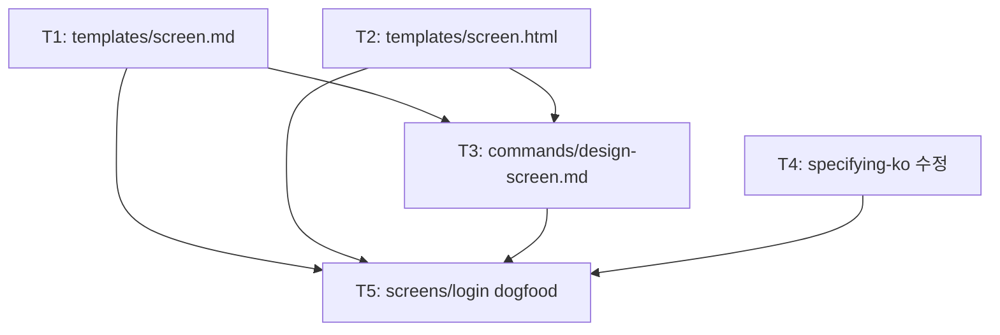

<!-- FID: 20260427-screen-design -->
<!-- OWNER_COMMAND: /tasks -->
<!-- MUTABLE_BY: /implement (상태 마킹만) -->
<!-- layer: Lifecycle-Artifact -->

# Screen Design 통합 태스크 목록 — 20260427-screen-design

> 각 태스크는 TDD 5 스텝(RED → 검증 → GREEN → 검증 → COMMIT)을 따릅니다.

**관련 플랜**: `.specops/20260427-screen-design/plan.md`
**관련 AC**: AC-1, AC-2, AC-3, AC-4, AC-5, AC-6

---

## 태스크 1: templates/screen.md 생성

**파일**:
- Create: `templates/screen.md`

**관련 AC**: AC-2

- [ ] **스텝 1: RED — 검증 명령 실패 확인**

```bash
ls templates/screen.md && echo "FAIL: 이미 존재" || echo "PASS: 없음"
```

기대: `PASS: 없음`

- [ ] **스텝 2: FAIL 검증**

위 명령 출력이 `PASS: 없음` 이면 계속 진행. `FAIL` 이면 중단.

- [ ] **스텝 3: GREEN — 파일 생성**

`templates/screen.md` 를 다음 내용으로 생성:

```
---
screen: {{name}}
title: {{화면 제목}}
created: YYYY-MM-DD
updated: YYYY-MM-DD
---

<!-- reference: specops-auto-ko templates/screen.md -->
<!-- layer: Template -->

# {{화면 제목}} 화면 스펙

> AI 에이전트용 화면 설계 문서. `/design-screen` 커맨드로 생성.
> HTML 미리보기: `screens/{{name}}.html`

## 목적

[이 화면이 사용자에게 하는 일 — 1~2 문장]

## Layout

[헤더]  로고 / 네비게이션
[본문]  메인 컨텐츠 영역
[하단]  액션 버튼 / 링크

## Components

- [ComponentName] — DESIGN.md §4
- [ComponentName] — DESIGN.md §4

## States

- Default: [초기 상태 설명]
- Loading: [로딩 중 상태]
- Error: [에러 발생 상태]
- Success: [성공/완료 상태]

## Interactions

- [요소] 클릭/입력 → [결과 또는 이동할 화면]
- [요소] 클릭/입력 → [결과 또는 이동할 화면]
```

- [ ] **스텝 4: PASS 검증**

```bash
ls templates/screen.md && grep -c "^## " templates/screen.md
```

기대: `5` 이상 (목적·Layout·Components·States·Interactions)

```bash
grep "screen:" templates/screen.md
```

기대: `screen: {{name}}` 라인 출력

- [ ] **스텝 5: COMMIT**

```bash
git add templates/screen.md
git commit -m "feat(screen-design): templates/screen.md 화면 스펙 템플릿 추가"
```

---

## 태스크 2: templates/screen.html 생성

**파일**:
- Create: `templates/screen.html`

**관련 AC**: AC-3

- [ ] **스텝 1: RED — 검증 명령 실패 확인**

```bash
ls templates/screen.html && echo "FAIL: 이미 존재" || echo "PASS: 없음"
```

기대: `PASS: 없음`

- [ ] **스텝 2: FAIL 검증**

위 명령 출력이 `PASS: 없음` 이면 계속 진행.

- [ ] **스텝 3: GREEN — 파일 생성**

`templates/screen.html` 을 다음 내용으로 생성:

```html
<!DOCTYPE html>
<html lang="ko">
<head>
  <meta charset="UTF-8">
  <meta name="viewport" content="width=device-width, initial-scale=1.0">
  <title>{{title}} — 화면 미리보기</title>
  <style>
    /* CSS 변수 — DESIGN.md §1 Color System 1:1 대응 */
    :root {
      --color-primary: #7C3AED;
      --color-secondary: #A78BFA;
      --color-bg: #0F0F10;
      --color-surface: #1A1A1F;
      --color-text: #F9FAFB;
      --color-text-secondary: #9CA3AF;
      --color-error: #EF4444;
      --color-success: #10B981;
      --color-border: #374151;
      --color-accent: #E0C9FF;
      --font-body: Inter, -apple-system, BlinkMacSystemFont, 'Segoe UI', sans-serif;
      --font-code: 'JetBrains Mono', monospace;
      --radius: 8px;
      --radius-lg: 12px;
      --radius-pill: 9999px;
    }

    *, *::before, *::after { box-sizing: border-box; margin: 0; padding: 0; }

    body {
      background-color: var(--color-bg);
      color: var(--color-text);
      font-family: var(--font-body);
      font-size: 1rem;
      line-height: 1.6;
      min-height: 100vh;
      display: flex;
      flex-direction: column;
    }

    .container { max-width: 1200px; margin: 0 auto; padding: 0 24px; }
    .center { display: flex; flex-direction: column; align-items: center; justify-content: center; }

    /* Button — DESIGN.md §4 */
    .btn {
      display: inline-flex;
      align-items: center;
      justify-content: center;
      padding: 8px 16px;
      border-radius: var(--radius);
      font-size: 1rem;
      font-weight: 500;
      cursor: pointer;
      border: none;
      transition: background-color 0.15s, opacity 0.15s;
    }
    .btn-primary { background-color: var(--color-primary); color: white; }
    .btn-primary:hover { background-color: #6D28D9; }
    .btn-secondary {
      background: transparent;
      border: 1px solid var(--color-primary);
      color: var(--color-primary);
    }
    .btn-secondary:hover { background-color: rgba(124,58,237,0.1); }
    .btn:disabled { opacity: 0.5; cursor: not-allowed; }
    .btn-full { width: 100%; }

    /* Input — DESIGN.md §4 */
    .input {
      width: 100%;
      padding: 10px 12px;
      background-color: var(--color-surface);
      border: 1px solid var(--color-border);
      border-radius: var(--radius);
      color: var(--color-text);
      font-size: 1rem;
      font-family: var(--font-body);
      outline: none;
      transition: border-color 0.15s, box-shadow 0.15s;
    }
    .input::placeholder { color: #6B7280; }
    .input:focus { border-color: var(--color-primary); box-shadow: 0 0 0 2px rgba(124,58,237,0.2); }
    .input.error { border-color: var(--color-error); }
    .input-label { display: block; font-size: 0.875rem; color: var(--color-text-secondary); margin-bottom: 6px; }
    .input-group { display: flex; flex-direction: column; gap: 4px; }

    /* Card — DESIGN.md §4 */
    .card {
      background-color: var(--color-surface);
      border: 1px solid var(--color-border);
      border-radius: var(--radius-lg);
      box-shadow: 0 4px 6px -1px rgba(0,0,0,0.3);
      padding: 24px;
    }

    .error-msg { color: var(--color-error); font-size: 0.875rem; margin-top: 4px; }

    a { color: var(--color-secondary); text-decoration: none; }
    a:hover { text-decoration: underline; }
    h1 { font-size: 2rem; font-weight: 700; }
    h2 { font-size: 1.5rem; font-weight: 600; }
  </style>
</head>
<body>
  <!-- 화면 콘텐츠를 여기에 작성 (screen: {{name}}) -->
  <main class="container center" style="flex: 1; padding-top: 64px; padding-bottom: 64px;">
    <div class="card" style="width: 100%; max-width: 400px;">
      <h1 style="font-size: 1.5rem; margin-bottom: 24px;">{{화면 제목}}</h1>
      <p style="color: var(--color-text-secondary);">화면 내용을 여기에 작성합니다.</p>
    </div>
  </main>
</body>
</html>
```

- [ ] **스텝 4: PASS 검증**

```bash
ls templates/screen.html && grep -c "var(--color" templates/screen.html
```

기대: `8` 이상

- [ ] **스텝 5: COMMIT**

```bash
git add templates/screen.html
git commit -m "feat(screen-design): templates/screen.html CSS 변수 기반 HTML 미리보기 템플릿 추가"
```

---

## 태스크 3: commands/design-screen.md 생성

**파일**:
- Create: `commands/design-screen.md`

**관련 AC**: AC-1, AC-5

- [ ] **스텝 1: RED — 검증 명령 실패 확인**

```bash
ls commands/design-screen.md && echo "FAIL: 이미 존재" || echo "PASS: 없음"
```

기대: `PASS: 없음`

- [ ] **스텝 2: FAIL 검증**

위 명령 출력이 `PASS: 없음` 이면 계속 진행.

- [ ] **스텝 3: GREEN — 파일 생성**

`commands/design-screen.md` 를 다음 내용으로 생성:

```
---
name: design-screen
description: 화면 스펙(.md) + HTML 미리보기(.html) 쌍을 screens/ 에 생성/수정 — 프로젝트 UI 화면 설계
triggers:
  - "/design-screen"
mode: ask
specops_version: 0.0.0
specops_layer: Lifecycle-Tool
---

# /design-screen

## 목적

`screens/{name}.md` (화면 스펙) + `screens/{name}.html` (HTML 미리보기)을 생성하거나 수정한다.
DESIGN.md §1 색상·§2 폰트를 CSS 변수로 참조한 정적 HTML을 함께 생성한다.

## Process

### Step 1: 기존 화면 확인

실행:
  ls screens/{name}.md 2>/dev/null

- 존재하면: 사용자에게 확인:
  "이미 `screens/{name}.md`가 존재합니다. 덮어쓸까요? [y/n]"
  - n → 중단. "기존 화면을 유지합니다."
  - y → Step 2 진행 (덮어쓰기)

- 없으면: Step 2 바로 진행

### Step 2: 화면 목적·레이아웃 질문

다음 질문을 제시:

"화면 설계를 시작합니다. 다음 정보를 알려주세요:

1. 이 화면의 목적은 무엇인가요? (1~2 문장)
2. 주요 컴포넌트는 무엇인가요? (예: 로그인 버튼, 이메일 입력)
3. 이 화면에서 다음으로 이동하는 화면이 있나요?"

### Step 3: HTML artifact 생성

`templates/screen.html` 기반으로 다음을 채워 HTML artifact를 생성:
- CSS `:root` 의 `--color-*` 변수는 `DESIGN.md §1`에서 그대로 가져옴
- 화면 레이아웃을 사용자 답변 기반으로 구성
- 컴포넌트는 `templates/screen.html` 의 `.btn`, `.input`, `.card` 클래스 사용

사용자에게 artifact를 보여주고 수정 요청을 받는다:
"위 HTML 미리보기를 확인해 주세요. 수정이 필요하시면 말씀해 주세요. 진행할까요? [y/n]"

수정 요청 시 → HTML artifact 재생성 후 재확인 루프.

### Step 4: 파일 저장

승인 후:

1. screens/ 디렉토리가 없으면 생성:
   mkdir -p screens

2. screens/{name}.md 생성 (templates/screen.md 기반으로 채움):
   - frontmatter: screen, title, created, updated
   - 섹션: 목적, Layout, Components, States, Interactions

3. screens/{name}.html 저장 (Step 3에서 승인한 HTML)

### Step 5: git commit

  git add screens/{name}.md screens/{name}.html
  git commit -m "feat(screens): {name} 화면 설계 추가"

## 사용 예

  /design-screen login
  → "이미 screens/login.md 가 존재합니다. 덮어쓸까요? [y/n]"
  → 사용자: "n" → "기존 화면을 유지합니다." 종료

  /design-screen dashboard
  → "화면 설계를 시작합니다..."
  → 사용자 답변
  → HTML artifact 생성 및 확인
  → 승인 → screens/dashboard.md + screens/dashboard.html 저장
  → git commit

## 참조

- templates/screen.md — 화면 스펙 마크다운 템플릿
- templates/screen.html — HTML 미리보기 템플릿
- DESIGN.md — 디자인 시스템 (색상·폰트·컴포넌트)
- commands/start-design.md — 패턴 참조

---

*specops-auto-ko · 2026-04-27 · FID: 20260427-screen-design*
```

- [ ] **스텝 4: PASS 검증**

```bash
ls commands/design-screen.md && grep "design-screen" commands/design-screen.md | head -2
```

기대: 파일 존재 + `design-screen` 포함 라인 출력

```bash
grep -c "덮어" commands/design-screen.md
```

기대: `1` 이상

- [ ] **스텝 5: COMMIT**

```bash
git add commands/design-screen.md
git commit -m "feat(screen-design): /design-screen 슬래시 커맨드 추가 — 덮어쓰기 방지 포함"
```

---

## 태스크 4: skills/specifying-ko/SKILL.md 수정

**파일**:
- Modify: `skills/specifying-ko/SKILL.md`

**관련 AC**: AC-4

현재 파일의 체크리스트 §1 항목 (28~32번째 줄 근처):

```
1. **프로젝트 맥락 탐색** — 파일·문서·최근 커밋 확인
   - 프로젝트 루트 `DESIGN.md` 존재 확인 (`ls DESIGN.md`)
     → **있으면**: 생성하는 `spec.md` §참조에 "`DESIGN.md` 디자인 시스템 준수" 포함
     → **없으면**: UI 컴포넌트 포함 기능이면 (HTML/CSS/React/Vue 등 시각 렌더링 포함) `/start-design` 실행 안내 (`DESIGN.md` 생성 후 재진입)
```

그리고 프로세스 흐름 다이어그램 (47~49번째 줄 근처):

```
DESIGN.md 존재? ── yes ──▶ spec.md §참조에 "DESIGN.md 디자인 시스템 준수" 포함
    │
    └── no (UI 기능이면 /start-design 안내)
```

- [ ] **스텝 1: RED — 검증 명령 실패 확인**

```bash
count=$(grep -c "screens/" skills/specifying-ko/SKILL.md 2>/dev/null || echo 0)
[ "$count" -ge 2 ] && echo "FAIL: 이미 $count 회" || echo "PASS: $count 회 — 수정 필요"
```

기대: `PASS: 0 회 — 수정 필요`

- [ ] **스텝 2: FAIL 검증**

위 명령이 `PASS` 이면 계속 진행.

- [ ] **스텝 3: GREEN — 파일 수정**

**수정 1**: 체크리스트 §1 — DESIGN.md 감지 블록 바로 아래에 screens/ 감지 블록 추가.

찾아야 할 기존 텍스트 (정확히 일치):
```
     → **없으면**: UI 컴포넌트 포함 기능이면 (HTML/CSS/React/Vue 등 시각 렌더링 포함) `/start-design` 실행 안내 (`DESIGN.md` 생성 후 재진입)
```

이 줄 바로 뒤에 다음 4줄을 추가:
```
   - 프로젝트 루트 `screens/` 존재 확인 (`ls screens/ 2>/dev/null`)
     → **있으면**: 기존 화면 목록 표시 — "현재 N개 화면: {name1}, {name2} ..."
       UI 기능이면: 관련 화면을 `spec.md` §참조에 포함 + HTML artifact 생성 제안
     → **없으면**: UI 기능이면 `screens/` 생성 및 `/design-screen` 활용 안내
```

**수정 2**: 프로세스 흐름 다이어그램 — DESIGN.md 블록 아래에 screens/ 블록 추가.

찾아야 할 기존 텍스트:
```
    └── no (UI 기능이면 /start-design 안내)
    ↓
시각 질문 예상?
```

이 사이에 다음을 삽입:
```
    └── no (UI 기능이면 /start-design 안내)
    ↓
screens/ 존재? ── yes ──▶ 기존 화면 목록 표시 + UI 기능이면 HTML artifact 안내
    │
    └── no (UI 기능이면 screens/ 생성 안내)
    ↓
시각 질문 예상?
```

- [ ] **스텝 4: PASS 검증**

```bash
grep -c "screens/" skills/specifying-ko/SKILL.md
```

기대: `2` 이상 (`screens/` 가 체크리스트와 다이어그램 각 1회 이상)

- [ ] **스텝 5: COMMIT**

```bash
git add skills/specifying-ko/SKILL.md
git commit -m "feat(screen-design): specifying-ko §1 체크리스트에 screens/ 감지 스텝 추가"
```

---

## 태스크 5: screens/login.md + screens/login.html dogfood 생성

**파일**:
- Create: `screens/login.md`
- Create: `screens/login.html`

**관련 AC**: AC-6

- [ ] **스텝 1: RED — 검증 명령 실패 확인**

```bash
ls screens/login.md 2>/dev/null && echo "FAIL: 이미 존재" || echo "PASS: 없음"
```

기대: `PASS: 없음`

- [ ] **스텝 2: FAIL 검증**

위 명령이 `PASS` 이면 계속 진행.

- [ ] **스텝 3a: GREEN — screens/login.md 생성**

먼저 디렉토리 생성:
```bash
mkdir -p screens
```

`screens/login.md` 를 다음 내용으로 생성:

```
---
screen: login
title: 로그인
created: 2026-04-27
updated: 2026-04-27
---

<!-- specops-auto-ko 웹 대시보드 — 가상 로그인 화면 (dogfood) -->

# 로그인 화면 스펙

> HTML 미리보기: screens/login.html

## 목적

specops-auto-ko 웹 대시보드 진입 전 사용자 인증을 처리한다.
이메일과 비밀번호를 입력받아 로그인하고, 성공 시 대시보드로 이동한다.

## Layout

[로고]   specops-auto-ko  (중앙 정렬)
[카드]
  [제목]  로그인
  [폼]
    이메일 Input
    비밀번호 Input
    로그인 Button (Primary, full-width)
  [링크]  "비밀번호를 잊으셨나요?"

## Components

- Input (Email, type="email") — DESIGN.md §4
- Input (Password, type="password") — DESIGN.md §4
- Button (Primary, "로그인", full-width) — DESIGN.md §4
- 텍스트 링크 ("비밀번호를 잊으셨나요?") — color: var(--color-secondary)

## States

- Default: 빈 폼, 로그인 버튼 활성
- Loading: 버튼 비활성 + 텍스트 "로그인 중..."
- Error: Input 테두리 --color-error + 에러 메시지 "이메일 또는 비밀번호가 올바르지 않습니다"
- Success: 대시보드(/dashboard) 화면으로 이동

## Interactions

- 로그인 버튼 클릭 → 인증 요청 → (success) dashboard 화면 / (error) Error 상태
- 비밀번호를 잊으셨나요? 링크 → forgot-password 화면
- Enter 키 (폼 내부) → 로그인 버튼과 동일 동작
```

- [ ] **스텝 3b: GREEN — screens/login.html 생성**

`screens/login.html` 을 다음 내용으로 생성:

```html
<!DOCTYPE html>
<html lang="ko">
<head>
  <meta charset="UTF-8">
  <meta name="viewport" content="width=device-width, initial-scale=1.0">
  <title>로그인 — specops-auto-ko</title>
  <style>
    :root {
      --color-primary: #7C3AED;
      --color-secondary: #A78BFA;
      --color-bg: #0F0F10;
      --color-surface: #1A1A1F;
      --color-text: #F9FAFB;
      --color-text-secondary: #9CA3AF;
      --color-error: #EF4444;
      --color-success: #10B981;
      --color-border: #374151;
      --font-body: Inter, -apple-system, BlinkMacSystemFont, 'Segoe UI', sans-serif;
      --radius: 8px;
      --radius-lg: 12px;
    }
    *, *::before, *::after { box-sizing: border-box; margin: 0; padding: 0; }
    body {
      background-color: var(--color-bg);
      color: var(--color-text);
      font-family: var(--font-body);
      font-size: 1rem;
      line-height: 1.6;
      min-height: 100vh;
      display: flex;
      flex-direction: column;
      align-items: center;
      justify-content: center;
      padding: 24px;
    }
    .logo {
      font-size: 1.125rem;
      font-weight: 700;
      color: var(--color-primary);
      margin-bottom: 32px;
      letter-spacing: -0.02em;
    }
    .card {
      background-color: var(--color-surface);
      border: 1px solid var(--color-border);
      border-radius: var(--radius-lg);
      box-shadow: 0 4px 6px -1px rgba(0,0,0,0.3);
      padding: 32px;
      width: 100%;
      max-width: 400px;
    }
    h1 { font-size: 1.5rem; font-weight: 700; margin-bottom: 24px; }
    .form { display: flex; flex-direction: column; gap: 16px; }
    .input-group { display: flex; flex-direction: column; gap: 6px; }
    label { font-size: 0.875rem; color: var(--color-text-secondary); }
    input {
      width: 100%;
      padding: 10px 12px;
      background-color: var(--color-bg);
      border: 1px solid var(--color-border);
      border-radius: var(--radius);
      color: var(--color-text);
      font-size: 1rem;
      font-family: var(--font-body);
      outline: none;
      transition: border-color 0.15s, box-shadow 0.15s;
    }
    input::placeholder { color: #6B7280; }
    input:focus { border-color: var(--color-primary); box-shadow: 0 0 0 2px rgba(124,58,237,0.2); }
    input.error-input { border-color: var(--color-error); }
    .error-msg { color: var(--color-error); font-size: 0.875rem; display: none; margin-top: -8px; }
    .error-msg.visible { display: block; }
    .btn {
      width: 100%;
      padding: 10px 16px;
      background-color: var(--color-primary);
      color: white;
      border: none;
      border-radius: var(--radius);
      font-size: 1rem;
      font-weight: 500;
      font-family: var(--font-body);
      cursor: pointer;
      transition: background-color 0.15s;
      margin-top: 8px;
    }
    .btn:hover:not(:disabled) { background-color: #6D28D9; }
    .btn:disabled { opacity: 0.5; cursor: not-allowed; }
    .forgot-link {
      display: block;
      text-align: center;
      margin-top: 16px;
      font-size: 0.875rem;
      color: var(--color-secondary);
      text-decoration: none;
    }
    .forgot-link:hover { text-decoration: underline; }
  </style>
</head>
<body>
  <div class="logo">specops-auto-ko</div>
  <div class="card">
    <h1>로그인</h1>
    <form class="form" onsubmit="handleLogin(event)">
      <div class="input-group">
        <label for="email">이메일</label>
        <input id="email" type="email" placeholder="name@example.com" autocomplete="email" required />
      </div>
      <div class="input-group">
        <label for="password">비밀번호</label>
        <input id="password" type="password" placeholder="••••••••" autocomplete="current-password" required />
        <span id="error-msg" class="error-msg">이메일 또는 비밀번호가 올바르지 않습니다</span>
      </div>
      <button id="login-btn" type="submit" class="btn">로그인</button>
    </form>
    <a href="#" class="forgot-link">비밀번호를 잊으셨나요?</a>
  </div>
  <script>
    function handleLogin(e) {
      e.preventDefault();
      const btn = document.getElementById('login-btn');
      const errorMsg = document.getElementById('error-msg');
      const emailInput = document.getElementById('email');
      const passwordInput = document.getElementById('password');
      btn.disabled = true;
      btn.textContent = '로그인 중...';
      errorMsg.classList.remove('visible');
      emailInput.classList.remove('error-input');
      passwordInput.classList.remove('error-input');
      setTimeout(() => {
        btn.disabled = false;
        btn.textContent = '로그인';
        errorMsg.classList.add('visible');
        emailInput.classList.add('error-input');
        passwordInput.classList.add('error-input');
      }, 1000);
    }
  </script>
</body>
</html>
```

- [ ] **스텝 4: PASS 검증**

```bash
ls screens/login.md && ls screens/login.html
```

기대: 두 파일 모두 존재 (exit 0)

```bash
grep -c "^## " screens/login.md
```

기대: `5` 이상

```bash
grep -c "var(--color" screens/login.html
```

기대: `5` 이상

- [ ] **스텝 5: COMMIT**

```bash
git add screens/login.md screens/login.html
git commit -m "feat(screen-design): screens/login dogfood 추가 — 가상 로그인 화면 스펙 + HTML 미리보기"
```

---

## 진행 상태

총 태스크 수: 5
완료: 0 / 5
차단: 0

## AC → Task 매핑

| AC | must/should | Task(s) |
|---|---|---|
| AC-1 | must | 태스크 3 |
| AC-2 | must | 태스크 1 |
| AC-3 | must | 태스크 2 |
| AC-4 | must | 태스크 4 |
| AC-5 | should | 태스크 3 |
| AC-6 | should | 태스크 5 |

**must AC 커버리지**: 4/4 (100%)

---

## 의존 그래프

> `decomposing-ko` 가 작성. `implementing-ko` 가 본 섹션을 파싱해 leaf 자동 라우팅.
> Mermaid (사람용) + YAML (기계용 단일 소스 진실) 병기. 충돌 시 YAML 우선.



```yaml
tasks:
  - id: T1
    depends_on: []
    inputs:
      - ".specops/20260427-screen-design/spec.md"
    outputs:
      - "templates/screen.md"
    ac: ["AC-2"]

  - id: T2
    depends_on: []
    inputs:
      - "DESIGN.md"
    outputs:
      - "templates/screen.html"
    ac: ["AC-3"]

  - id: T3
    depends_on: ["T1", "T2"]
    inputs:
      - "templates/screen.md"
      - "templates/screen.html"
      - "commands/start-design.md"
    outputs:
      - "commands/design-screen.md"
    ac: ["AC-1", "AC-5"]

  - id: T4
    depends_on: []
    inputs:
      - "skills/specifying-ko/SKILL.md"
    outputs:
      - "skills/specifying-ko/SKILL.md"
    ac: ["AC-4"]

  - id: T5
    depends_on: ["T1", "T2", "T3", "T4"]
    inputs:
      - "templates/screen.md"
      - "templates/screen.html"
      - "DESIGN.md"
    outputs:
      - "screens/login.md"
      - "screens/login.html"
    ac: ["AC-6"]
```

## 참조

- `skills/tdd-ko/SKILL.md` — TDD 5 스텝
- `.specops/20260427-screen-design/plan.md` — 상세 설계
- `.specops/20260427-screen-design/acceptance-criteria.md` — 검증 기준
- `scripts/dag/parse-dag.sh` — DAG 파서

---

*작성: decomposing-ko · 2026-04-27 · FID: 20260427-screen-design*
