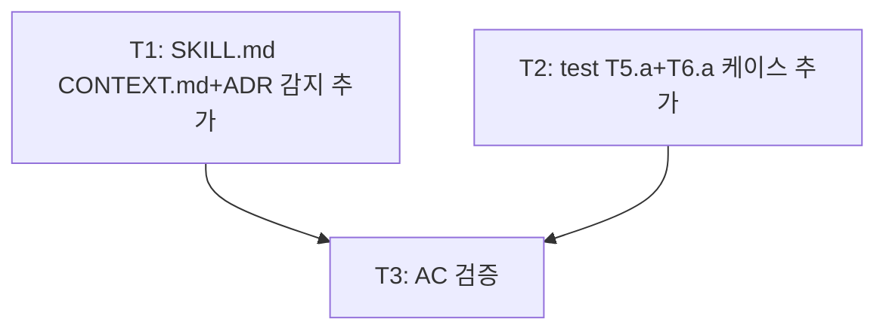

<!-- FID: 20260518-context-adr-auto-ref -->
<!-- OWNER_COMMAND: /tasks -->
<!-- MUTABLE_BY: /implement (상태 마킹만) -->
<!-- reference_upstream: github/spec-kit tasks-template.md + obra/superpowers writing-plans -->
<!-- layer: Lifecycle-Artifact -->

# CONTEXT.md + ADR 자동 참조 레이어 태스크 목록 — 20260518-context-adr-auto-ref

> 각 태스크는 TDD 5 스텝(RED → 검증 → GREEN → 검증 → COMMIT)을 따릅니다.

**관련 플랜**: `.specops/20260518-context-adr-auto-ref/plan.md`
**관련 AC**: AC-1, AC-2, AC-3, AC-4, AC-5, AC-R-1

---

## AC → Task 매핑

| AC | must/should | Task(s) |
|---|---|---|
| AC-1 | must | Task 1 |
| AC-2 | must | Task 1 |
| AC-3 | must | Task 1 |
| AC-4 | must | Task 2 |
| AC-5 | must | Task 3 |
| AC-R-1 | must | Task 3 |

**must AC 커버리지**: 6/6 (100%)

---

## 태스크 1: specifying-ko SKILL.md — CONTEXT.md + ADR 감지 블록 추가

**AC 매핑**: AC-1, AC-2, AC-3
**파일**:
- Modify: `skills/specifying-ko/SKILL.md:65-66`

- [ ] **스텝 1: RED — 감지 지시 부재 확인**

```bash
grep -c "CONTEXT\.md" skills/specifying-ko/SKILL.md
grep -c "docs/adr" skills/specifying-ko/SKILL.md
```

- [ ] **스텝 2: FAIL 검증**

예상: 두 명령 모두 `0`

- [ ] **스텝 3: GREEN — SKILL.md L65 직후에 감지 블록 삽입**

`skills/specifying-ko/SKILL.md`의 L65 (`**회귀 보호 계약** ...` 라인) 직후, L66 (`**유지보수 분기 진입 신호 검사**` 라인) 직전에 다음을 삽입:

```markdown
   - **`CONTEXT.md` 프로젝트 컨텍스트 자동 감지** (v2.1 신규):
     - `ls CONTEXT.md 2>/dev/null` — 부재 시 graceful skip
     - 존재 시: spec.md `§참조`에 `"프로젝트 컨텍스트 — \`CONTEXT.md\`"` 인용
   - **`docs/adr/*.md` Architecture Decision Records 자동 감지** (v2.1 신규):
     - `ls docs/adr/*.md 2>/dev/null | wc -l` — 0이면 graceful skip
     - N > 0이면: spec.md `§참조`에 `"아키텍처 결정 기록 — \`docs/adr/\` (N건)"` 인용
```

- [ ] **스텝 4: PASS 검증**

```bash
# AC-1
grep -c "CONTEXT\.md" skills/specifying-ko/SKILL.md
# AC-2
grep -c "docs/adr" skills/specifying-ko/SKILL.md
# AC-3
grep -A3 "CONTEXT\.md" skills/specifying-ko/SKILL.md | grep -c "graceful skip\|부재"
```

예상: AC-1 → 1 이상, AC-2 → 1 이상, AC-3 → 1 이상

- [ ] **스텝 5: COMMIT**

```bash
git add skills/specifying-ko/SKILL.md
git commit -m "feat(specifying-ko): v2.1 CONTEXT.md + docs/adr/ 자동 감지 추가 — graceful skip 패턴 준용"
```

---

## 태스크 2: test-memory-references.sh — T5.a + T6.a 케이스 추가

**AC 매핑**: AC-4
**파일**:
- Modify: `scripts/tests/test-memory-references.sh:60`

- [ ] **스텝 1: RED — T5.a/T6.a 케이스 부재 확인**

```bash
grep -c "T5\.a\|T6\.a" scripts/tests/test-memory-references.sh
```

- [ ] **스텝 2: FAIL 검증**

예상: `0`

- [ ] **스텝 3: GREEN — L60 (echo "") 직전에 T5.a + T6.a 삽입**

`scripts/tests/test-memory-references.sh`의 `echo ""` (L60) 직전에 다음을 삽입:

```bash
# ── T5.a 정적: SKILL.md 가 CONTEXT.md 감지 명시 ──
if grep -q "CONTEXT\.md" "$SKILL"; then
  ok "T5.a SKILL.md — CONTEXT.md 자동 감지 명시"
else
  nope "T5.a CONTEXT.md 감지" "SKILL.md에 CONTEXT.md 언급 없음"
fi

# ── T6.a 정적: SKILL.md 가 docs/adr/ 감지 명시 ──
if grep -q "docs/adr" "$SKILL"; then
  ok "T6.a SKILL.md — docs/adr/ 자동 감지 명시"
else
  nope "T6.a ADR 감지" "SKILL.md에 docs/adr 언급 없음"
fi

```

- [ ] **스텝 4: PASS 검증**

```bash
bash scripts/tests/test-memory-references.sh 2>&1
```

예상: `PASS T5.a`, `PASS T6.a` 포함, `PASS=6 FAIL=0`

- [ ] **스텝 5: COMMIT**

```bash
git add scripts/tests/test-memory-references.sh
git commit -m "test(memory-references): T5.a CONTEXT.md + T6.a ADR 정적 검증 케이스 추가"
```

---

## 태스크 3: AC 검증

**AC 매핑**: AC-5, AC-R-1
**파일**: 읽기 전용

- [ ] **스텝 1: RED — Task 1·2 완료 전 상태 확인 (참고용)**

```bash
echo "AC-1:" && grep -c "CONTEXT\.md" skills/specifying-ko/SKILL.md
echo "AC-2:" && grep -c "docs/adr" skills/specifying-ko/SKILL.md
echo "AC-4 T5:" && bash scripts/tests/test-memory-references.sh 2>&1 | grep "T5\|T6"
echo "AC-R-1:" && bash scripts/tests/test-memory-references.sh 2>&1 | grep "T[1-4]\.a"
```

- [ ] **스텝 2: FAIL 검증**

Task 1·2 완료 전: AC-1=0, AC-2=0, T5/T6 없음

- [ ] **스텝 3: GREEN — Task 1·2 완료 후 재실행**

Task 1·2가 완료된 상태에서 스텝 1 명령 재실행.

- [ ] **스텝 4: PASS 검증**

```bash
bash scripts/_internal/validate-structure.sh 2>&1
bash scripts/tests/test-memory-references.sh 2>&1 | tail -5
```

예상: validate-structure 전 항목 ✅, test PASS=6 FAIL=0

- [ ] **스텝 5: COMMIT**

Task 3은 검증만 — 코드 변경 없음. 커밋 불필요.

---

## 진행 상태

총 태스크 수: 3
완료: 0 / 3
차단: 0

## 의존 그래프

> Mermaid (사람용) + YAML (기계용 단일 소스 진실). 충돌 시 YAML 우선.



```yaml
tasks:
  - id: T1
    test_command: "bash scripts/tests/test-memory-references.sh"
    depends_on: []
    inputs: []
    outputs: [skills/specifying-ko/SKILL.md]
    ac: [AC-1, AC-2, AC-3]
  - id: T2
    test_command: "bash scripts/tests/test-memory-references.sh"
    depends_on: []
    inputs: [skills/specifying-ko/SKILL.md]
    outputs: [scripts/tests/test-memory-references.sh]
    ac: [AC-4]
  - id: T3
    test_command: "bash scripts/_internal/validate-structure.sh"
    depends_on: [T1, T2]
    inputs: [skills/specifying-ko/SKILL.md, scripts/tests/test-memory-references.sh]
    outputs: []
    ac: [AC-5, AC-R-1]
```

## 참조

- `skills/specifying-ko/SKILL.md` — 수정 대상
- `scripts/tests/test-memory-references.sh` — 수정 대상
- `scripts/dag/parse-dag.sh` — DAG 파싱

---

*작성: andyko · 2026-05-18 · FID: 20260518-context-adr-auto-ref · 생성 커맨드: /tasks*
