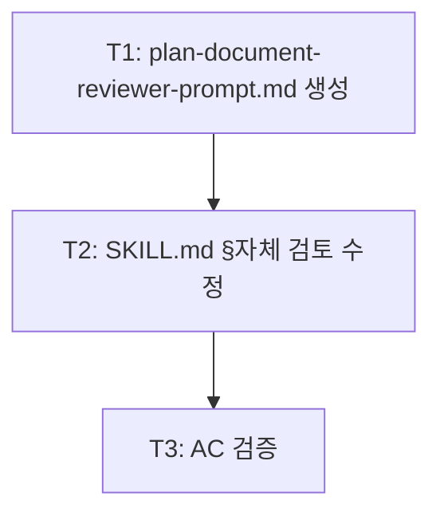

<!-- FID: 20260518-plan-doc-reviewer -->
<!-- OWNER_COMMAND: /tasks -->
<!-- MUTABLE_BY: /implement (상태 마킹만) -->
<!-- reference_upstream: github/spec-kit tasks-template.md + obra/superpowers writing-plans -->
<!-- layer: Lifecycle-Artifact -->

# Plan Document Reviewer 태스크 목록 — 20260518-plan-doc-reviewer

> 각 태스크는 TDD 5 스텝(RED → 검증 → GREEN → 검증 → COMMIT)을 따릅니다.

**관련 플랜**: `.specops/20260518-plan-doc-reviewer/plan.md`
**관련 AC**: AC-1, AC-2, AC-3, AC-4, AC-R-1

---

## AC → Task 매핑

| AC | must/should | Task(s) |
|---|---|---|
| AC-1 | must | Task 2 |
| AC-2 | must | Task 1 |
| AC-3 | must | Task 1 |
| AC-4 | must | Task 3 |
| AC-R-1 | must | Task 2 |

**must AC 커버리지**: 5/5 (100%)

---

## 태스크 1: plan-document-reviewer-prompt.md 신규 생성

**AC 매핑**: AC-2, AC-3
**파일**:
- Create: `skills/planning-ko/plan-document-reviewer-prompt.md`

- [ ] **스텝 1: RED — 파일 부재 확인**

```bash
[ -f skills/planning-ko/plan-document-reviewer-prompt.md ] && echo "EXISTS" || echo "MISSING"
```

- [ ] **스텝 2: FAIL 검증**

```bash
[ -f skills/planning-ko/plan-document-reviewer-prompt.md ] && echo "EXISTS" || echo "MISSING"
```

예상: `MISSING`

- [ ] **스텝 3: GREEN — 파일 생성**

`skills/planning-ko/plan-document-reviewer-prompt.md` 를 아래 내용으로 생성:

```markdown
# Plan Document Reviewer

You are a Plan Document Reviewer. Your job is to review an implementation plan against its spec to ensure it is complete and correct before task decomposition begins.

## Your Task

Read the following two files for FID `<FID>` (the caller will provide the exact paths):
1. `.specops/<FID>/spec.md` — the specification this plan must implement
2. `.specops/<FID>/plan.md` — the implementation plan to review

## Review Criteria

Check these 4 axes:

### 1. Completeness
Does the plan cover all FRs listed in the spec? List any FRs that have no corresponding task or category.

### 2. Spec Alignment
Are the plan's tasks consistent with what the spec requires? Flag any tasks that contradict the spec's scope or constraints.

### 3. Task Decomposition
Are tasks appropriately sized (2–5 minutes each)? Are there placeholders (TBD, TODO, "similar to Task N")? Flag them.

### 4. Buildability
Can the plan be built as described? Are file paths exact? Are code snippets complete and non-placeholder?

## Output Format

Return exactly one of:

`APPROVED`

— or —

`ISSUES FOUND:
- [Axis] <issue description>
- [Axis] <issue description>`

**Approve unless serious gaps.** Minor style issues, small omissions, or nitpicks do not warrant ISSUES FOUND. Only flag issues that would cause the implementation to fail or miss spec requirements.
```

- [ ] **스텝 4: PASS 검증**

```bash
grep -E "Completeness|Spec Alignment|Task Decomposition|Buildability" skills/planning-ko/plan-document-reviewer-prompt.md | wc -l | tr -d ' '
grep -E "APPROVED|ISSUES FOUND" skills/planning-ko/plan-document-reviewer-prompt.md | wc -l | tr -d ' '
```

예상: 첫 명령 `4` 이상, 둘째 명령 `1` 이상

- [ ] **스텝 5: COMMIT**

```bash
git add skills/planning-ko/plan-document-reviewer-prompt.md
git commit -m "feat(planning-ko): plan-document-reviewer-prompt.md 신규 생성 — obra 패턴 4축 검토"
```

---

## 태스크 2: SKILL.md §자체 검토 수정 — dispatch 지시 추가

**AC 매핑**: AC-1, AC-R-1
**파일**:
- Modify: `skills/planning-ko/SKILL.md:130-141`

- [ ] **스텝 1: RED — dispatch 지시 부재 확인**

```bash
grep -c "plan-document-reviewer" skills/planning-ko/SKILL.md
```

- [ ] **스텝 2: FAIL 검증**

```bash
grep -c "plan-document-reviewer" skills/planning-ko/SKILL.md
```

예상: `0`

- [ ] **스텝 3: GREEN — SKILL.md 수정**

`skills/planning-ko/SKILL.md` L130 `## 자체 검토` 섹션을 다음으로 교체:

**현재 (L130-141)**:
```
## 자체 검토

완전한 플랜 작성 후, 새 눈으로 스펙과 대조. **이것은 자체 체크리스트**이지 서브에이전트 디스패치가 아님.

**1. 스펙 커버리지**: 스펙의 각 섹션/요구를 훑어보고, 그 요구를 구현하는 태스크를 짚을 수 있는가? 누락 나열.

**2. 플레이스홀더 스캔**: "플레이스홀더 금지" 섹션의 레드 플래그 검색. 수정.

**3. 타입 일관성**: 후반 태스크에서 쓴 타입·메서드 시그니처·속성명이 전반 태스크에서 정의한 것과 일치하는가? Task 3에서 `clearLayers()`였는데 Task 7에서 `clearFullLayers()`라면 버그.

이슈 발견 시 인라인 수정. 재검토 불필요 — 수정하고 진행. 스펙 요구에 태스크가 없으면 **태스크 추가**.
```

**변경 후**:
```
## 자체 검토

완전한 플랜 작성 후, 새 눈으로 스펙과 대조.

**1. 스펙 커버리지**: 스펙의 각 섹션/요구를 훑어보고, 그 요구를 구현하는 태스크를 짚을 수 있는가? 누락 나열.

**2. 플레이스홀더 스캔**: "플레이스홀더 금지" 섹션의 레드 플래그 검색. 수정.

**3. 타입 일관성**: 후반 태스크에서 쓴 타입·메서드 시그니처·속성명이 전반 태스크에서 정의한 것과 일치하는가? Task 3에서 `clearLayers()`였는데 Task 7에서 `clearFullLayers()`라면 버그.

이슈 발견 시 인라인 수정. 재검토 불필요 — 수정하고 진행. 스펙 요구에 태스크가 없으면 **태스크 추가**.

### Plan Document Reviewer (독립 서브에이전트 검증)

자체 체크리스트 완료 후, `skills/planning-ko/plan-document-reviewer-prompt.md`의 지시를 따라 **general-purpose 서브에이전트를 dispatch**한다. 서브에이전트는 신선한 컨텍스트로 `.specops/<FID>/spec.md`와 `.specops/<FID>/plan.md`를 대조 검증한다.

- **APPROVED**: decomposing-ko 진입 허용
- **ISSUES FOUND: \<상세\>**: plan.md에 이슈를 반영한 후 session-progress append로 진행. 심각한 갭(스펙 커버리지 누락·전면 재설계 필요)이면 사용자에게 알리고 확인 후 진행.
```

- [ ] **스텝 4: PASS 검증**

```bash
# AC-1: dispatch 지시 존재
grep -n "plan-document-reviewer" skills/planning-ko/SKILL.md

# AC-R-1: 기존 chain 무손상 — decomposing-ko + session-progress-append 지시 보존
grep -n "decomposing-ko\|session-progress-append" skills/planning-ko/SKILL.md
```

예상: 첫 명령 1건 이상, 둘째 명령 기존 라인 보존 (2건 이상)

- [ ] **스텝 5: COMMIT**

```bash
git add skills/planning-ko/SKILL.md
git commit -m "feat(planning-ko): §자체 검토 후 Plan Document Reviewer 서브에이전트 dispatch 추가

자기평가 편향 제거 — 독립 서브에이전트가 spec.md·plan.md 대조 검증.
관련 AC: AC-1, AC-R-1"
```

---

## 태스크 3: AC 검증

**AC 매핑**: AC-1, AC-2, AC-3, AC-4, AC-R-1 전체
**파일**: 읽기 전용 검증

- [ ] **스텝 1: RED — 검증 명령 준비**

```bash
echo "AC-1 dispatch 지시:"
grep -c "plan-document-reviewer" skills/planning-ko/SKILL.md
echo "AC-2 4축:"
grep -E "Completeness|Spec Alignment|Task Decomposition|Buildability" skills/planning-ko/plan-document-reviewer-prompt.md | wc -l | tr -d ' '
echo "AC-3 판정 형식:"
grep -E "APPROVED|ISSUES FOUND" skills/planning-ko/plan-document-reviewer-prompt.md | wc -l | tr -d ' '
echo "AC-4 validate-structure:"
bash scripts/_internal/validate-structure.sh 2>&1 | grep -E "✅|❌|PASS|FAIL"
echo "AC-R-1 chain 보존:"
grep -c "decomposing-ko" skills/planning-ko/SKILL.md
```

- [ ] **스텝 2: FAIL 검증**

Task 1·2 완료 전 실행 시 예상:
- AC-1: `0` (dispatch 지시 없음)
- AC-2: `0` (파일 없음)
- AC-3: `0` (파일 없음)

- [ ] **스텝 3: GREEN — Task 1·2 완료 후 재실행**

Task 1·2가 완료된 상태에서 스텝 1의 명령을 다시 실행.

- [ ] **스텝 4: PASS 검증**

```bash
bash scripts/tests/test-validate-structure.sh 2>&1 | tail -5
bash scripts/_internal/validate-structure.sh 2>&1 | grep -E "✅|❌"
```

예상: `validate-structure.sh` 전 항목 ✅ PASS

- [ ] **스텝 5: COMMIT**

Task 3은 검증만 — 코드 변경 없음. 커밋 불필요.

---

## 진행 상태

총 태스크 수: 3
완료: 0 / 3
차단: 0

## 의존 그래프

> Mermaid (사람용) + YAML (기계용 단일 소스 진실). 충돌 시 YAML 우선.



```yaml
tasks:
  - id: T1
    test_command: "bash scripts/_internal/validate-structure.sh"
    depends_on: []
    inputs: []
    outputs: [skills/planning-ko/plan-document-reviewer-prompt.md]
    ac: [AC-2, AC-3]
  - id: T2
    test_command: "bash scripts/_internal/validate-structure.sh"
    depends_on: [T1]
    inputs: [skills/planning-ko/plan-document-reviewer-prompt.md]
    outputs: [skills/planning-ko/SKILL.md]
    ac: [AC-1, AC-R-1]
  - id: T3
    test_command: "bash scripts/_internal/validate-structure.sh"
    depends_on: [T2]
    inputs: [skills/planning-ko/SKILL.md, skills/planning-ko/plan-document-reviewer-prompt.md]
    outputs: []
    ac: [AC-4]
```

## 참조

- `skills/tdd-ko/SKILL.md`
- `skills/sprint-contracts-ko/SKILL.md`
- `scripts/dag/parse-dag.sh`

---

*작성: andyko · 2026-05-18 · FID: 20260518-plan-doc-reviewer · 생성 커맨드: /tasks*
