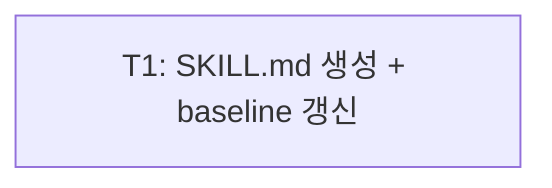

<!-- FID: 20260519-finishing-dev-branch-ko -->
<!-- OWNER_COMMAND: /tasks -->
<!-- MUTABLE_BY: /implement (상태 마킹만) -->
<!-- layer: Lifecycle-Artifact -->

# finishing-a-development-branch-ko 태스크 목록 — 20260519-finishing-dev-branch-ko

> 각 태스크는 TDD 5 스텝(RED → 검증 → GREEN → 검증 → COMMIT)을 따릅니다. 본 FID는 SKILL.md(markdown) 생성이므로 TDD RED/GREEN은 validate-structure.sh + test-skill-conventions.sh 기반.

**관련 플랜**: `.specops/20260519-finishing-dev-branch-ko/plan.md`
**관련 AC**: AC-1, AC-2, AC-3, AC-4, AC-5, AC-6, AC-7, AC-8, AC-9, AC-10, AC-R-1, AC-R-2

---

## 태스크 1: SKILL.md 생성 + baseline 갱신

**파일**:
- Create: `skills/finishing-a-development-branch-ko/SKILL.md`
- Modify: `scripts/_internal/.structure-baseline` (skills count 24→25)

**관련 AC**: AC-1, AC-2, AC-3, AC-4, AC-5, AC-6, AC-7, AC-8, AC-9, AC-10, AC-R-1, AC-R-2

- [ ] **스텝 1: RED — 파일 미존재 + baseline 갱신 후 validate FAIL 확인**

```bash
# SKILL.md 미존재 확인 (RED 조건)
ls skills/finishing-a-development-branch-ko/SKILL.md 2>&1
# 예상: No such file or directory

# baseline을 25로 먼저 갱신 → validate-structure.sh FAIL (파일 없어서 count 불일치)
sed -i '' 's/{"category":"skills","glob":"skills\/\*\/SKILL.md","count":24}/{"category":"skills","glob":"skills\/*\/SKILL.md","count":25}/' scripts/_internal/.structure-baseline
bash scripts/_internal/validate-structure.sh 2>&1 | grep "file_counts"
# 예상: ❌ file_counts: FAIL
```

- [ ] **스텝 2: FAIL 검증**

실행: `bash scripts/_internal/validate-structure.sh 2>&1 | grep file_counts`
기대: `❌ file_counts: FAIL`

- [ ] **스텝 3: GREEN — SKILL.md 생성**

```bash
mkdir -p skills/finishing-a-development-branch-ko
```

파일 `skills/finishing-a-development-branch-ko/SKILL.md` 생성 (아래 전체 내용):

```markdown
---
name: finishing-a-development-branch-ko
description: feature branch 작업 완료 후 worktree 정리·branch 삭제·main 동기화를 체계적으로 수행하는 Lifecycle 최종 정리 스킬
layer: 2
reference_upstream: obra/superpowers@v5.0.7 skills/finishing-a-development-branch/SKILL.md
specops_version: 1.0.0
used_by: specops-auto-ko:using-git-worktrees-ko (짝 스킬 — 작업 완료 후 호출)
---

# Engine 스킬 — 개발 브랜치 정리 (finishing-a-development-branch)

## 개요

feature branch 작업·PR 머지가 완료된 후 **worktree 제거 → local/remote branch 삭제 → main 동기화** 순서로 저장소를 클린 상태로 복원한다.

**핵심 원칙**: 미머지 브랜치 강제 삭제 금지. remote 삭제는 반드시 사용자 확인 후.

**시작 시 선언**: "specops-auto-ko:finishing-a-development-branch-ko 스킬로 브랜치 정리를 시작합니다."

## 체크리스트

### Step 1: 현재 상태 확인

```bash
# 현재 브랜치 확인
git branch --show-current

# 미커밋 변경 확인
git status --short

# 미push 커밋 확인 (비어있어야 정상)
git log origin/$(git branch --show-current)..HEAD --oneline 2>/dev/null \
  | head -5
```

**HARD GATE**: 미커밋 변경이 있으면 중단 — "미커밋 변경이 있습니다. 커밋·stash 후 재실행하세요."

### Step 2: PR 상태 확인

**gh CLI 가용 시**:
```bash
gh pr view --json state,number,title 2>/dev/null
```
- `state: MERGED` → 계속 진행
- `state: OPEN` 또는 `CLOSED` → HARD GATE: "PR이 아직 머지되지 않았습니다. 머지 후 재실행하세요."

**gh CLI 미가용 시 (fallback)**:
```bash
# 로컬 브랜치가 origin/main 에 포함되어 있으면 머지된 것으로 간주
FEAT_BRANCH=$(git branch --show-current)
UNMERGED=$(git log origin/main.."$FEAT_BRANCH" --oneline 2>/dev/null | wc -l | tr -d ' ')
if [ "$UNMERGED" -gt 0 ]; then
  echo "⚠️ 경고: origin/main 에 없는 커밋 ${UNMERGED}건. PR이 머지됐나요? [y/n]"
  # 사용자 응답 대기
fi
```

### Step 3: Worktree 정리

```bash
# 현재 FID 관련 worktree 탐색
git worktree list | grep ".worktrees/"

# 각 worktree 제거
git worktree list | grep ".worktrees/" | awk '{print $1}' | while read wt; do
  echo "Removing worktree: $wt"
  git worktree remove --force "$wt"
done
```

worktree가 없으면 "worktree 없음 — 스킵" 출력 후 다음 단계.

### Step 4: 로컬 feature branch 삭제

```bash
FEAT_BRANCH=$(git branch --show-current)

# main으로 먼저 이동
git checkout main

# 안전 삭제 (미머지 시 에러 발생 — 의도적)
git branch -d "$FEAT_BRANCH"
```

**HARD GATE**: `git branch -d` 가 "not fully merged" 에러 발생 시:
- `-D` 강제 삭제 **금지**
- "브랜치가 완전히 머지되지 않았습니다. PR 상태를 확인하세요." 출력 후 중단
- 사용자가 명시적으로 `-D` 를 요청해야만 실행

### Step 5: Remote branch 삭제 (사용자 확인)

```bash
echo "remote branch 'feat/<FID>'를 삭제하시겠습니까? [y/n]"
# 사용자 응답 대기
# y 시:
git push origin --delete "$FEAT_BRANCH"
# n 시: "remote branch 유지. 나중에 수동 삭제: git push origin --delete $FEAT_BRANCH"
```

### Step 6: main 동기화

```bash
git checkout main
git pull origin main
echo "✅ main 동기화 완료"
```

### Step 7: 정리 확인

```bash
echo "=== 잔류 worktree 확인 ==="
git worktree list

echo "=== 잔류 로컬 브랜치 확인 ==="
git branch

echo "=== 정리 완료 ==="
```

feat/<FID> 브랜치와 관련 worktree가 목록에 없으면 정리 성공.

## 5원칙 주입 (specops-auto-ko 고유)

| 원칙 | 본 스킬 적용 |
|---|---|
| 1 **투명성** | 각 단계 실행 전 "무엇을 하려 하는지" 1줄 출력 |
| 2 **문지기** | 미머지 상태에서 `-D` 강제 삭제 절대 금지. remote 삭제 전 반드시 확인 |
| 3 **깊이** | PR 상태를 실제 확인 — "아마 머지됐겠지" 추측 금지 |
| 4 **주권 존중** | remote branch 삭제는 사용자가 결정. 자동 삭제 금지 |
| 5 **한계 고백** | gh CLI 미가용 시 git log fallback 사용 — "머지 여부를 완전히 확인할 수 없음" 명시 |

## 참조

- 짝 스킬: `skills/using-git-worktrees-ko/SKILL.md` — worktree 생성 측
- upstream 참조: `obra/superpowers@v5.0.7 skills/finishing-a-development-branch/SKILL.md`

## 다음 skill

본 스킬은 Lifecycle의 **최종 정리 단계**다. 정리 완료 후 chain을 시작하지 않는다.

다음 기능 작업은 `/start "<기능>"` 또는 `/maintain "<대상>"` 으로 새 Lifecycle을 시작한다.
```

- [ ] **스텝 4: PASS 검증**

실행:
```bash
bash scripts/tests/test-skill-conventions.sh
bash scripts/_internal/validate-structure.sh
```

기대:
- `test-skill-conventions.sh`: `PASS=5 FAIL=0`
- `validate-structure.sh`: 전 항목 ✅ (file_counts: OK 포함)

- [ ] **스텝 5: COMMIT**

```bash
git add skills/finishing-a-development-branch-ko/SKILL.md
git add scripts/_internal/.structure-baseline
git commit -m "feat(finishing-a-development-branch-ko): SKILL.md 신규 생성 — worktree 정리·branch 삭제·main 동기화 Lifecycle 최종 정리 스킬

- frontmatter 6필드: name·description·layer·reference_upstream·specops_version·used_by
- Step 1~7: 상태확인·PR확인·worktree정리·local삭제·remote삭제·main동기화·정리확인
- 5원칙 주입 + 다음 skill (chain 종료)
- baseline skills count 24→25

관련 AC: AC-1 AC-2 AC-3 AC-4 AC-5 AC-6 AC-7 AC-8 AC-9 AC-10 AC-R-1 AC-R-2"
```

---

## AC → Task 매핑

| AC | must/should | Task(s) |
|---|---|---|
| AC-1 | must | T1 |
| AC-2 | must | T1 |
| AC-3 | must | T1 |
| AC-4 | must | T1 |
| AC-5 | must | T1 |
| AC-6 | must | T1 |
| AC-7 | must | T1 |
| AC-8 | must | T1 |
| AC-9 | must | T1 |
| AC-10 | must | T1 |
| AC-R-1 | must | T1 |
| AC-R-2 | must | T1 |

**must AC 커버리지**: 12/12 (100%)

## 진행 상태

총 태스크 수: 1
완료: 0 / 1
차단: 0

## 의존 그래프 (v0.4a 의무)

> `decomposing-ko` 가 작성. `implementing-ko` 가 본 섹션을 파싱해 leaf 자동 라우팅.
> Mermaid (사람용) + YAML (기계용 단일 소스 진실) 병기. 충돌 시 YAML 우선.



```yaml
tasks:
  - id: T1
    test_command: "bash scripts/tests/test-skill-conventions.sh && bash scripts/_internal/validate-structure.sh"
    depends_on: []
    inputs: []
    outputs:
      - skills/finishing-a-development-branch-ko/SKILL.md
      - scripts/_internal/.structure-baseline
    ac: [AC-1, AC-2, AC-3, AC-4, AC-5, AC-6, AC-7, AC-8, AC-9, AC-10, AC-R-1, AC-R-2]
```

## 참조

- `skills/tdd-ko/SKILL.md` — TDD 5 스텝
- `skills/decomposing-ko/SKILL.md` — 본 템플릿 작성 책임
- `scripts/dag/parse-dag.sh` — DAG 파서 (v0.4a W1)

---

*작성: decomposing-ko · 2026-05-19 · FID: 20260519-finishing-dev-branch-ko · 생성 커맨드: /tasks*
