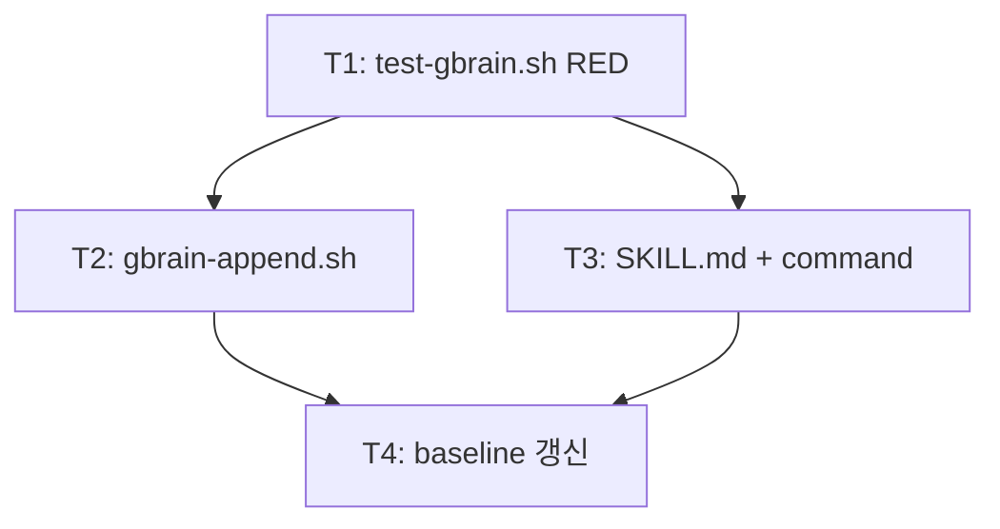

<!-- FID: 20260519-gbrain-skill -->
<!-- OWNER_COMMAND: /decompose -->
<!-- layer: Lifecycle-Artifact -->

# Tasks — 20260519-gbrain-skill

## AC → Task 매핑

| AC | must/should | Task(s) |
|---|---|---|
| AC-1 | must | T1, T2 |
| AC-2 | must | T1, T2 |
| AC-3 | must | T1, T2 |
| AC-4 | must | T1, T3 |
| AC-5 | must | T1, T3 |
| AC-6 | must | T1, T3 |
| AC-7 | should | T2 |
| AC-R-1 | must | T4 |

**must AC 커버리지**: 7/7 (100%)

---

### Task 1 (T1): test-gbrain.sh 작성 (RED)

**AC 매핑**: AC-1, AC-2, AC-3, AC-4, AC-5, AC-6, AC-R-1
**파일**:
- Create: `scripts/tests/test-gbrain.sh`

- [ ] **Step 1: RED — 테스트 파일 작성**

```bash
cat > scripts/tests/test-gbrain.sh << 'EOF'
#!/usr/bin/env bash
set -u
PASS=0; FAIL=0
PLUGIN=$(cd "$(dirname "$0")/../.." && pwd)

run() {
  local desc="$1"; shift
  if "$@" 2>/dev/null; then PASS=$((PASS+1)); echo "PASS: $desc"
  else FAIL=$((FAIL+1)); echo "FAIL: $desc"; fi
}

# T1.a: gbrain-append.sh 존재
run "T1.a gbrain-append.sh 존재" \
  test -f "$PLUGIN/scripts/gbrain-append.sh"

# T1.b: usage 출력 (인자 없음 → exit 1)
T1_b() {
  bash "$PLUGIN/scripts/gbrain-append.sh" 2>&1 | grep -qi "usage\|insight" && \
  ! bash "$PLUGIN/scripts/gbrain-append.sh" >/dev/null 2>&1
}
run "T1.b usage 출력 exit 1" T1_b

# T2.a: JSONL 레코드 추가 (ts·fid·insight·tags 포함)
T2_a() {
  local tmp
  tmp=$(mktemp)
  GBRAIN_FILE="$tmp" bash "$PLUGIN/scripts/gbrain-append.sh" "테스트 인사이트" 2>/dev/null
  local result
  result=$(cat "$tmp")
  rm -f "$tmp"
  echo "$result" | grep -q '"insight"' && \
  echo "$result" | grep -q '"ts"' && \
  echo "$result" | grep -q '"tags"'
}
run "T2.a JSONL 레코드 추가" T2_a

# T3.a: 파일 미존재 시 자동 생성
T3_a() {
  local tmpdir tmp
  tmpdir=$(mktemp -d)
  tmp="$tmpdir/learnings.jsonl"
  GBRAIN_FILE="$tmp" bash "$PLUGIN/scripts/gbrain-append.sh" "첫 인사이트" 2>/dev/null
  local ret=0
  test -f "$tmp" || ret=1
  rm -rf "$tmpdir"
  return $ret
}
run "T3.a 파일 미존재 시 자동 생성" T3_a

# T4.a: SKILL.md 존재 + frontmatter 6 필드
T4_a() {
  local count
  count=$(grep -c "^name:\|^description:\|^layer:\|^reference_upstream:\|^specops_version:\|^used_by:" \
    "$PLUGIN/skills/gbrain-ko/SKILL.md" 2>/dev/null || echo 0)
  [ "$count" -ge 6 ]
}
run "T4.a SKILL.md frontmatter 6 필드" T4_a

# T5.a: SKILL.md 조회 프로세스 언급
run "T5.a SKILL.md 조회 프로세스 언급" \
  grep -q "learnings.jsonl\|tail\|최신" "$PLUGIN/skills/gbrain-ko/SKILL.md" 2>/dev/null

# T6.a: commands/gbrain.md 존재
run "T6.a commands/gbrain.md 존재" \
  test -f "$PLUGIN/commands/gbrain.md"

# T6.b: gbrain-ko 언급
run "T6.b commands/gbrain.md gbrain-ko 언급" \
  grep -q "gbrain-ko" "$PLUGIN/commands/gbrain.md" 2>/dev/null

# T7.a: --fid 레코드 기록 (should)
T7_a() {
  local tmp
  tmp=$(mktemp)
  GBRAIN_FILE="$tmp" bash "$PLUGIN/scripts/gbrain-append.sh" "인사이트A" --fid "fid-A" 2>/dev/null
  GBRAIN_FILE="$tmp" bash "$PLUGIN/scripts/gbrain-append.sh" "인사이트B" --fid "fid-B" 2>/dev/null
  local ret=0
  grep -q '"fid-A"' "$tmp" && grep -q '"fid-B"' "$tmp" || ret=1
  rm -f "$tmp"
  return $ret
}
run "T7.a --fid 레코드 기록" T7_a

echo "PASS=$PASS FAIL=$FAIL"
[ "$FAIL" -eq 0 ] && exit 0 || exit 1
EOF
chmod +x scripts/tests/test-gbrain.sh
```

- [ ] **Step 2: FAIL 검증**

```bash
bash scripts/tests/test-gbrain.sh
```

예상: `FAIL=8` 이상 (모든 대상 파일 미존재)

- [ ] **Step 3: GREEN — 없음 (RED 단계만)**

테스트 파일 자체가 산출물. 구현은 T2·T3에서.

- [ ] **Step 4: PASS 검증 — 해당 없음**

T1은 RED 단계. FAIL이 맞는 결과.

- [ ] **Step 5: COMMIT**

```bash
git add scripts/tests/test-gbrain.sh
git commit -m "test(red): test-gbrain.sh 작성 — AC-1~AC-7 정적 검증 9케이스 (FID 20260519-gbrain-skill)"
```

---

### Task 2 (T2): gbrain-append.sh 구현

**AC 매핑**: AC-1, AC-2, AC-3, AC-7
**파일**:
- Create: `scripts/gbrain-append.sh`
- Test: `scripts/tests/test-gbrain.sh`

- [ ] **Step 1: RED — 현재 T1.a/T1.b/T2.a/T3.a/T7.a 실패 확인**

```bash
bash scripts/tests/test-gbrain.sh 2>/dev/null | grep "^FAIL"
```

예상: `FAIL: T1.a`, `FAIL: T1.b`, `FAIL: T2.a`, `FAIL: T3.a`, `FAIL: T7.a` 포함

- [ ] **Step 2: FAIL 검증**

```bash
bash scripts/tests/test-gbrain.sh
echo "exit: $?"
```

예상: exit code 1 (FAIL 존재)

- [ ] **Step 3: GREEN — gbrain-append.sh 작성**

```bash
cat > scripts/gbrain-append.sh << 'EOF'
#!/usr/bin/env bash
# Usage: gbrain-append.sh <insight> [--fid FID] [--tags tag1,tag2]
set -u

INSIGHT="${1:-}"
if [ -z "$INSIGHT" ]; then
  echo "Usage: gbrain-append.sh <insight> [--fid FID] [--tags tag1,tag2]" >&2
  exit 1
fi
shift

FID_VAL=""
TAGS="[]"
while [ $# -gt 0 ]; do
  case "$1" in
    --fid)
      FID_VAL="${2:-}"
      shift 2
      ;;
    --tags)
      raw="${2:-}"
      TAGS=$(printf '%s' "$raw" | awk -F',' '{
        printf "["
        for(i=1;i<=NF;i++){
          printf "\"%s\"", $i
          if(i<NF) printf ","
        }
        printf "]"
      }')
      shift 2
      ;;
    *)
      shift
      ;;
  esac
done

TS=$(date -u +%Y-%m-%dT%H:%M:%SZ)
TARGET="${GBRAIN_FILE:-.specops/memory/learnings.jsonl}"
mkdir -p "$(dirname "$TARGET")"

printf '{"ts":"%s","fid":"%s","insight":"%s","tags":%s}\n' \
  "$TS" "$FID_VAL" "$INSIGHT" "$TAGS" >> "$TARGET"
EOF
chmod +x scripts/gbrain-append.sh
```

- [ ] **Step 4: PASS 검증**

```bash
bash scripts/tests/test-gbrain.sh 2>/dev/null | grep -E "^PASS: T1|^PASS: T2|^PASS: T3|^PASS: T7"
```

예상:
```
PASS: T1.a gbrain-append.sh 존재
PASS: T1.b usage 출력 exit 1
PASS: T2.a JSONL 레코드 추가
PASS: T3.a 파일 미존재 시 자동 생성
PASS: T7.a --fid 레코드 기록
```

- [ ] **Step 5: COMMIT**

```bash
git add scripts/gbrain-append.sh
git commit -m "feat: scripts/gbrain-append.sh — JSONL 레코드 추가 (ts·fid·insight·tags) (FID 20260519-gbrain-skill)"
```

---

### Task 3 (T3): gbrain-ko SKILL.md + commands/gbrain.md 구현

**AC 매핑**: AC-4, AC-5, AC-6
**파일**:
- Create: `skills/gbrain-ko/SKILL.md`
- Create: `commands/gbrain.md`
- Test: `scripts/tests/test-gbrain.sh`

- [ ] **Step 1: RED — 현재 T4.a/T5.a/T6.a/T6.b 실패 확인**

```bash
bash scripts/tests/test-gbrain.sh 2>/dev/null | grep "^FAIL"
```

예상: `FAIL: T4.a`, `FAIL: T5.a`, `FAIL: T6.a`, `FAIL: T6.b` 포함

- [ ] **Step 2: FAIL 검증**

```bash
bash scripts/tests/test-gbrain.sh
echo "exit: $?"
```

예상: exit code 1 (T4~T6 계열 FAIL)

- [ ] **Step 3: GREEN — SKILL.md + commands/gbrain.md 작성**

```bash
mkdir -p skills/gbrain-ko
cat > skills/gbrain-ko/SKILL.md << 'EOF'
---
name: gbrain-ko
description: 개발 세션 인사이트를 learnings.jsonl에서 조회·요약 — 최신 10건 + 전체 개수 출력, --fid 필터링 가능
layer: 2
reference_upstream: specops-auto-ko 독자 추가 (garrytan/gstack office-hours gbrain 패턴 한국어 재창작)
specops_version: 1.0.0
used_by: commands/gbrain.md
---

# gbrain — 세션 인사이트 조회·요약

## 개요

`scripts/gbrain-append.sh`로 누적된 `.specops/memory/learnings.jsonl` 레코드를 읽어 최신 10건을 요약 출력한다.

## 사용법

```
/gbrain [--fid FID]
```

## 프로세스

### Step 1: learnings.jsonl 존재 확인

```bash
GBRAIN_FILE="${GBRAIN_FILE:-.specops/memory/learnings.jsonl}"
if [ ! -f "$GBRAIN_FILE" ]; then
  echo "learnings.jsonl 없음 — 아직 인사이트 없음"
  exit 0
fi
```

### Step 2: 전체 개수 + 최신 10건 출력

```bash
total=$(wc -l < "$GBRAIN_FILE" | tr -d ' ')
echo "## gbrain 인사이트 요약 (전체 ${total}건)"
echo ""
echo "### 최신 10건"
tail -10 "$GBRAIN_FILE" | while IFS= read -r line; do
  ts=$(echo "$line" | grep -o '"ts":"[^"]*"' | cut -d'"' -f4)
  insight=$(echo "$line" | grep -o '"insight":"[^"]*"' | cut -d'"' -f4)
  fid=$(echo "$line" | grep -o '"fid":"[^"]*"' | cut -d'"' -f4)
  echo "- [$ts]${fid:+ (FID: $fid)} $insight"
done
```

### Step 3: --fid 필터링 (인자 지정 시)

```bash
# skill 호출 시 첫 번째 인자로 --fid FID 전달
FID_FILTER="${1:-}"
if [ -n "$FID_FILTER" ]; then
  echo ""
  echo "### FID 필터: $FID_FILTER"
  grep "\"fid\":\"$FID_FILTER\"" "$GBRAIN_FILE" | while IFS= read -r line; do
    ts=$(echo "$line" | grep -o '"ts":"[^"]*"' | cut -d'"' -f4)
    insight=$(echo "$line" | grep -o '"insight":"[^"]*"' | cut -d'"' -f4)
    echo "- [$ts] $insight"
  done
fi
```

## 인사이트 추가

세션 중 발견한 패턴·주의사항을 추가:

```bash
bash scripts/gbrain-append.sh "인사이트 내용" --fid <FID> --tags tag1,tag2
```

## 5원칙 주입 (specops-auto-ko 고유)

| 원칙 | 본 skill 적용 |
|---|---|
| 1 **투명성** | 전체 개수 + 최신 10건 동시 출력 |
| 2 **문지기** | 파일 미존재 시 조용히 안내 후 종료 |
| 3 **깊이** | bash grep 기반 JSON 파싱 — 큰따옴표 포함 insight 미지원 명시 |
| 4 **주권 존중** | 조회·요약만. 삭제·수정 기능 없음 |
| 5 **한계 고백** | insight 내 큰따옴표 미이스케이프 — 단순 구현 한계 |

## 참조

- `scripts/gbrain-append.sh` — 인사이트 추가 스크립트
- `commands/gbrain.md` — 슬래시 진입점
- `.specops/memory/learnings.jsonl` — 저장소
- upstream 패턴: garrytan/gstack office-hours gbrain 누적 패턴

## 다음 skill

chain 종료. 본 skill은 조회·요약만. 인사이트 추가는 `scripts/gbrain-append.sh` 직접 호출.
EOF
```

```bash
cat > commands/gbrain.md << 'EOF'
---
name: gbrain
description: 개발 세션 인사이트 조회·요약 슬래시 — gbrain-ko 호출. learnings.jsonl 최신 10건 + 전체 개수 출력.
triggers:
  - "/gbrain"
mode: ask
specops_version: 1.0.0
reference_upstream: specops-auto-ko 독자 추가 (garrytan/gstack office-hours gbrain 패턴 한국어 재창작)
---

# /gbrain [--fid <FID>]

## 목적

`.specops/memory/learnings.jsonl`에 누적된 개발 인사이트를 조회·요약한다.

## Process

1. **즉시 `specops-auto-ko:gbrain-ko` 호출** — `--fid` 인자를 그대로 전달
2. learnings.jsonl 읽기 → 전체 개수 + 최신 10건 출력
3. `--fid FID` 지정 시 해당 FID 레코드만 추가 출력

## 사용 예

```
/gbrain

→ gbrain-ko 호출
→ 전체 N건, 최신 10건 출력
```

```
/gbrain --fid 20260519-foo

→ 최신 10건 + "20260519-foo" FID 레코드 필터 출력
```

## 인사이트 추가

```bash
bash scripts/gbrain-append.sh "인사이트 내용" --fid <FID> --tags tag1,tag2
```

## 안티패턴

- **인사이트 수정·삭제** — 본 슬래시는 읽기 전용
- **자동 추가** — 추가는 `gbrain-append.sh` 수동 호출만

## 참조

- `skills/gbrain-ko/SKILL.md` — 실행 skill
- `scripts/gbrain-append.sh` — 인사이트 추가 스크립트
- `.specops/memory/learnings.jsonl` — 저장소

---

*specops-auto-ko v1.0.0 · 2026-05-19 · garrytan/gstack office-hours gbrain 패턴 한국어 재창작*
EOF
```

- [ ] **Step 4: PASS 검증**

```bash
bash scripts/tests/test-gbrain.sh
```

예상: `PASS=9 FAIL=0`

- [ ] **Step 5: COMMIT**

```bash
git add skills/gbrain-ko/SKILL.md commands/gbrain.md
git commit -m "feat: skills/gbrain-ko/SKILL.md + commands/gbrain.md — /gbrain 조회·요약 슬래시 (FID 20260519-gbrain-skill)"
```

---

### Task 4 (T4): .structure-baseline + validate-structure.sh 갱신

**AC 매핑**: AC-R-1
**파일**:
- Modify: `scripts/_internal/.structure-baseline`
- Modify: `scripts/_internal/validate-structure.sh:5`
- Test: `scripts/_internal/validate-structure.sh`

- [ ] **Step 1: RED — 현재 validate-structure.sh file_counts FAIL 확인**

```bash
bash scripts/_internal/validate-structure.sh 2>/dev/null | grep -E "FAIL|❌"
```

예상: `❌ file_counts: skills FAIL (expected 25, got 24)` 또는 유사 메시지

- [ ] **Step 2: FAIL 검증**

```bash
bash scripts/_internal/validate-structure.sh
echo "exit: $?"
```

예상: exit code 1 (file_counts FAIL)

- [ ] **Step 3: GREEN — baseline 갱신**

```bash
# skills 24→25, commands 8→9
cat > scripts/_internal/.structure-baseline << 'EOF'
{"category":"commands","glob":"commands/*.md","count":9}
{"category":"skills","glob":"skills/*/SKILL.md","count":25}
{"category":"templates","glob":"templates/*.md","count":25}
{"category":"agents","glob":"agents/*.md","count":3}
EOF

# validate-structure.sh 주석 갱신 (L5)
sed -i '' 's/baseline: skills\/<name>\/SKILL\.md × 24.*/baseline: skills\/<name>\/SKILL.md × 25  (gbrain-ko 추가)/' \
  scripts/_internal/validate-structure.sh
sed -i '' 's/(commands=8 · agents=3.*/(commands=9 · agents=3 · conductor 없이 chain)  (gbrain.md 추가)/' \
  scripts/_internal/validate-structure.sh
```

- [ ] **Step 4: PASS 검증**

```bash
bash scripts/_internal/validate-structure.sh
```

예상: 전 항목 ✅

```bash
bash scripts/tests/test-gbrain.sh
```

예상: `PASS=9 FAIL=0`

- [ ] **Step 5: COMMIT**

```bash
git add scripts/_internal/.structure-baseline scripts/_internal/validate-structure.sh
git commit -m "chore: .structure-baseline skills 24→25, commands 8→9 (gbrain-ko 추가) (FID 20260519-gbrain-skill)"
```

---

## 의존 그래프



```yaml
tasks:
  - id: T1
    depends_on: []
    inputs: []
    outputs: [scripts/tests/test-gbrain.sh]
    ac: [AC-1, AC-2, AC-3, AC-4, AC-5, AC-6, AC-R-1]
    test_command: bash scripts/tests/test-gbrain.sh
  - id: T2
    depends_on: [T1]
    inputs: [scripts/tests/test-gbrain.sh]
    outputs: [scripts/gbrain-append.sh]
    ac: [AC-1, AC-2, AC-3, AC-7]
    test_command: bash scripts/tests/test-gbrain.sh
  - id: T3
    depends_on: [T1]
    inputs: [scripts/tests/test-gbrain.sh]
    outputs: [skills/gbrain-ko/SKILL.md, commands/gbrain.md]
    ac: [AC-4, AC-5, AC-6]
    test_command: bash scripts/tests/test-gbrain.sh
  - id: T4
    depends_on: [T2, T3]
    inputs: [scripts/gbrain-append.sh, skills/gbrain-ko/SKILL.md, commands/gbrain.md]
    outputs: [scripts/_internal/.structure-baseline, scripts/_internal/validate-structure.sh]
    ac: [AC-R-1]
    test_command: bash scripts/_internal/validate-structure.sh
```
