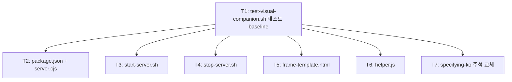

<!-- FID: 20260519-visual-companion-server -->
<!-- OWNER_COMMAND: /tasks -->
<!-- MUTABLE_BY: /implement (상태 마킹만) -->
<!-- layer: Lifecycle-Artifact -->

# Visual Companion 서버 포팅 태스크 목록 — 20260519-visual-companion-server

> 각 태스크는 TDD 5 스텝(RED → 검증 → GREEN → 검증 → COMMIT)을 따릅니다.

**관련 플랜**: `.specops/20260519-visual-companion-server/plan.md`
**관련 AC**: AC-1, AC-2, AC-3, AC-4, AC-5, AC-6, AC-7, AC-R-1, AC-R-2

---

## AC → Task 매핑

| AC | must/should | Task(s) |
|---|---|---|
| AC-1 | must | T2 (server.cjs) |
| AC-2 | must | T2 (server.cjs broadcast) |
| AC-3 | must | T3 (start-server.sh PID) |
| AC-4 | must | T4 (stop-server.sh) |
| AC-5 | must | T5 (frame-template.html) |
| AC-6 | must | T6 (helper.js) |
| AC-7 | must | T7 (specifying-ko 주석 교체) |
| AC-R-1 | must | T1 (test baseline 커버리지 포함) |
| AC-R-2 | must | T1~T7 (구조 무영향 보장) |

**must AC 커버리지**: 9/9 (100%)

---

## Task 1: test-visual-companion.sh — RED baseline 테스트

**AC 매핑**: AC-R-1, AC-R-2 (baseline), 모든 AC 검증 포함
**파일**:
- Create: `scripts/tests/test-visual-companion.sh`

- [ ] **Step 1: RED — 실패 테스트 작성**

```bash
#!/usr/bin/env bash
set -u
PASS=0; FAIL=0
PLUGIN="$(cd "$(dirname "$0")/../.." && pwd)"
SCRIPTS_DIR="$PLUGIN/skills/brainstorming-ko/scripts"

# T1: server.cjs 존재 확인 (AC-1)
[ -f "$SCRIPTS_DIR/server.cjs" ] \
  && echo "T1.a PASS: server.cjs 존재" && PASS=$((PASS+1)) \
  || { echo "T1.a FAIL: server.cjs 미존재"; FAIL=$((FAIL+1)); }

# T1: package.json ws 의존성 (AC-1)
[ -f "$SCRIPTS_DIR/package.json" ] && grep -q '"ws"' "$SCRIPTS_DIR/package.json" \
  && echo "T1.b PASS: package.json ws 의존성" && PASS=$((PASS+1)) \
  || { echo "T1.b FAIL: package.json 미존재 또는 ws 누락"; FAIL=$((FAIL+1)); }

# T2: start-server.sh exec-bit (AC-3)
[ -x "$SCRIPTS_DIR/start-server.sh" ] \
  && echo "T2.a PASS: start-server.sh exec-bit" && PASS=$((PASS+1)) \
  || { echo "T2.a FAIL: start-server.sh 미존재 또는 exec-bit 누락"; FAIL=$((FAIL+1)); }

# T3: stop-server.sh exec-bit (AC-4)
[ -x "$SCRIPTS_DIR/stop-server.sh" ] \
  && echo "T3.a PASS: stop-server.sh exec-bit" && PASS=$((PASS+1)) \
  || { echo "T3.a FAIL: stop-server.sh 미존재 또는 exec-bit 누락"; FAIL=$((FAIL+1)); }

# T4: frame-template.html WebSocket 코드 (AC-5)
[ -f "$SCRIPTS_DIR/frame-template.html" ] \
  && grep -q 'ws://localhost:4242' "$SCRIPTS_DIR/frame-template.html" \
  && grep -q 'id="content"' "$SCRIPTS_DIR/frame-template.html" \
  && echo "T4.a PASS: frame-template.html WebSocket+content" && PASS=$((PASS+1)) \
  || { echo "T4.a FAIL: frame-template.html 미존재 또는 필수 코드 누락"; FAIL=$((FAIL+1)); }

# T5: helper.js sendToVisualCompanion (AC-6)
[ -f "$SCRIPTS_DIR/helper.js" ] \
  && grep -q 'sendToVisualCompanion' "$SCRIPTS_DIR/helper.js" \
  && echo "T5.a PASS: helper.js sendToVisualCompanion" && PASS=$((PASS+1)) \
  || { echo "T5.a FAIL: helper.js 미존재 또는 sendToVisualCompanion 누락"; FAIL=$((FAIL+1)); }

# T6: specifying-ko 포팅 주석 없음 (AC-7)
! grep -q 'Phase 1 현재.*visual-companion.*포팅' \
    "$PLUGIN/skills/specifying-ko/SKILL.md" \
  && echo "T6.a PASS: specifying-ko 포팅 주석 없음" && PASS=$((PASS+1)) \
  || { echo "T6.a FAIL: specifying-ko 포팅 주석 여전히 존재"; FAIL=$((FAIL+1)); }

echo ""
echo "PASS=$PASS FAIL=$FAIL"
[ "$FAIL" -eq 0 ] && exit 0 || exit 1
```

- [ ] **Step 2: FAIL 검증**

```bash
bash scripts/tests/test-visual-companion.sh
```

예상: `PASS=0 FAIL=7` (파일 미존재)

- [ ] **Step 3: GREEN — exec-bit 부여 및 저장**

```bash
chmod +x scripts/tests/test-visual-companion.sh
```

파일 생성만 (내용은 Step 1에서 작성). exec-bit 부여.

- [ ] **Step 4: PASS 검증 (스크립트 실행 가능 확인)**

```bash
bash scripts/tests/test-visual-companion.sh 2>&1 | head -5
# 스크립트가 실행되고 FAIL 출력함 (아직 구현 파일 없으니 FAIL이 맞음)
echo "exit: $?"
```

예상: 스크립트가 실행되어 FAIL 출력 (exit 1) — 스크립트 자체는 정상 동작 확인

- [ ] **Step 5: COMMIT**

```bash
git add scripts/tests/test-visual-companion.sh
git commit -m "test(visual-companion): RED baseline 테스트 추가 (T1~T6 7개 검증 항목)"
```

---

## Task 2: package.json + server.cjs — WebSocket 서버

**AC 매핑**: AC-1, AC-2
**파일**:
- Create: `skills/brainstorming-ko/scripts/package.json`
- Create: `skills/brainstorming-ko/scripts/server.cjs`

- [ ] **Step 1: RED — 실패 테스트 확인**

```bash
bash scripts/tests/test-visual-companion.sh 2>&1 | grep "T1\."
```

예상: `T1.a FAIL`, `T1.b FAIL`

- [ ] **Step 2: FAIL 검증**

```bash
bash scripts/tests/test-visual-companion.sh 2>&1 | grep -c "FAIL"
```

예상: FAIL 포함 출력

- [ ] **Step 3: GREEN — 파일 생성**

`skills/brainstorming-ko/scripts/package.json`:

```json
{
  "name": "visual-companion-server",
  "version": "1.0.0",
  "description": "Visual Companion WebSocket server for specops-auto-ko",
  "main": "server.cjs",
  "dependencies": {
    "ws": "^8.0.0"
  }
}
```

`skills/brainstorming-ko/scripts/server.cjs`:

```javascript
'use strict'

const WebSocket = require('ws')
const { WebSocketServer } = WebSocket

const PORT = 4242
const wss = new WebSocketServer({ host: '127.0.0.1', port: PORT })

wss.on('listening', () => {
  console.log(`Visual Companion server listening on port ${PORT}`)
})

wss.on('connection', (ws) => {
  ws.on('message', (data) => {
    wss.clients.forEach((client) => {
      if (client.readyState === WebSocket.OPEN) {
        client.send(data.toString())
      }
    })
  })
})

wss.on('error', (err) => {
  console.error('Visual Companion server error:', err.message)
  process.exit(1)
})
```

- [ ] **Step 4: PASS 검증**

```bash
bash scripts/tests/test-visual-companion.sh 2>&1 | grep "T1\."
```

예상: `T1.a PASS`, `T1.b PASS`

- [ ] **Step 5: COMMIT**

```bash
git add skills/brainstorming-ko/scripts/package.json \
        skills/brainstorming-ko/scripts/server.cjs
git commit -m "feat(visual-companion): server.cjs WebSocket 서버 + package.json (port 4242, broadcast, 127.0.0.1)"
```

---

## Task 3: start-server.sh — 서버 시작 + PID 저장 + 브라우저 오픈

**AC 매핑**: AC-3
**파일**:
- Create: `skills/brainstorming-ko/scripts/start-server.sh`

- [ ] **Step 1: RED — 실패 테스트 확인**

```bash
bash scripts/tests/test-visual-companion.sh 2>&1 | grep "T2\."
```

예상: `T2.a FAIL`

- [ ] **Step 2: FAIL 검증**

```bash
[ -x "skills/brainstorming-ko/scripts/start-server.sh" ] && echo "PASS" || echo "FAIL"
```

예상: `FAIL`

- [ ] **Step 3: GREEN — 파일 생성**

`skills/brainstorming-ko/scripts/start-server.sh`:

```bash
#!/usr/bin/env bash
set -u

SCRIPT_DIR="$(cd "$(dirname "$0")" && pwd)"
PID_FILE="/tmp/.vc-server.pid"
PORT=4242

if [ -f "$PID_FILE" ] && kill -0 "$(cat "$PID_FILE")" 2>/dev/null; then
  echo "Visual Companion server already running (PID $(cat "$PID_FILE"))"
  exit 0
fi

if [ ! -d "$SCRIPT_DIR/node_modules" ]; then
  echo "Installing dependencies..."
  (cd "$SCRIPT_DIR" && npm install --silent)
fi

node "$SCRIPT_DIR/server.cjs" &
echo $! > "$PID_FILE"
sleep 0.5

echo "Visual Companion server started (PID $(cat "$PID_FILE"))"
echo "URL: file://$SCRIPT_DIR/frame-template.html"

OS="$(uname -s)"
if [ "$OS" = "Darwin" ]; then
  open "file://$SCRIPT_DIR/frame-template.html"
elif [ "$OS" = "Linux" ]; then
  xdg-open "file://$SCRIPT_DIR/frame-template.html" 2>/dev/null \
    || echo "브라우저를 수동으로 열어주세요: file://$SCRIPT_DIR/frame-template.html"
else
  echo "브라우저를 수동으로 열어주세요: file://$SCRIPT_DIR/frame-template.html"
fi
```

```bash
chmod +x skills/brainstorming-ko/scripts/start-server.sh
```

- [ ] **Step 4: PASS 검증**

```bash
bash scripts/tests/test-visual-companion.sh 2>&1 | grep "T2\."
```

예상: `T2.a PASS`

- [ ] **Step 5: COMMIT**

```bash
git add skills/brainstorming-ko/scripts/start-server.sh
git commit -m "feat(visual-companion): start-server.sh — 서버 시작·PID /tmp/.vc-server.pid·브라우저 오픈 (macOS/Linux)"
```

---

## Task 4: stop-server.sh — 서버 종료

**AC 매핑**: AC-4
**파일**:
- Create: `skills/brainstorming-ko/scripts/stop-server.sh`

- [ ] **Step 1: RED — 실패 테스트 확인**

```bash
bash scripts/tests/test-visual-companion.sh 2>&1 | grep "T3\."
```

예상: `T3.a FAIL`

- [ ] **Step 2: FAIL 검증**

```bash
[ -x "skills/brainstorming-ko/scripts/stop-server.sh" ] && echo "PASS" || echo "FAIL"
```

예상: `FAIL`

- [ ] **Step 3: GREEN — 파일 생성**

`skills/brainstorming-ko/scripts/stop-server.sh`:

```bash
#!/usr/bin/env bash
set -u

PID_FILE="/tmp/.vc-server.pid"

if [ ! -f "$PID_FILE" ]; then
  echo "Visual Companion server not running (PID file not found)"
  exit 0
fi

PID="$(cat "$PID_FILE")"

if kill -0 "$PID" 2>/dev/null; then
  kill "$PID"
  echo "Visual Companion server stopped (PID $PID)"
else
  echo "Process $PID not running (stale PID file)"
fi

rm -f "$PID_FILE"
```

```bash
chmod +x skills/brainstorming-ko/scripts/stop-server.sh
```

- [ ] **Step 4: PASS 검증**

```bash
bash scripts/tests/test-visual-companion.sh 2>&1 | grep "T3\."
```

예상: `T3.a PASS`

- [ ] **Step 5: COMMIT**

```bash
git add skills/brainstorming-ko/scripts/stop-server.sh
git commit -m "feat(visual-companion): stop-server.sh — PID로 서버 종료 + /tmp/.vc-server.pid 삭제"
```

---

## Task 5: frame-template.html — WebSocket 수신 UI

**AC 매핑**: AC-5
**파일**:
- Create: `skills/brainstorming-ko/scripts/frame-template.html`

- [ ] **Step 1: RED — 실패 테스트 확인**

```bash
bash scripts/tests/test-visual-companion.sh 2>&1 | grep "T4\."
```

예상: `T4.a FAIL`

- [ ] **Step 2: FAIL 검증**

```bash
[ -f "skills/brainstorming-ko/scripts/frame-template.html" ] && echo "PASS" || echo "FAIL"
```

예상: `FAIL`

- [ ] **Step 3: GREEN — 파일 생성**

`skills/brainstorming-ko/scripts/frame-template.html`:

```html
<!DOCTYPE html>
<html lang="ko">
<head>
  <meta charset="UTF-8">
  <title>Visual Companion</title>
  <style>
    * { margin: 0; padding: 0; box-sizing: border-box; }
    body { font-family: -apple-system, BlinkMacSystemFont, 'Segoe UI', sans-serif; background: #f5f5f5; }
    #status { padding: 8px 16px; background: #555; color: #fff; font-size: 12px; }
    #status.connected { background: #2d7d2a; }
    #status.disconnected { background: #b03a2e; }
    #content { padding: 24px; min-height: 100vh; }
  </style>
</head>
<body>
  <div id="status" class="disconnected">서버에 연결 중...</div>
  <div id="content"></div>
  <script>
    const statusEl = document.getElementById('status')
    const content = document.getElementById('content')

    function connect() {
      const ws = new WebSocket('ws://localhost:4242')
      ws.onopen = () => {
        statusEl.textContent = 'Visual Companion 연결됨'
        statusEl.className = 'connected'
      }
      ws.onmessage = (event) => {
        content.innerHTML = event.data
      }
      ws.onclose = () => {
        statusEl.textContent = '연결 끊김 — 재연결 중...'
        statusEl.className = 'disconnected'
        setTimeout(connect, 2000)
      }
      ws.onerror = () => {
        statusEl.textContent = '연결 오류 — start-server.sh 실행 확인'
        statusEl.className = 'disconnected'
      }
    }

    connect()
  </script>
</body>
</html>
```

- [ ] **Step 4: PASS 검증**

```bash
bash scripts/tests/test-visual-companion.sh 2>&1 | grep "T4\."
```

예상: `T4.a PASS`

- [ ] **Step 5: COMMIT**

```bash
git add skills/brainstorming-ko/scripts/frame-template.html
git commit -m "feat(visual-companion): frame-template.html — ws://localhost:4242 연결 + #content innerHTML 렌더링"
```

---

## Task 6: helper.js — sendToVisualCompanion

**AC 매핑**: AC-6
**파일**:
- Create: `skills/brainstorming-ko/scripts/helper.js`

- [ ] **Step 1: RED — 실패 테스트 확인**

```bash
bash scripts/tests/test-visual-companion.sh 2>&1 | grep "T5\."
```

예상: `T5.a FAIL`

- [ ] **Step 2: FAIL 검증**

```bash
[ -f "skills/brainstorming-ko/scripts/helper.js" ] && echo "PASS" || echo "FAIL"
```

예상: `FAIL`

- [ ] **Step 3: GREEN — 파일 생성**

`skills/brainstorming-ko/scripts/helper.js`:

```javascript
'use strict'

const WebSocket = require('ws')

const SERVER_URL = 'ws://localhost:4242'

function sendToVisualCompanion(html) {
  return new Promise((resolve) => {
    let ws
    try {
      ws = new WebSocket(SERVER_URL)
    } catch (err) {
      console.error('[Visual Companion] 연결 실패 — start-server.sh 실행 확인:', err.message)
      return resolve()
    }

    ws.on('open', () => {
      ws.send(html)
      ws.close()
      resolve()
    })

    ws.on('error', (err) => {
      console.error('[Visual Companion] 서버 연결 실패 — start-server.sh 실행 확인:', err.message)
      resolve()
    })
  })
}

module.exports = { sendToVisualCompanion }
```

- [ ] **Step 4: PASS 검증**

```bash
bash scripts/tests/test-visual-companion.sh 2>&1 | grep "T5\."
```

예상: `T5.a PASS`

- [ ] **Step 5: COMMIT**

```bash
git add skills/brainstorming-ko/scripts/helper.js
git commit -m "feat(visual-companion): helper.js — sendToVisualCompanion(html) export, 서버 미기동 시 조용히 실패"
```

---

## Task 7: specifying-ko/SKILL.md — 포팅 주석 교체

**AC 매핑**: AC-7, AC-R-1
**파일**:
- Modify: `skills/specifying-ko/SKILL.md` (포팅 주석 1줄 교체)

- [ ] **Step 1: RED — 현재 상태 확인**

```bash
bash scripts/tests/test-visual-companion.sh 2>&1 | grep "T6\."
```

예상: `T6.a FAIL` (포팅 주석 여전히 존재)

확인:

```bash
grep -n 'Phase 1 현재.*visual-companion.*포팅' skills/specifying-ko/SKILL.md
```

예상: line 326에서 매칭

- [ ] **Step 2: FAIL 검증**

```bash
grep -c 'Phase 1 현재.*visual-companion.*포팅' skills/specifying-ko/SKILL.md
```

예상: `1` (주석 존재 — FAIL)

- [ ] **Step 3: GREEN — 주석 교체**

`skills/specifying-ko/SKILL.md`의 해당 라인을:

```
(Phase 1 현재 — visual-companion 상세 가이드는 v0.1+에서 포팅)
```

아래로 교체:

```
사용법: `bash skills/brainstorming-ko/scripts/start-server.sh` → 브라우저 오픈 → `helper.js`의 `sendToVisualCompanion(html)` 호출.
```

- [ ] **Step 4: PASS 검증**

```bash
bash scripts/tests/test-visual-companion.sh 2>&1 | grep "T6\."
# 회귀 검증
bash scripts/tests/test-skill-conventions.sh 2>&1 | tail -3
bash scripts/_internal/validate-structure.sh 2>&1 | tail -10
```

예상: `T6.a PASS`, `PASS=5 FAIL=0`, 전 항목 ✅

- [ ] **Step 5: COMMIT**

```bash
git add skills/specifying-ko/SKILL.md
git commit -m "fix(specifying-ko): Visual Companion 포팅 주석 → 실제 사용 가이드로 교체 (AC-7)"
```

---

## 최종 검증

```bash
bash scripts/tests/test-visual-companion.sh
bash scripts/tests/test-skill-conventions.sh
bash scripts/_internal/validate-structure.sh
```

예상: `PASS=7 FAIL=0`, `PASS=5 FAIL=0`, 전 항목 ✅

---

## 의존 그래프



```yaml
tasks:
  - id: T1
    depends_on: []
    inputs: []
    outputs: [scripts/tests/test-visual-companion.sh]
    ac: [AC-R-1, AC-R-2]
    test_command: "bash scripts/tests/test-visual-companion.sh"
  - id: T2
    depends_on: [T1]
    inputs: [scripts/tests/test-visual-companion.sh]
    outputs: [skills/brainstorming-ko/scripts/package.json, skills/brainstorming-ko/scripts/server.cjs]
    ac: [AC-1, AC-2]
    test_command: "bash scripts/tests/test-visual-companion.sh"
  - id: T3
    depends_on: [T1]
    inputs: [scripts/tests/test-visual-companion.sh]
    outputs: [skills/brainstorming-ko/scripts/start-server.sh]
    ac: [AC-3]
    test_command: "bash scripts/tests/test-visual-companion.sh"
  - id: T4
    depends_on: [T1]
    inputs: [scripts/tests/test-visual-companion.sh]
    outputs: [skills/brainstorming-ko/scripts/stop-server.sh]
    ac: [AC-4]
    test_command: "bash scripts/tests/test-visual-companion.sh"
  - id: T5
    depends_on: [T1]
    inputs: [scripts/tests/test-visual-companion.sh]
    outputs: [skills/brainstorming-ko/scripts/frame-template.html]
    ac: [AC-5]
    test_command: "bash scripts/tests/test-visual-companion.sh"
  - id: T6
    depends_on: [T1]
    inputs: [scripts/tests/test-visual-companion.sh]
    outputs: [skills/brainstorming-ko/scripts/helper.js]
    ac: [AC-6]
    test_command: "bash scripts/tests/test-visual-companion.sh"
  - id: T7
    depends_on: [T1]
    inputs: [scripts/tests/test-visual-companion.sh]
    outputs: [skills/specifying-ko/SKILL.md]
    ac: [AC-7, AC-R-1]
    test_command: "bash scripts/tests/test-visual-companion.sh"
```
