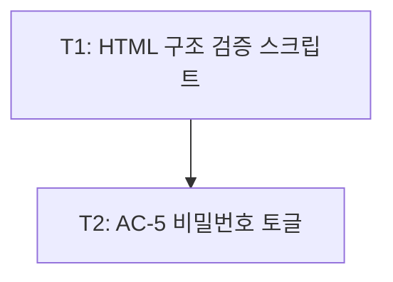

<!-- FID: 20260604-login-screen -->
<!-- OWNER_COMMAND: /tasks -->
<!-- MUTABLE_BY: /implement (상태 마킹만) -->
<!-- reference_upstream: github/spec-kit tasks-template.md + obra/superpowers writing-plans -->
<!-- layer: Lifecycle-Artifact -->

# 로그인 화면 태스크 목록 — 20260604-login-screen

> 각 태스크는 TDD 5 스텝(RED → 검증 → GREEN → 검증 → COMMIT)을 따릅니다.

**관련 플랜**: `.specops/20260604-login-screen/plan.md`
**관련 AC**: AC-1, AC-2, AC-3, AC-4, AC-5

---

## AC → Task 매핑

| AC | must/should | Task(s) |
|---|---|---|
| AC-1 | must | T1 |
| AC-2 | must | T1 |
| AC-3 | must | T1 |
| AC-4 | must | T1 |
| AC-5 | should | T2 |

**must AC 커버리지**: 4/4 (100%)

---

## 태스크 1: HTML 구조 검증 스크립트

**파일**:
- Create: `scripts/tests/test-login-screen.sh`

**관련 AC**: AC-1, AC-2, AC-3, AC-4

- [x] **스텝 1: RED — 실패하는 테스트 작성**

`scripts/tests/test-login-screen.sh` 파일이 아직 없으므로 실행 시 "No such file" 오류 → FAIL 상태

```bash
#!/usr/bin/env bash
set -euo pipefail
FILE="screens/login.html"
PASS=0; FAIL=0

check() {
  local label="$1" pattern="$2"
  if grep -q "$pattern" "$FILE"; then
    echo "PASS: $label"; ((PASS++))
  else
    echo "FAIL: $label"; ((FAIL++))
  fi
}

check "AC-1 이메일 input(type=email)" 'type="email"'
check "AC-1 비밀번호 input(type=password)" 'type="password"'
check "AC-1 label[for=email]" 'for="email"'
check "AC-1 label[for=password]" 'for="password"'
check "AC-2/AC-3 error-msg 요소" 'error-msg'
check "AC-2/AC-3 error-input 클래스" 'error-input'
check "AC-2 btn.disabled 처리" 'btn.disabled'
check "AC-2 로그인 중 텍스트" '로그인 중'
check "AC-4 viewport meta" 'width=device-width'
check "AC-5 비밀번호 토글 버튼" 'toggle-password'
check "AC-5 토글 aria-label" 'aria-label="비밀번호 표시/숨김"'

echo ""
echo "결과: PASS=${PASS}, FAIL=${FAIL}"
[ "$FAIL" -eq 0 ] && exit 0 || exit 1
```

- [x] **스텝 2: FAIL 검증**

```bash
bash scripts/tests/test-login-screen.sh
```

예상: `bash: scripts/tests/test-login-screen.sh: No such file or directory` (파일 미존재)

- [x] **스텝 3: GREEN — 스크립트 파일 저장 + 실행 권한**

위 스텝 1 내용을 `scripts/tests/test-login-screen.sh`에 저장 후:

```bash
chmod +x scripts/tests/test-login-screen.sh
bash scripts/tests/test-login-screen.sh
```

- [x] **스텝 4: PASS 검증**

예상 출력:
```
PASS: AC-1 이메일 input(type=email)
PASS: AC-1 비밀번호 input(type=password)
PASS: AC-1 label[for=email]
PASS: AC-1 label[for=password]
PASS: AC-2/AC-3 error-msg 요소
PASS: AC-2/AC-3 error-input 클래스
PASS: AC-2 btn.disabled 처리
PASS: AC-2 로그인 중 텍스트
PASS: AC-4 viewport meta
FAIL: AC-5 비밀번호 토글 버튼
FAIL: AC-5 토글 aria-label
결과: PASS=9, FAIL=2
```

AC-1~AC-4 체크는 9개 PASS. AC-5 2개만 FAIL — 기대 동작 (T2에서 구현 예정)

- [x] **스텝 5: COMMIT**

```bash
git add scripts/tests/test-login-screen.sh
git commit -m "test(login-screen): AC-1~AC-5 HTML 구조 검증 스크립트 추가

관련 AC: AC-1, AC-2, AC-3, AC-4"
```

---

## 태스크 2: AC-5 비밀번호 표시/숨김 토글

**파일**:
- Modify: `screens/login.html`

**관련 AC**: AC-5

- [ ] **스텝 1: RED — 기존 스크립트로 AC-5 FAIL 확인**

```bash
bash scripts/tests/test-login-screen.sh
```

예상: `FAIL: AC-5 비밀번호 토글 버튼` + `FAIL: AC-5 토글 aria-label` → exit 1

- [ ] **스텝 2: FAIL 검증**

exit code 1 확인:
```bash
bash scripts/tests/test-login-screen.sh; echo "exit: $?"
```

예상: `exit: 1`

- [ ] **스텝 3: GREEN — 토글 CSS + HTML + JS 추가**

**3a. CSS 추가** — `screens/login.html` `<style>` 블록 내 `input` 스타일 뒤에:

```css
.input-wrapper {
  position: relative;
  display: flex;
  align-items: center;
}
.input-wrapper input {
  padding-right: 40px;
}
.toggle-password {
  position: absolute;
  right: 10px;
  background: none;
  border: none;
  cursor: pointer;
  color: var(--color-text-secondary);
  font-size: 0.8rem;
  padding: 2px 4px;
  line-height: 1;
}
.toggle-password:hover { color: var(--color-text); }
```

**3b. HTML 수정** — 비밀번호 input을 `.input-wrapper`로 감싸고 토글 버튼 추가:

변경 전:
```html
<input id="password" type="password" placeholder="••••••••" autocomplete="current-password" required />
```

변경 후:
```html
<div class="input-wrapper">
  <input id="password" type="password" placeholder="••••••••" autocomplete="current-password" required />
  <button type="button" class="toggle-password" id="toggle-password" aria-label="비밀번호 표시/숨김">보기</button>
</div>
```

**3c. JS 추가** — `<script>` 블록 내 `handleLogin` 함수 이후에:

```javascript
document.getElementById('toggle-password').addEventListener('click', function() {
  const input = document.getElementById('password');
  if (input.type === 'password') {
    input.type = 'text';
    this.textContent = '숨기기';
  } else {
    input.type = 'password';
    this.textContent = '보기';
  }
});
```

- [ ] **스텝 4: PASS 검증**

```bash
bash scripts/tests/test-login-screen.sh
```

예상 출력:
```
PASS: AC-1 이메일 input(type=email)
PASS: AC-1 비밀번호 input(type=password)
PASS: AC-1 label[for=email]
PASS: AC-1 label[for=password]
PASS: AC-2/AC-3 error-msg 요소
PASS: AC-2/AC-3 error-input 클래스
PASS: AC-2 btn.disabled 처리
PASS: AC-2 로그인 중 텍스트
PASS: AC-4 viewport meta
PASS: AC-5 비밀번호 토글 버튼
PASS: AC-5 토글 aria-label
결과: PASS=11, FAIL=0
```

수동 브라우저 검증:
```bash
open screens/login.html
```
- [ ] "보기" 클릭 → 비밀번호 텍스트 표시 + "숨기기"
- [ ] "숨기기" 클릭 → 마스킹 복원 + "보기"
- [ ] 로그인 버튼 클릭 → 로딩 → 에러 상태 (기존 AC-2/AC-3 확인)
- [ ] DevTools 320px → 토글 버튼이 input을 벗어나지 않음

- [ ] **스텝 5: COMMIT**

```bash
git add screens/login.html
git commit -m "feat(login-screen): AC-5 비밀번호 표시/숨김 토글 추가

관련 AC: AC-5"
```

---

## 진행 상태

총 태스크 수: 2
완료: 1 / 2
차단: 0

## 의존 그래프 (v0.4a 의무)

> `decomposing-ko` 가 작성. `implementing-ko` 가 본 섹션을 파싱해 leaf 자동 라우팅.
> Mermaid (사람용) + YAML (기계용 단일 소스 진실) 병기. 충돌 시 YAML 우선.



```yaml
tasks:
  - id: T1
    test_command: "bash scripts/tests/test-login-screen.sh"
    depends_on: []
    inputs: [screens/login.html]
    outputs: [scripts/tests/test-login-screen.sh]
    ac: [AC-1, AC-2, AC-3, AC-4]
  - id: T2
    test_command: "bash scripts/tests/test-login-screen.sh"
    depends_on: [T1]
    inputs: [scripts/tests/test-login-screen.sh]
    outputs: [screens/login.html]
    ac: [AC-5]
```

## 참조

- `skills/tdd-ko/SKILL.md` — TDD 5 스텝
- `.specops/20260604-login-screen/plan.md` — 관련 플랜
- `scripts/dag/parse-dag.sh` — DAG 파서

---

*작성: specops-auto-ko · 2026-06-04 · FID: 20260604-login-screen · 생성 커맨드: /tasks*
