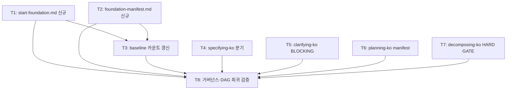

<!-- FID: 20260604-start-foundation -->
<!-- OWNER_COMMAND: /tasks -->
<!-- MUTABLE_BY: /implement (상태 마킹만) -->
<!-- reference_upstream: specops-auto-ko 독자 추가 -->
<!-- layer: Lifecycle-Artifact -->

# `/start-foundation` 태스크 목록 — 20260604-start-foundation

> 각 태스크는 TDD 5 스텝(RED → 검증 → GREEN → 검증 → COMMIT)을 따릅니다.

**관련 플랜**: `.specops/20260604-start-foundation/plan.md`
**관련 AC**: AC-1, AC-2, AC-3, AC-4, AC-5, AC-6, AC-7

---

## AC → Task 매핑

| AC | must/should | Task(s) |
|---|---|---|
| AC-1 | must | T1 |
| AC-2 | must | T4 |
| AC-3 | must | T5 |
| AC-4 | must | T6 |
| AC-5 | must | T7 |
| AC-6 | must | T2, T3 |
| AC-7 | must | T8 |

**must AC 커버리지**: 7/7 (100%)

---

## 태스크 1: `commands/start-foundation.md` 신규 생성

**AC 매핑**: AC-1
**파일**:
- Create: `commands/start-foundation.md`

- [ ] **스텝 1: RED — 실패 확인**

```bash
grep -qF 'entry: foundation' commands/start-foundation.md; echo "exit: $?"
```

예상: `exit: 1` (파일 없음)

- [ ] **스텝 2: FAIL 검증**

exit code 1 확인.

- [ ] **스텝 3: GREEN — 파일 생성**

`commands/start-foundation.md` 전체 내용:

```markdown
---
name: start-foundation
description: specops-auto-ko 한국어 자율 Lifecycle — 공통부 우선 개발 진입 슬래시. specifying-ko 를 foundation 분기로 호출
triggers:
  - "/start-foundation"
mode: ask
specops_version: 1.0.0
specops_layer: Lifecycle
reference_upstream: specops-auto-ko 독자 추가
---

# /start-foundation [<공통부 설명>]

## 목적

specops-auto-ko Lifecycle 에서 **per-feature `/start` 사이클 이전에** 실행 가능한 공통부 코드(라우팅·레이아웃·인증·공통 컴포넌트·DB 마이그레이션)를 생성하는 독립 커맨드.

한국 SI 표준 "공통부 먼저 개발" 단계를 지원한다. `/start-project`(doc-only) → **`/start-foundation`(공통 코드)** → `/start`(기능 단위) 순서로 진행.

## Process

1. `specops-auto-ko:specifying-ko` 스킬 호출 — args 첫 줄에 `<!-- entry: foundation -->` HTML 주석을 prepend 하고 나머지 args 이어붙임
2. specifying-ko 가 foundation 분기 감지 → Step 5.5 화면 루프 skip → 공통부 컴포넌트 spec 작성 (§유형=`foundation`)
3. 이후 chain: clarifying-ko(기술스택 BLOCKING 게이트) → planning-ko(foundation-manifest.md 산출) → decomposing-ko → implementing-ko → verifying-evidence-ko → requesting-code-review-ko → receiving-code-review-ko

## 사용 예

```
/start-foundation React 기반 SPA 공통부 — 라우팅, 인증, 레이아웃, API 클라이언트

→ specifying-ko 호출 (args 첫 줄: <!-- entry: foundation -->)
→ foundation 분기 진입 → Step 5.5 skip → 공통부 spec 작성
→ clarifying-ko: 기술 프레임워크 BLOCKING 확정
→ planning-ko: 공통부 구현 + foundation-manifest.md 산출
→ decomposing-ko: 재사용 HARD GATE 활성
→ 이후 /start <기능> 시 각 task 가 재사용 선언 의무화
```

## 안티패턴

- **화면 단위 구현 요구** — `/start-foundation` 은 인프라·공통부 전용. 화면 단위 기능은 foundation 완료 후 `/start` 로 진행
- **specifying-ko 생략** — 공통부라도 spec → clarify → plan → decompose 체인 필수. 직접 구현 금지
- **`/start-project` 대체** — `/start-foundation` 은 foundation 코드 생성 전용. 프로젝트 문서 부트스트랩은 `/start-project` 담당

## 참조

- `skills/specifying-ko/SKILL.md` — foundation 분기 처리 (Step 5.5 skip, §유형=foundation)
- `skills/clarifying-ko/SKILL.md` — 기술스택 BLOCKING 게이트
- `skills/planning-ko/SKILL.md` — foundation-manifest.md 산출 지시
- `skills/decomposing-ko/SKILL.md` — 재사용 HARD GATE 조건
- `templates/foundation-manifest.md` — manifest 템플릿
- `commands/start.md` — 기능 단위 구현 진입 슬래시 (미러링 패턴 참조)
```

- [ ] **스텝 4: PASS 검증**

```bash
grep -qF 'entry: foundation' commands/start-foundation.md && echo "PASS: AC-1" || echo "FAIL"
grep -qF 'reference_upstream: specops-auto-ko 독자 추가' commands/start-foundation.md && echo "PASS: frontmatter" || echo "FAIL"
```

예상: 두 줄 모두 PASS

- [ ] **스텝 5: COMMIT**

```bash
git add commands/start-foundation.md
git commit -m "feat(command): start-foundation 슬래시 커맨드 신규 생성 — foundation 분기 진입점"
```

---

## 태스크 2: `templates/foundation-manifest.md` 신규 생성

**AC 매핑**: AC-6
**파일**:
- Create: `templates/foundation-manifest.md`

- [ ] **스텝 1: RED — 실패 확인**

```bash
ls templates/foundation-manifest.md 2>&1; echo "exit: $?"
```

예상: `No such file or directory` + `exit: 2`

- [ ] **스텝 2: FAIL 검증**

exit code 0 아님 확인.

- [ ] **스텝 3: GREEN — 파일 생성**

`templates/foundation-manifest.md` 전체 내용:

```markdown
<!-- FID: <YYYYMMDD-kebab-slug> -->
<!-- OWNER_COMMAND: /start-foundation (planning-ko 산출) -->
<!-- MUTABLE_BY: planning-ko (foundation 구현 후 갱신) -->
<!-- layer: Lifecycle-Artifact -->

# Foundation Manifest — <프로젝트명>

> 이 파일은 **공통부 제공 모듈 목록**입니다. planning-ko 가 foundation 구현 완료 후 `.specops/memory/foundation-manifest.md` 에 실제 내용으로 채워 저장합니다. 후속 `/start` 기능 task 는 이 파일을 참조해 재사용 선언 또는 미재사용 근거를 의무 기재합니다.

## 제공 모듈

| 모듈 | 경로 | 역할 (1줄) | 재사용 방법 |
|---|---|---|---|
| 라우팅 | `<경로>` | <설명> | `<import 예시>` |
| 인증 | `<경로>` | <설명> | `<import 예시>` |
| 레이아웃 | `<경로>` | <설명> | `<import 예시>` |
| 공통 컴포넌트 | `<경로>` | <설명> | `<import 예시>` |
| DB 스키마 | `<경로>` | <설명> | `<import 예시>` |

## 기술 스택

- **프론트엔드**: <확정된 프레임워크>
- **백엔드**: <확정된 프레임워크>
- **DB**: <확정된 DB>

## 재사용 게이트 규약

후속 `/start <기능>` 의 각 task 에 다음 필드를 반드시 기재한다:

```
**재사용 foundation**: <이 표의 모듈명 1개 이상>
```

또는:

```
**미재사용 근거**: <이 모듈을 쓰지 않는 이유>
```

누락 task 는 decomposing-ko HARD GATE 에서 차단된다.

---

*산출: specops-auto-ko · planning-ko · FID: <FID> · 경로: `.specops/memory/foundation-manifest.md`*
```

- [ ] **스텝 4: PASS 검증**

```bash
ls templates/foundation-manifest.md && echo "PASS: 파일 존재" || echo "FAIL"
grep -qF 'foundation-manifest' templates/foundation-manifest.md && echo "PASS: 키워드" || echo "FAIL"
```

예상: 두 줄 모두 PASS

- [ ] **스텝 5: COMMIT**

```bash
git add templates/foundation-manifest.md
git commit -m "feat(template): foundation-manifest.md 신규 — 공통부 모듈 목록 템플릿"
```

---

## 태스크 3: `.structure-baseline` 카운트 갱신 (commands 8→9, templates 26→27)

**AC 매핑**: AC-6
**파일**:
- Modify: `scripts/_internal/.structure-baseline`

> **전제**: T1·T2 완료 후 실행 (validate-structure.sh Step 4 검증이 신규 파일 존재를 전제함)

- [ ] **스텝 1: RED — 실패 확인**

```bash
grep -qF '"count":9' scripts/_internal/.structure-baseline; echo "exit: $?"
```

예상: `exit: 1` (현재 commands count=8)

- [ ] **스텝 2: FAIL 검증**

exit code 1 확인.

- [ ] **스텝 3: GREEN — sed 인라인 편집 (JSONL 포맷 보존)**

> `.structure-baseline` 은 JSONL (1줄 1객체) — json.load() 사용 금지.

```bash
sed -i '' 's/"category":"commands","glob":"commands\/\*.md","count":8/"category":"commands","glob":"commands\/*.md","count":9/' scripts/_internal/.structure-baseline
sed -i '' 's/"category":"templates","glob":"templates\/\*.md","count":26/"category":"templates","glob":"templates\/*.md","count":27/' scripts/_internal/.structure-baseline
```

결과 파일 예상:
```
{"category":"commands","glob":"commands/*.md","count":9}
{"category":"skills","glob":"skills/*/SKILL.md","count":27}
{"category":"templates","glob":"templates/*.md","count":27}
{"category":"agents","glob":"agents/*.md","count":3}
```

- [ ] **스텝 4: PASS 검증**

```bash
grep -qF '"category":"commands","glob":"commands/*.md","count":9' scripts/_internal/.structure-baseline && echo "PASS: commands=9" || echo "FAIL"
grep -qF '"category":"templates","glob":"templates/*.md","count":27' scripts/_internal/.structure-baseline && echo "PASS: templates=27" || echo "FAIL"
bash scripts/_internal/validate-structure.sh 2>&1 | grep -c '✅'
```

예상: `PASS: commands=9`, `PASS: templates=27`, validate-structure ✅ 전 항목 (7개 이상)

- [ ] **스텝 5: COMMIT**

```bash
git add scripts/_internal/.structure-baseline
git commit -m "chore(baseline): .structure-baseline commands 8→9, templates 26→27"
```

---

## 태스크 4: `skills/specifying-ko/SKILL.md` — foundation 분기 추가

**AC 매핑**: AC-2
**파일**:
- Modify: `skills/specifying-ko/SKILL.md`

- [ ] **스텝 1: RED — 실패 확인**

```bash
grep -qF 'entry: foundation' skills/specifying-ko/SKILL.md; echo "exit: $?"
```

예상: `exit: 1`

- [ ] **스텝 2: FAIL 검증**

exit code 1 확인.

- [ ] **스텝 3: GREEN — 2곳 편집**

**편집 A** — 진입 신호 검사 (signal check) 확장:

변경 전:
```
   - **유지보수 분기 진입 신호 검사** (Phase A — 신규 추가):
     - args 첫 줄이 `<!-- entry: maintain -->` HTML 주석이면 [유지보수 분기] 진입
     - 그렇지 않으면 [신규 분기] (현재 동작 — DESIGN.md / screens/ 점검)
```

변경 후:
```
   - **유지보수·foundation 분기 진입 신호 검사** (Phase A):
     - args 첫 줄이 `<!-- entry: maintain -->` HTML 주석이면 [유지보수 분기] 진입
     - args 첫 줄이 `<!-- entry: foundation -->` HTML 주석이면 **[foundation 분기]** 진입 — Step 5.5 화면 루프 **skip**. 공통부 컴포넌트(라우팅·레이아웃·인증·공통 UI·DB 스키마)를 spec.md §2 포함 항목으로 DAG 의도 추출(독립/의존 표기). spec.md §참조에 `.specops/memory/frontend-architecture.md`·`backend-architecture.md`·`data-model.md`·`api-spec.md` 자동 인용(기존 memory 감지 표 재사용)
     - 그렇지 않으면 [신규 분기] (현재 동작 — DESIGN.md / screens/ 점검)
```

**편집 B** — §유형 라벨 표에 foundation 행 추가:

변경 전:
```
     | 진입 신호 | current-state.md §1 라인 범위 합산 | 라벨 |
     |---|---|---|
     | 신규 분기 | N/A | `**§유형**: 신규` |
     | 유지보수 분기 | ≤ 5 | `**§유형**: trivial` (사용자가 자기선언으로 거부 가능) |
     | 유지보수 분기 | > 5 또는 미산출 | `**§유형**: 유지보수` |
```

변경 후:
```
     | 진입 신호 | current-state.md §1 라인 범위 합산 | 라벨 |
     |---|---|---|
     | 신규 분기 | N/A | `**§유형**: 신규` |
     | foundation 분기 | N/A | `**§유형**: foundation` |
     | 유지보수 분기 | ≤ 5 | `**§유형**: trivial` (사용자가 자기선언으로 거부 가능) |
     | 유지보수 분기 | > 5 또는 미산출 | `**§유형**: 유지보수` |
```

- [ ] **스텝 4: PASS 검증**

```bash
grep -qF 'entry: foundation' skills/specifying-ko/SKILL.md && echo "PASS: AC-2 signal" || echo "FAIL"
grep -qF '§유형**: foundation' skills/specifying-ko/SKILL.md && echo "PASS: §유형 표" || echo "FAIL"
```

예상: 두 줄 모두 PASS

- [ ] **스텝 5: COMMIT**

```bash
git add skills/specifying-ko/SKILL.md
git commit -m "feat(skill): specifying-ko foundation 분기 추가 — signal check + §유형 표"
```

---

## 태스크 5: `skills/clarifying-ko/SKILL.md` — BLOCKING 기술스택 게이트 추가

**AC 매핑**: AC-3
**파일**:
- Modify: `skills/clarifying-ko/SKILL.md`

- [ ] **스텝 1: RED — 실패 확인**

```bash
grep -qF 'foundation' skills/clarifying-ko/SKILL.md; echo "exit: $?"
```

예상: `exit: 1` (foundation 키워드 없음)

- [ ] **스텝 2: FAIL 검증**

exit code 1 확인.

- [ ] **스텝 3: GREEN — BLOCKING 기준에 foundation 게이트 추가**

변경 전 (BLOCKING 기준 — `## 모호성 탐지 기준` 섹션):
```
**BLOCKING** (해소 없이 plan 진행 불가):
- 핵심 동작의 입출력이 결정 안 됨
- 아키텍처 선택지가 미확정 (저장소·프레임워크·프로토콜)
- AC Given/When/Then 중 필수 분기가 비어 있음
- 스펙이 두 가지로 해석되어 **근본적으로 다른 구현**을 초래
```

변경 후:
```
**BLOCKING** (해소 없이 plan 진행 불가):
- 핵심 동작의 입출력이 결정 안 됨
- 아키텍처 선택지가 미확정 (저장소·프레임워크·프로토콜)
- AC Given/When/Then 중 필수 분기가 비어 있음
- 스펙이 두 가지로 해석되어 **근본적으로 다른 구현**을 초래
- **§유형=`foundation`** 이고 `frontend-architecture.md` 또는 `backend-architecture.md` 에 `<...>` 형태의 미해소 placeholder 가 있으면 **기술 프레임워크 확정을 BLOCKING 질문으로 강제** — RESOLVED 전 planning-ko 진입 차단
```

- [ ] **스텝 4: PASS 검증**

```bash
grep -qF 'foundation' skills/clarifying-ko/SKILL.md && echo "PASS: foundation" || echo "FAIL"
grep -qF 'BLOCKING' skills/clarifying-ko/SKILL.md && echo "PASS: BLOCKING" || echo "FAIL"
```

예상: 두 줄 모두 PASS (AC-3 충족)

- [ ] **스텝 5: COMMIT**

```bash
git add skills/clarifying-ko/SKILL.md
git commit -m "feat(skill): clarifying-ko foundation §유형 BLOCKING 기술스택 게이트 추가"
```

---

## 태스크 6: `skills/planning-ko/SKILL.md` — foundation-manifest 산출 지시 추가

**AC 매핑**: AC-4
**파일**:
- Modify: `skills/planning-ko/SKILL.md`

- [ ] **스텝 1: RED — 실패 확인**

```bash
grep -qF 'foundation-manifest' skills/planning-ko/SKILL.md; echo "exit: $?"
```

예상: `exit: 1`

- [ ] **스텝 2: FAIL 검증**

exit code 1 확인.

- [ ] **스텝 3: GREEN — 새 섹션 삽입**

`## session-progress append (v0.4-pre P1 신설)` 헤더 바로 앞에 삽입:

변경 전:
```
## session-progress append (v0.4-pre P1 신설)

플랜 저장 직후, decomposing-ko 호출 직전에:
```

변경 후 (새 섹션 먼저 추가):
```
## foundation 분기 — manifest 산출 지시

spec.md §유형=`foundation` 인 플랜은 **반드시** 태스크 목록 마지막에 다음 태스크를 포함한다:

> **[foundation 전용 마지막 태스크]** 공통부 구현 완료 후 `templates/foundation-manifest.md` 를 기반으로 실제 모듈 경로·역할을 채워 `.specops/memory/foundation-manifest.md` 에 저장한다.

이 태스크가 없으면 후속 `/start <기능>` 시 decomposing-ko HARD GATE 가 `foundation-manifest.md` 를 발견하지 못해 재사용 게이트가 동작하지 않는다.

## session-progress append (v0.4-pre P1 신설)

플랜 저장 직후, decomposing-ko 호출 직전에:
```

- [ ] **스텝 4: PASS 검증**

```bash
grep -qF 'foundation-manifest' skills/planning-ko/SKILL.md && echo "PASS: AC-4" || echo "FAIL"
grep -qF 'foundation 분기 — manifest 산출 지시' skills/planning-ko/SKILL.md && echo "PASS: 섹션 존재" || echo "FAIL"
```

예상: 두 줄 모두 PASS

- [ ] **스텝 5: COMMIT**

```bash
git add skills/planning-ko/SKILL.md
git commit -m "feat(skill): planning-ko foundation-manifest.md 산출 지시 섹션 추가"
```

---

## 태스크 7: `skills/decomposing-ko/SKILL.md` — HARD GATE 재사용 선언 조건 추가

**AC 매핑**: AC-5
**파일**:
- Modify: `skills/decomposing-ko/SKILL.md`

- [ ] **스텝 1: RED — 실패 확인**

```bash
grep -qF 'foundation-manifest' skills/decomposing-ko/SKILL.md; echo "exit: $?"
```

예상: `exit: 1`

- [ ] **스텝 2: FAIL 검증**

exit code 1 확인.

- [ ] **스텝 3: GREEN — HARD-GATE 블록에 조건 추가**

`<HARD-GATE>` 블록 내 마지막 줄 (`</HARD-GATE>` 직전) 앞에 삽입:

변경 전:
```
**v0.4a 신규 — DAG 섹션 의무**: `tasks.md` 끝에 `## 의존 그래프` 섹션이 **YAML fenced block** 으로 작성되지 않은 채로 `specops-auto-ko:implementing-ko` 호출 금지. YAML 파싱 실패 (`bash scripts/dag/parse-dag.sh` 의 `dag::find_independent_batch` 가 stderr WARN 발화) 시도 차단. fallback 운영은 implementing-ko 의 sequential 분기 책임 (advisor 협의 13:00 — v0.4a 는 decomposing-ko 자동 생성은 100% YAML 정합 보장).
</HARD-GATE>
```

변경 후:
```
**v0.4a 신규 — DAG 섹션 의무**: `tasks.md` 끝에 `## 의존 그래프` 섹션이 **YAML fenced block** 으로 작성되지 않은 채로 `specops-auto-ko:implementing-ko` 호출 금지. YAML 파싱 실패 (`bash scripts/dag/parse-dag.sh` 의 `dag::find_independent_batch` 가 stderr WARN 발화) 시도 차단. fallback 운영은 implementing-ko 의 sequential 분기 책임 (advisor 협의 13:00 — v0.4a 는 decomposing-ko 자동 생성은 100% YAML 정합 보장).

**foundation 재사용 게이트**: spec.md §유형이 `foundation` 이 **아니고** `.specops/memory/foundation-manifest.md` 가 존재하면, 각 task 에 다음 중 하나가 **반드시** 기재되어야 한다 — 누락 시 `specops-auto-ko:implementing-ko` 호출 금지:
- `**재사용 foundation**: <foundation-manifest.md 의 모듈명>` — foundation 모듈을 재사용하는 경우
- `**미재사용 근거**: <이유>` — 재사용하지 않는 경우 (예: 해당 task 가 foundation 범위 외)
</HARD-GATE>
```

- [ ] **스텝 4: PASS 검증**

```bash
grep -qF 'foundation-manifest' skills/decomposing-ko/SKILL.md && echo "PASS: AC-5" || echo "FAIL"
grep -qF '재사용 foundation' skills/decomposing-ko/SKILL.md && echo "PASS: 재사용 선언 문구" || echo "FAIL"
```

예상: 두 줄 모두 PASS

- [ ] **스텝 5: COMMIT**

```bash
git add skills/decomposing-ko/SKILL.md
git commit -m "feat(skill): decomposing-ko foundation-manifest 재사용 HARD GATE 추가"
```

---

## 태스크 8: 거버넌스·DAG 회귀 검증

**AC 매핑**: AC-7
**파일**: (변경 없음 — T1~T7 완료 후 기존 테스트 실행)

> **전제**: T1~T7 모두 완료 후 실행

- [ ] **스텝 1: RED — 기준선 확인 (T1~T7 이전)**

```bash
bash scripts/tests/governance/test-rules.sh 2>&1 | tail -1
bash scripts/tests/dag/test-parse-dag.sh 2>&1 | tail -1
```

예상: `PASS=70 FAIL=0`, `PASS=16 FAIL=0`

- [ ] **스텝 2: FAIL 검증**

기준선 정상 확인 (이 단계는 T1~T7 전 상태가 이미 PASS임을 기록).

- [ ] **스텝 3: GREEN — T1~T7 완료 후 재실행**

T1~T7 모두 커밋된 상태에서:

```bash
bash scripts/tests/governance/test-rules.sh 2>&1 | tail -1
bash scripts/tests/dag/test-parse-dag.sh 2>&1 | tail -1
```

- [ ] **스텝 4: PASS 검증**

```bash
bash scripts/tests/governance/test-rules.sh 2>&1 | grep -q 'FAIL=0' && echo "PASS: governance FAIL=0" || echo "FAIL: governance 회귀"
bash scripts/tests/dag/test-parse-dag.sh 2>&1 | grep -q 'FAIL=0' && echo "PASS: dag FAIL=0" || echo "FAIL: dag 회귀"
```

예상: 두 줄 모두 PASS

- [ ] **스텝 5: COMMIT**

```bash
# T1~T7 이 각자 커밋 완료. 본 태스크 추가 커밋 없음.
echo "AC-7 PASS: 거버넌스·DAG 회귀 없음 확인"
```

---

## 진행 상태

총 태스크 수: 8
완료: 0 / 8
차단: 0

---

## 의존 그래프



```yaml
tasks:
  - id: T1
    test_command: "grep -qF 'entry: foundation' commands/start-foundation.md"
    depends_on: []
    inputs: []
    outputs: [commands/start-foundation.md]
    ac: [AC-1]
  - id: T2
    test_command: "bash -c 'ls templates/foundation-manifest.md > /dev/null 2>&1'"
    depends_on: []
    inputs: []
    outputs: [templates/foundation-manifest.md]
    ac: [AC-6]
  - id: T3
    test_command: "grep -qF '\"count\":9' scripts/_internal/.structure-baseline"
    depends_on: [T1, T2]
    inputs: [scripts/_internal/.structure-baseline]
    outputs: [scripts/_internal/.structure-baseline]
    ac: [AC-6]
  - id: T4
    test_command: "grep -qF 'entry: foundation' skills/specifying-ko/SKILL.md"
    depends_on: []
    inputs: [skills/specifying-ko/SKILL.md]
    outputs: [skills/specifying-ko/SKILL.md]
    ac: [AC-2]
  - id: T5
    test_command: "bash -c 'grep -qF foundation skills/clarifying-ko/SKILL.md && grep -qF BLOCKING skills/clarifying-ko/SKILL.md'"
    depends_on: []
    inputs: [skills/clarifying-ko/SKILL.md]
    outputs: [skills/clarifying-ko/SKILL.md]
    ac: [AC-3]
  - id: T6
    test_command: "grep -qF 'foundation-manifest' skills/planning-ko/SKILL.md"
    depends_on: []
    inputs: [skills/planning-ko/SKILL.md]
    outputs: [skills/planning-ko/SKILL.md]
    ac: [AC-4]
  - id: T7
    test_command: "grep -qF 'foundation-manifest' skills/decomposing-ko/SKILL.md"
    depends_on: []
    inputs: [skills/decomposing-ko/SKILL.md]
    outputs: [skills/decomposing-ko/SKILL.md]
    ac: [AC-5]
  - id: T8
    test_command: "bash -c 'bash scripts/tests/governance/test-rules.sh 2>&1 | grep -q FAIL=0 && bash scripts/tests/dag/test-parse-dag.sh 2>&1 | grep -q FAIL=0'"
    depends_on: [T1, T2, T3, T4, T5, T6, T7]
    inputs: []
    outputs: []
    ac: [AC-7]
```

---

## 참조

- `skills/tdd-ko/SKILL.md` — TDD 5스텝
- `.specops/20260604-start-foundation/plan.md` — 관련 플랜
- `scripts/dag/parse-dag.sh` — DAG 파서

---

*작성: specops-auto-ko · 2026-06-04 · FID: 20260604-start-foundation · 생성 커맨드: /tasks*
