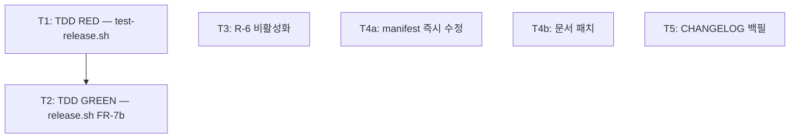

<!-- FID: 20260609-release-manifest-r6-doc-fix -->
<!-- OWNER_COMMAND: /tasks -->
<!-- MUTABLE_BY: /implement (상태 마킹만) -->
<!-- reference_upstream: specops-auto-ko 독자 추가 -->
<!-- layer: Lifecycle-Artifact -->

# release manifest bump + R-6 재정의 + 문서 동기화 태스크 목록 — 20260609-release-manifest-r6-doc-fix

> 각 태스크는 TDD 5스텝(RED → 검증 → GREEN → 검증 → COMMIT)을 따릅니다. `/implement`가 체크박스를 마킹합니다.

**관련 플랜**: `.specops/20260609-release-manifest-r6-doc-fix/plan.md`
**관련 AC**: AC-1, AC-2, AC-3, AC-4, AC-5, AC-6, AC-7, AC-8, AC-9, AC-10, AC-R-1, AC-R-2

---

## AC → Task 매핑

| AC | must/should | Task(s) |
|---|---|---|
| AC-1 (release.sh plugin.json bump) | must | T1, T2 |
| AC-2 (release.sh marketplace.json bump) | must | T1, T2 |
| AC-3 (즉시 desync 수정) | must | T4a |
| AC-4 (CHANGELOG v1.10.0 백필) | must | T5 |
| AC-5 (R-6 enabled=false) | must | T3 |
| AC-6 (test-rules.sh T5.c stop=2 PASS) | must | T3 |
| AC-7 (README commands 12건) | must | T4b |
| AC-8 (README footer v1.10.0) | must | T4b |
| AC-9 (maintain.md chain) | must | T4b |
| AC-10 (메타 skill chain) | must | T4b |
| AC-R-1 (test-release.sh 전체 PASS) | must | T2 |
| AC-R-2 (validate-structure.sh 전체 PASS) | must | T4a |

**must AC 커버리지**: 12/12 (100%)

---

## 태스크 1 (T1): TDD RED — test-release.sh manifest 테스트 추가

**AC 매핑**: AC-1, AC-2
**파일**:
- 수정: `scripts/tests/test-release.sh`

- [ ] **Step 1: `_make_git_fixture`에 manifest 파일 추가**

`_make_git_fixture()` 내 `mkdir -p "$dir/commands"` 직후에 삽입:

```bash
  mkdir -p "$dir/.claude-plugin"
  cat > "$dir/.claude-plugin/plugin.json" <<'JSON'
{
  "name": "specops-auto-ko",
  "version": "1.9.0",
  "description": "test"
}
JSON
  cat > "$dir/.claude-plugin/marketplace.json" <<'JSON'
{
  "name": "specops-auto-ko",
  "version": "1.9.0"
}
JSON
```

- [ ] **Step 2: T-manifest 테스트 케이스 추가** (기존 T9 블록 직후, T10 블록 직전에 삽입)

```bash
# T-manifest: AC-1/AC-2 plugin.json + marketplace.json 버전 bump
TD=$(mktemp -d); _make_git_fixture "$TD"
RELEASE_PLUGIN_ROOT="$TD" RELEASE_PREFLIGHT_CMD=true bash "$RELEASE" 1.11.0 > /dev/null 2>&1
plugin_ver=$(grep '"version"' "$TD/.claude-plugin/plugin.json" | grep -oE '"[0-9]+\.[0-9]+\.[0-9]+"' | tr -d '"')
market_ver=$(grep '"version"' "$TD/.claude-plugin/marketplace.json" | grep -oE '"[0-9]+\.[0-9]+\.[0-9]+"' | tr -d '"')
[ "$plugin_ver" = "1.11.0" ] \
  && ok "T-manifest.a plugin.json 버전 1.11.0 갱신" || fail "T-manifest.a (got: $plugin_ver)"
[ "$market_ver" = "1.11.0" ] \
  && ok "T-manifest.b marketplace.json 버전 1.11.0 갱신" || fail "T-manifest.b (got: $market_ver)"
rm -rf "$TD"
```

- [ ] **Step 3: RED 확인**

```bash
bash scripts/tests/test-release.sh 2>&1 | grep -E "T-manifest|FAIL"
```

예상: `FAIL T-manifest.a (got: 1.9.0)`, `FAIL T-manifest.b (got: 1.9.0)` (release.sh에 FR-7b 미존재)

- [ ] **Step 4: COMMIT**

```bash
git add scripts/tests/test-release.sh
git commit -m "test(release): T-manifest RED — manifest bump AC-1/AC-2 검증"
```

---

## 태스크 2 (T2): TDD GREEN — release.sh FR-7b manifest bump 추가

**AC 매핑**: AC-1, AC-2, AC-R-1
**파일**:
- 수정: `scripts/release.sh`

> 전제: T1 완료 (T-manifest 케이스 기존재)

- [ ] **Step 1: FR-7b 블록 삽입** (FR-7 for 루프 닫힘 `done` 직후, `echo "-> 파일 변환 완료"` 직전)

현재 코드 (`done` 직후):
```bash
done

echo "-> 파일 변환 완료"
```

변경 후:
```bash
done

# FR-7b: plugin.json/marketplace.json 버전 bump
for manifest in "$PLUGIN_ROOT/.claude-plugin/plugin.json" \
                "$PLUGIN_ROOT/.claude-plugin/marketplace.json"; do
  [ -f "$manifest" ] || continue
  _sed_i "s/\"version\": \"[0-9][^\"]*\"/\"version\": \"${VERSION}\"/" "$manifest"
  CHANGED_FILES+=("$manifest")
done

echo "-> 파일 변환 완료"
```

- [ ] **Step 2: dry-run 출력 갱신** (항목 4~6 번호 정렬 — L71~77 블록)

현재:
```bash
  echo "4. git commit: chore: release v${VERSION}"
  echo "5. git tag: v${VERSION}"
```

변경 후 (4번 앞에 manifest 항목 삽입, git 항목을 5~6으로):
```bash
  echo "4. .claude-plugin/plugin.json + marketplace.json: 버전 bump"
  echo "5. git commit: chore: release v${VERSION}"
  echo "6. git tag: v${VERSION}"
```

- [ ] **Step 3: GREEN 확인**

```bash
bash scripts/tests/test-release.sh 2>&1 | grep -E "T-manifest|FAIL"
```

예상: `PASS T-manifest.a plugin.json 버전 1.11.0 갱신`, `PASS T-manifest.b marketplace.json 버전 1.11.0 갱신`, FAIL 0

- [ ] **Step 4: 전체 테스트 PASS 확인 (AC-R-1)**

```bash
bash scripts/tests/test-release.sh 2>&1 | tail -3
```

예상: `PASS=12 FAIL=0` (기존 10 + T-manifest 2건)

- [ ] **Step 5: COMMIT**

```bash
git add scripts/release.sh
git commit -m "feat(release): FR-7b manifest bump — plugin.json/marketplace.json 버전 갱신"
```

---

## 태스크 3 (T3): R-6 비활성화

**AC 매핑**: AC-5, AC-6
**파일**:
- 수정: `hooks/rules.jsonl`
- 수정: `scripts/tests/governance/test-rules.sh:L33`

> ⚠️ 두 파일을 반드시 같은 커밋으로 처리 — 분리 커밋 시 pre-flight(test-rules.sh)가 잠시 FAIL

- [ ] **Step 1: test-rules.sh T5.c 어서션 갱신** (L33 근방)

현재:
```bash
if [ "$posttool_count" = "3" ] && [ "$stop_count" = "3" ]; then
  PASS=$((PASS+1)); echo "PASS T5.c matcher 분류 posttool=3 stop=3"
```

변경 후:
```bash
if [ "$posttool_count" = "3" ] && [ "$stop_count" = "2" ]; then
  PASS=$((PASS+1)); echo "PASS T5.c matcher 분류 posttool=3 stop=2"
```

- [ ] **Step 2: rules.jsonl R-6 비활성화**

```bash
python3 -c "
import sys, json
lines = open('hooks/rules.jsonl').readlines()
out = []
for l in lines:
    r = json.loads(l)
    if r.get('id') == 'R-6':
        r['enabled'] = False
    out.append(json.dumps(r, ensure_ascii=False))
open('hooks/rules.jsonl', 'w').write('\n'.join(out) + '\n')
"
```

- [ ] **Step 3: test-rules.sh 전체 PASS 확인 (AC-5, AC-6)**

```bash
bash scripts/tests/governance/test-rules.sh 2>&1 | grep -E "T5.c|FAIL=|PASS="
```

예상: `PASS T5.c matcher 분류 posttool=3 stop=2`, 마지막 줄 `FAIL=0`

- [ ] **Step 4: COMMIT**

```bash
git add hooks/rules.jsonl scripts/tests/governance/test-rules.sh
git commit -m "fix(governance): R-6 disabled — gbrain-ko manual-only 설계 우선, false-warn 제거"
```

---

## 태스크 4a (T4a): manifest 즉시 수정 — plugin.json + marketplace.json

**AC 매핑**: AC-3, AC-R-2
**파일**:
- 수정: `.claude-plugin/plugin.json:L3`
- 수정: `.claude-plugin/marketplace.json:L14`

- [ ] **Step 1: plugin.json v1.10.0**

`.claude-plugin/plugin.json` L3 변경:
```json
  "version": "1.10.0",
```

- [ ] **Step 2: marketplace.json v1.10.0**

`.claude-plugin/marketplace.json` — version 행 변경:
```json
      "version": "1.10.0",
```

- [ ] **Step 3: AC-3 검증**

```bash
grep '"version"' .claude-plugin/plugin.json .claude-plugin/marketplace.json
```

예상: 두 파일 모두 `"version": "1.10.0"`

- [ ] **Step 4: validate-structure.sh PASS 확인 (AC-R-2)**

```bash
bash scripts/_internal/validate-structure.sh 2>&1 | grep manifest
```

예상: `manifest: OK (both=1.10.0)`

- [ ] **Step 5: COMMIT**

```bash
git add .claude-plugin/plugin.json .claude-plugin/marketplace.json
git commit -m "fix: manifest v1.10.0 즉시 desync 수정 (plugin.json + marketplace.json)"
```

---

## 태스크 4b (T4b): 문서 패치 — README + maintain.md + 메타skill

**AC 매핑**: AC-7, AC-8, AC-9, AC-10
**파일**:
- 수정: `README.md` (commands 건수 + listing + footer)
- 수정: `commands/maintain.md:L24` (chain 확장)
- 수정: `skills/using-specops-auto-ko-ko/SKILL.md:L70` (chain 다이어그램 확장)

- [ ] **Step 1: README commands 건수 + listing**

`README.md`에서 "10건" → "12건" 변경, 그리고 commands 목록에 누락된 3개 추가:
```
│   ├── release.md                            ← 릴리즈 자동화 /release
│   ├── start-auto.md                         ← 완전자동 모드 /start-auto
│   ├── start-batch.md                        ← 배치 오케스트레이터 /start-batch
```

- [ ] **Step 2: README footer v1.10.0**

`README.md` footer — `최신: v1.9.0 (2026-06-08)` → `최신: v1.10.0 (2026-06-09)`

- [ ] **Step 3: maintain.md chain 확장**

`commands/maintain.md:L24` — chain 끝 `→ review` 부분을 다음으로 변경:
```
4. **이후 chain** — 각 engine skill 본문의 `## 다음 skill` 섹션이 자동 강제: clarifying-ko → planning-ko → decomposing-ko → implementing-ko → verifying-evidence-ko → requesting-code-review-ko → receiving-code-review-ko → integration-test-ko → performance-test-ko → PR. 본 command는 **진입만** 책임
```

- [ ] **Step 4: 메타 skill chain 다이어그램 확장**

`skills/using-specops-auto-ko-ko/SKILL.md:L70` 현재 chain 끝:
```
→ verifying-evidence-ko → receiving-code-review-ko
```

변경:
```
→ verifying-evidence-ko → requesting-code-review-ko → receiving-code-review-ko → integration-test-ko → performance-test-ko → PR
```

- [ ] **Step 5: AC-7/AC-8/AC-9/AC-10 검증**

```bash
grep -E "12건" README.md && grep '최신: v1.10.0' README.md && grep 'integration-test-ko' commands/maintain.md && grep 'integration-test-ko' skills/using-specops-auto-ko-ko/SKILL.md
```

예상: 4개 명령 모두 매칭 출력

- [ ] **Step 6: COMMIT**

```bash
git add README.md commands/maintain.md skills/using-specops-auto-ko-ko/SKILL.md
git commit -m "docs: README 12건·footer v1.10.0 + maintain.md·메타skill chain 동기화"
```

---

## 태스크 5 (T5): CHANGELOG v1.10.0 백필

**AC 매핑**: AC-4
**파일**:
- 수정: `CHANGELOG.md` ([1.10.0] 섹션 본문)

- [ ] **Step 1: [1.10.0] 섹션 본문 삽입**

현재 `## [1.10.0] — 2026-06-09` 섹션이 빈 상태. 아래 내용으로 채움:

```markdown
## [1.10.0] — 2026-06-09

### Added
- **`/start-auto` 완전자동 모드** — `<!-- entry: auto -->` 진입, 각 HARD GATE 자동 통과(가역), PR 직전 단일 확인. commands/start-auto.md 신설. specifying/clarifying/planning/decomposing/implementing/verifying/performance-test-ko 전 단계 §auto 분기 적용.
- **`show-fid-status.sh` FID Lifecycle 상태 표시 CLI** — `.specops/<FID>/` 산출물 기반 현재 단계 표시 (AC-1~AC-5). PR #50.
- **Dynamic workflow 패턴** — 다단계 병렬 wave (`dag::find_ready`), 모델 티어 라우팅(tasks.md `tier: low|medium|high`), Stage handoff 규약(`handoffs/` 4필드), Bounded verify→fix 루프(fix_count 추적·상한 3회). implementing-ko·verifying-evidence-ko·structured-artifacts-ko 적용.
- **`/release` 릴리즈 자동화 skill + `scripts/release.sh`** — CHANGELOG·README·commands footer·manifest 버전 동기화. PR #51.

### Changed
- **`specifying-ko`** — §auto 분기: 화면 설계 자동수락 + spec 게이트 자동통과.
- **`clarifying-ko`** — §auto BLOCKING best-guess 자동응답 + `status: ASSUMED` + 가정 근거 필드.
- **`planning-ko`** — plan-reviewer cap 초과 시 §auto 자동통과(가역).
- **`decomposing-ko`** — `irreversible: true` DAG 필드, 3-way 다음 skill 분기(batch/auto/single).
- **`implementing-ko`** — Phase B/C §auto 수렴 + `auto_retry_count` 전역 재시도(cap=1).
- **`verifying-evidence-ko`** — fix_loop cap §auto 수렴 + shared `auto_retry_count`.
- **`performance-test-ko`** — 3-way PR 게이트(batch/auto 가정다이제스트/single).
- **`structured-artifacts-ko`** — `auto-state.md` 규약, 무인 모드 술어 문서화.
```

- [ ] **Step 2: AC-4 검증**

```bash
grep -E "show-fid|release-ko|release\.sh" CHANGELOG.md
```

예상: `show-fid-status.sh`, `release.sh` 모두 검출

- [ ] **Step 3: COMMIT**

```bash
git add CHANGELOG.md
git commit -m "docs(changelog): v1.10.0 섹션 백필 — show-fid-status + release-ko + dynamic workflow + start-auto"
```

---

## 진행 상태

총 태스크 수: 6
완료: 0 / 6
차단: 0

## 의존 그래프



```yaml
tasks:
  - id: T1
    test_command: "bash scripts/tests/test-release.sh 2>&1 | grep -E 'T-manifest|FAIL'"
    depends_on: []
    inputs: []
    outputs: [scripts/tests/test-release.sh]
    ac: [AC-1, AC-2]
  - id: T2
    test_command: "bash scripts/tests/test-release.sh 2>&1 | tail -3"
    depends_on: [T1]
    inputs: [scripts/tests/test-release.sh]
    outputs: [scripts/release.sh]
    ac: [AC-1, AC-2, AC-R-1]
  - id: T3
    test_command: "bash scripts/tests/governance/test-rules.sh 2>&1 | tail -3"
    depends_on: []
    inputs: []
    outputs: [hooks/rules.jsonl, scripts/tests/governance/test-rules.sh]
    ac: [AC-5, AC-6]
  - id: T4a
    test_command: "bash scripts/_internal/validate-structure.sh 2>&1 | grep manifest"
    depends_on: []
    inputs: []
    outputs: [.claude-plugin/plugin.json, .claude-plugin/marketplace.json]
    ac: [AC-3, AC-R-2]
  - id: T4b
    test_command: "grep -E '12건|integration-test-ko' README.md commands/maintain.md skills/using-specops-auto-ko-ko/SKILL.md"
    depends_on: []
    inputs: []
    outputs: [README.md, commands/maintain.md, skills/using-specops-auto-ko-ko/SKILL.md]
    ac: [AC-7, AC-8, AC-9, AC-10]
  - id: T5
    test_command: "grep -E 'show-fid|release-ko|release\\.sh' CHANGELOG.md"
    depends_on: []
    inputs: []
    outputs: [CHANGELOG.md]
    ac: [AC-4]
```

---

## 참조

- `skills/tdd-ko/SKILL.md` — TDD 5스텝
- `.specops/20260609-release-manifest-r6-doc-fix/plan.md` — 관련 플랜
- `scripts/dag/parse-dag.sh` — DAG 파서

---

*작성: decomposing-ko · 2026-06-09 · FID: 20260609-release-manifest-r6-doc-fix · 생성 커맨드: /tasks*
