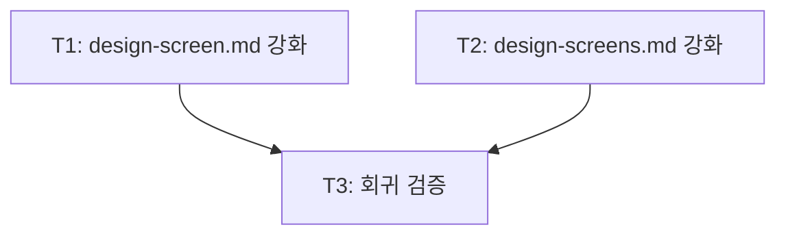

<!-- FID: 20260610-design-screen-enrich -->
<!-- OWNER_COMMAND: /tasks -->
<!-- MUTABLE_BY: /implement (상태 마킹만) -->
<!-- reference_upstream: github/spec-kit tasks-template.md + obra/superpowers writing-plans -->
<!-- layer: Lifecycle-Artifact -->

# design-screen(s) ui-ux-pro-max 심층 연동 강화 태스크 목록 — 20260610-design-screen-enrich

> 각 태스크는 TDD 5 스텝(RED → 검증 → GREEN → 검증 → COMMIT)을 따릅니다. `/implement`가 체크박스를 마킹합니다.

**관련 플랜**: `.specops/20260610-design-screen-enrich/plan.md`
**관련 AC**: AC-1, AC-2, AC-3, AC-4, AC-5, AC-8-override, AC-9, AC-10, AC-R-1, AC-R-2

---

## 태스크 T1: commands/design-screen.md 강화

**파일**:
- Modify: `commands/design-screen.md`

**관련 AC**: AC-1, AC-2, AC-3, AC-4, AC-5, AC-6, AC-7, AC-10, AC-11

- [ ] **스텝 1: RED — 변경 전 상태 확인 (키워드 없음)**

```bash
grep -n "rationale\|Step 3\.5\|Anti-pattern 게이트\|Design Rationale" commands/design-screen.md
# 기대: 매칭 없음 (exit 1 또는 빈 출력)
```

- [ ] **스텝 2: FAIL 검증**

실행: 위 grep 결과 0건 확인
기대: `rationale`, `Step 3.5`, `Anti-pattern 게이트`, `Design Rationale` 키워드 없음

- [ ] **스텝 3: GREEN — 세 곳 편집**

**편집 A — Step 2.5 제목 + rationale 변수 추출 명세 추가**

`### Step 2.5: [ui-ux-pro-max 있으면] design system 자문 (자동)` 섹션을 아래로 교체:

```markdown
### Step 2.5: [ui-ux-pro-max 있으면] design system 자문 + rationale 보관 (자동)

**탐지**: 현재 세션 available-skills 에 `ui-ux-pro-max:ui-ux-pro-max` 가 있는가?
- **없으면**: 이 단계 전체 skip → Step 3 직행. `rationale = null`
- **있으면**: `ui-ux-pro-max:ui-ux-pro-max` Skill 자동 호출 (제품유형·산업·톤·밀도 멀티키워드 입력). 산출된 design system(style/colors/typography/effects + anti-patterns)을 Step 3 HTML artifact 의 레이아웃·컴포넌트·스타일 선택에 반영. **우선순위**: ui-ux-pro-max 결과 우선 채택 — DESIGN.md 토큰은 후순위 fallback.

  자문 완료 후 아래 4개 항목을 **rationale 변수**로 추출해 이후 Step에서 사용:
  - `style`: style 이름 + 근거 한 줄
  - `color`: primary hex / surface hex
  - `font`: heading-font / body-font 페어링
  - `antipatterns`: anti-pattern 목록 배열 (필드 부재 시 빈 배열 `[]`)
```

**편집 B — Step 3.5 신설 (Step 3 끝 ~ Step 4 사이 삽입)**

`### Step 4: 파일 저장` 헤더 직전에 삽입:

```markdown
### Step 3.5: Anti-pattern 게이트 (자동)

**활성 조건**: `rationale`가 null이거나 `rationale.antipatterns`가 빈 배열(`[]`)이면 → skip, Step 4 직행.

**활성 시**: Step 3에서 생성한 HTML과 `rationale.antipatterns` 목록을 대조:

- **위반 없음** → `✅ Anti-pattern 체크 통과` 출력 후 Step 4 직행
- **위반 발견** → 아래 프롬프트 출력 후 응답 대기:
  > `⚠️ Anti-pattern 위반: {위반 항목 목록}. 수정 후 저장 / 그냥 저장 [m/s, 기본=s]`
  - `m` → Step 3(HTML artifact 생성 + 수정 루프)으로 복귀
  - `s` 또는 Enter → Step 4 직행 (위반 인지, 사용자 주권 존중)

```

**편집 C — Step 4 rationale 동적 append 추가**

`### Step 4: 파일 저장` 섹션의 기존 bullet 목록 (`- \`screens-overview.md\` 갱신은 Step 1 스크립트가 이미 완료`) 끝에 추가:

```markdown

**[rationale 있으면]** screen.md 파일 끝에 다음 섹션을 append:
```markdown
## Design Rationale

> ui-ux-pro-max 자문 기반 ({YYYY-MM-DD})

- **Style**: {rationale.style}
- **Color**: {rationale.color}
- **Font pairing**: {rationale.font}
- **Anti-patterns (금지)**: {rationale.antipatterns 쉼표 연결}
```
rationale가 null이면 append 없이 저장 완료.
```

- [ ] **스텝 4: PASS 검증**

```bash
grep -n "rationale" commands/design-screen.md
# 기대: Step 2.5 (rationale = null + rationale 변수), Step 3.5 (rationale 조건), Step 4 (rationale 있으면) 각 존재

grep -n "Step 3\.5\|Anti-pattern 게이트" commands/design-screen.md
# 기대: "### Step 3.5: Anti-pattern 게이트 (자동)" 라인 존재

grep -n "Design Rationale" commands/design-screen.md
# 기대: Step 4 섹션에 존재
```

- [ ] **스텝 5: COMMIT**

```bash
git add commands/design-screen.md
git commit -m "feat(design-screen): rationale 보관 + Step 3.5 anti-pattern 게이트 + Step 4 동적 append

관련 AC: AC-1, AC-2, AC-3, AC-4, AC-5, AC-10"
```

---

## 태스크 T2: commands/design-screens.md 강화

**파일**:
- Modify: `commands/design-screens.md`

**관련 AC**: AC-1, AC-2, AC-3, AC-4, AC-5, AC-6, AC-7, AC-9, AC-10, AC-11

- [ ] **스텝 1: RED — 변경 전 상태 확인**

```bash
grep -n "rationale\|3-3\.5\|Anti-pattern 게이트\|Design Rationale" commands/design-screens.md
# 기대: 매칭 없음
```

- [ ] **스텝 2: FAIL 검증**

실행: 위 grep 결과 0건 확인
기대: 4개 키워드 모두 없음

- [ ] **스텝 3: GREEN — 세 곳 편집**

**편집 A — Step 2 제목 + rationale 공유 보관 명세 추가**

`## Step 2: design system 자문 (1회 공유)` 섹션을 아래로 교체:

```markdown
## Step 2: design system 자문 + rationale 보관 (1회 공유)

available-skills 에 `ui-ux-pro-max:ui-ux-pro-max` 가 있으면 **첫 화면 전 단 1회** 호출한다. 산출된 design system을 모든 화면에 공유 적용한다. (단수 `/design-screen`은 화면마다 호출하지만 복수는 1회로 집약 — 일관성 + 토큰 절감)

없으면 skip → DESIGN.md 토큰 fallback(DESIGN.md 존재 시 읽어 공유). `rationale = null`

**[있으면]** 자문 완료 후 단수 Step 2.5와 동일한 4개 항목을 **rationale 변수**로 추출해 모든 화면에 공유 적용:
- `style`: style 이름 + 근거 한 줄
- `color`: primary hex / surface hex
- `font`: heading-font / body-font 페어링
- `antipatterns`: anti-pattern 목록 배열 (필드 부재 시 `[]`)
```

**편집 B — Step 3-3.5 신설 (Step 3-3 끝 ~ Step 3-4 사이 삽입)**

`**Step 3-4: 저장**` 단락 직전에 삽입:

```markdown
**Step 3-3.5: Anti-pattern 게이트**

단수 Step 3.5와 동일. `rationale`가 null이거나 `antipatterns`가 빈 배열이면 → skip, Step 3-4 직행.

활성 시 HTML ↔ `antipatterns` 대조:
- **위반 없음** → `✅ Anti-pattern 체크 통과` 출력 후 Step 3-4 직행
- **위반 발견** → `⚠️ Anti-pattern 위반: {위반 항목 목록}. 수정 후 저장 / 그냥 저장 [m/s, 기본=s]`
  - `m` → Step 3-3(HTML 수정 루프) 복귀
  - `s` 또는 Enter → Step 3-4 직행

```

**편집 C — Step 3-4 rationale append 추가**

`**Step 3-4: 저장**` 단락의 기존 내용 (`승인 시 단수 Step 4와 동일하게 \`screens/{name}.md\` + \`screens/{name}.html\` 저장.`) 끝에 추가:

```markdown
**[rationale 있으면]** 단수 Step 4와 동일하게 screen.md 끝에 `## Design Rationale` 섹션 append (공유 rationale 적용). rationale가 null이면 append 없이 저장.
```

- [ ] **스텝 4: PASS 검증**

```bash
grep -n "rationale" commands/design-screens.md
# 기대: Step 2 (rationale = null + rationale 변수), Step 3-3.5 (rationale 조건), Step 3-4 (rationale 있으면) 각 존재

grep -n "3-3\.5\|Anti-pattern 게이트" commands/design-screens.md
# 기대: "Step 3-3.5: Anti-pattern 게이트" 라인 존재

grep -n "Design Rationale" commands/design-screens.md
# 기대: Step 3-4 섹션에 존재
```

- [ ] **스텝 5: COMMIT**

```bash
git add commands/design-screens.md
git commit -m "feat(design-screens): rationale 공유 보관 + Step 3-3.5 게이트 + Step 3-4 동적 append

관련 AC: AC-1, AC-2, AC-3, AC-4, AC-5, AC-9, AC-10"
```

---

## 태스크 T3: 회귀 검증

**파일**:
- Verify: `templates/screen.md` (변경 없음)
- Verify: `scripts/tests/test-design-screen.sh` (실행만)

**관련 AC**: AC-8-override, AC-R-1, AC-R-2

- [ ] **스텝 1: RED — templates/screen.md 변경 없음 사전 확인**

```bash
grep "## Design Rationale" templates/screen.md
# 기대: 매칭 없음 (AC-8-override 준수)
```

- [ ] **스텝 2: FAIL 검증**

실행: 위 grep 결과 0건 확인
기대: templates/screen.md에 `## Design Rationale` 섹션 없음

- [ ] **스텝 3: GREEN — 회귀 테스트 실행**

```bash
bash scripts/tests/test-design-screen.sh
```

- [ ] **스텝 4: PASS 검증**

```bash
# 기대 출력 마지막 줄:
PASS=12 FAIL=0

# 추가 AC 수동 확인 — design-screen.md
grep -c "rationale" commands/design-screen.md
# 기대: 3 이상 (Step 2.5 × 2 + Step 3.5 + Step 4)

grep -c "rationale" commands/design-screens.md
# 기대: 3 이상 (Step 2 × 2 + Step 3-3.5 + Step 3-4)
```

- [ ] **스텝 5: COMMIT**

```bash
git add -f .specops/20260610-design-screen-enrich/
git commit -m "chore: T3 회귀검증 PASS=12 기록 (20260610-design-screen-enrich)

관련 AC: AC-8-override, AC-R-1, AC-R-2"
```

---

## 진행 상태

총 태스크 수: 3
완료: 3 / 3
차단: 0

## AC → Task 매핑

| AC | must/should | Task(s) |
|---|---|---|
| AC-1 rationale 추출 | must | T1, T2 |
| AC-2 Design Rationale 섹션 저장 | must | T1, T2 |
| AC-3 없으면 섹션 생략 | must | T1, T2 |
| AC-4 위반 없음 → 자동 통과 | must | T1, T2 |
| AC-5 위반 발견 → 사용자 확인 | must | T1, T2 |
| AC-6 [m] → HTML 루프 복귀 | should | T1, T2 |
| AC-7 [s] → 위반 상태 저장 | should | T1, T2 |
| AC-8-override templates 변경 없음 | must | T3 |
| AC-9 rationale 1회 공유 | must | T2 |
| AC-10 없으면 게이트 skip | must | T1, T2 |
| AC-11 [m/s] 기본=s | should | T1, T2 |
| AC-R-1 기존 경로 보존 | must | T3 |
| AC-R-2 sh 스크립트 무변경 | must | T3 |

**must AC 커버리지**: 10/10 (100%)

## 의존 그래프 (v0.4a 의무)

> `decomposing-ko` 가 작성. `implementing-ko` 가 본 섹션을 파싱해 leaf 자동 라우팅.
> Mermaid (사람용) + YAML (기계용 단일 소스 진실) 병기. 충돌 시 YAML 우선.



```yaml
tasks:
  - id: T1
    test_command: "grep -n 'rationale|Step 3\\.5|Anti-pattern 게이트|Design Rationale' commands/design-screen.md"
    depends_on: []
    inputs: []
    outputs: [commands/design-screen.md]
    ac: [AC-1, AC-2, AC-3, AC-4, AC-5, AC-6, AC-7, AC-10, AC-11]
  - id: T2
    test_command: "grep -n 'rationale|3-3\\.5|Anti-pattern 게이트|Design Rationale' commands/design-screens.md"
    depends_on: []
    inputs: []
    outputs: [commands/design-screens.md]
    ac: [AC-1, AC-2, AC-3, AC-4, AC-5, AC-6, AC-7, AC-9, AC-10, AC-11]
  - id: T3
    test_command: "bash scripts/tests/test-design-screen.sh"
    depends_on: [T1, T2]
    inputs: [commands/design-screen.md, commands/design-screens.md, templates/screen.md]
    outputs: []
    ac: [AC-8-override, AC-R-1, AC-R-2]
```

## 참조

- `skills/tdd-ko/SKILL.md` — TDD 5 스텝
- `skills/sprint-contracts-ko/SKILL.md` — AC 매핑
- `skills/decomposing-ko/SKILL.md` — 본 템플릿 작성 책임
- `scripts/dag/parse-dag.sh` — DAG 파서

---

*작성: andyko · 2026-06-10 · FID: 20260610-design-screen-enrich · 생성 커맨드: /tasks*
