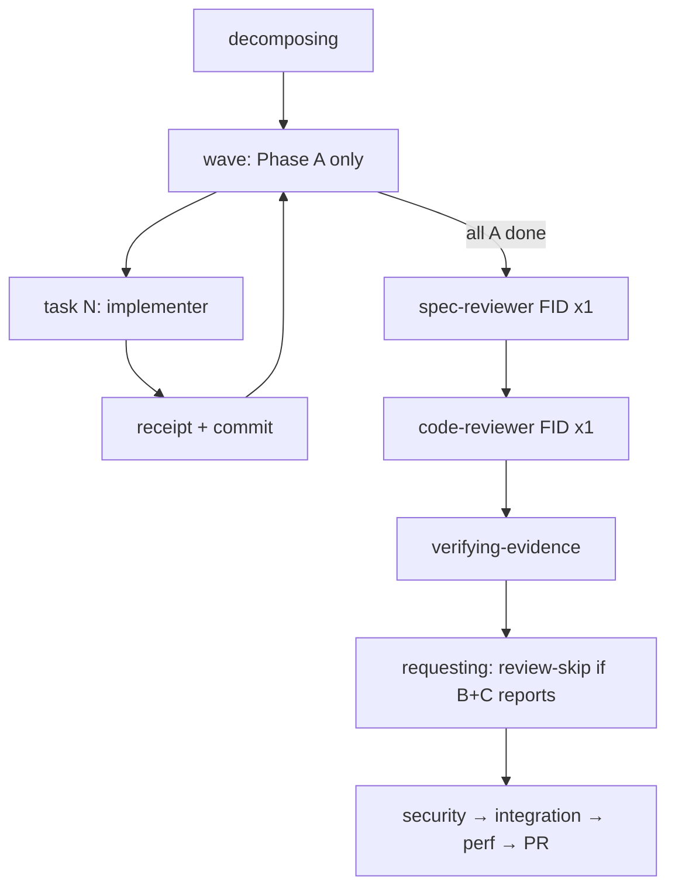
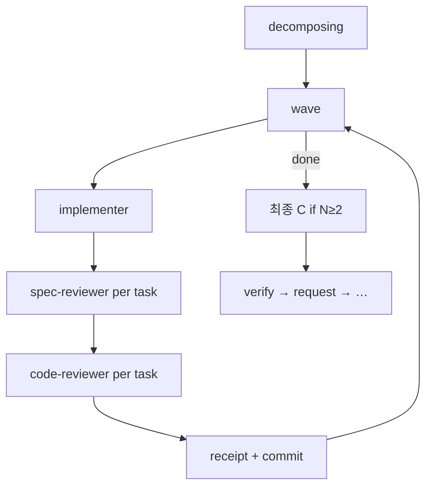

# `/start` implementing — end-loaded 리뷰

기본 `review_mode: end-loaded` (tasks.md YAML; 필드 부재 시 동일).

## 현재(기본)



- B/C는 **1회씩**이지만 감사 파일은 **tid마다** `reviews/<tid>-B-report.md` / `-C-report.md`.
- requesting 추가 리뷰는 end-loaded C와 중복 → `review-skip.md` (`end-loaded: …`).
- **`/start-all` Phase 3**: FR마다 위 end-loaded implementing → verify → request/receive(또는 end-loaded skip). batch 단위 B/C 1회는 **쓰지 않음**.

## 레거시 (`review_mode: per-task`)



## 비용

| 모드 | 리뷰 dispatch |
|---|---|
| end-loaded (`/start` · `/start-all` FR) | B×1 + C×1 (+ requesting skip) |
| per-task | (B+C)×N (+ 최종 C if N≥2) |

## `/start-all` Phase 1–2 plan-reviewer defer

Phase 1 FR마다 ★플랜 검사관을 돌리지 않는다:

```text
FR: 스펙 → 플랜 → (★ DEFER) → 쪼개기 → PLAN_DONE
…
Phase 2: ★ plan-reviewer ×1 → batch-plan-digest.sh → [y/n] → Phase 2.5
```

- planning-ko: `**§batch**`이면 `DEFERRED → Phase 2 batch`
- `/start`·foundation(비-batch): FID마다 plan-reviewer **유지**
