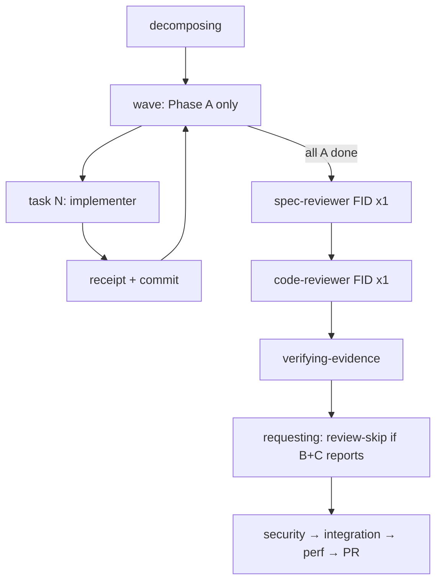
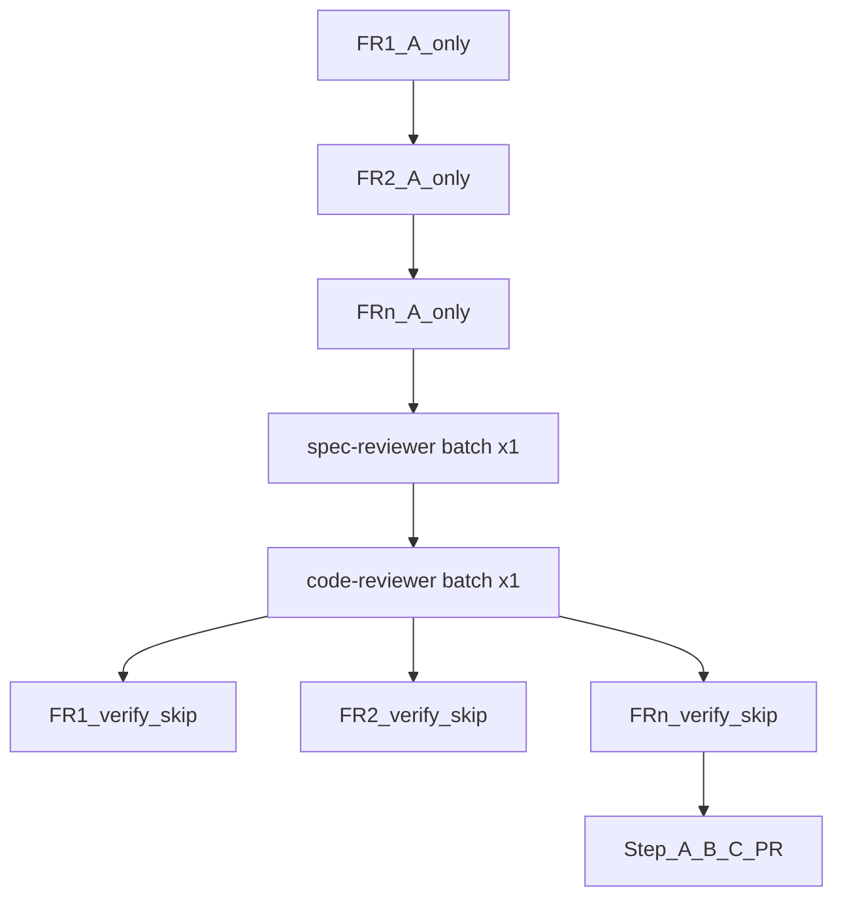

# end-loaded 리뷰 — `/start` · `/start-all`

## `/start` — FID end-loaded (기본)

`review_mode: end-loaded` (tasks.md YAML; 필드 부재 시 동일).



- B/C는 **1회씩**이지만 감사 파일은 **tid마다** `reviews/<tid>-B-report.md` / `-C-report.md`.
- requesting 추가 리뷰는 end-loaded C와 중복 → `review-skip.md` (`end-loaded: …`).

## `/start-all` — batch end-loaded

§batch FID는 `review_mode: batch-end-loaded`. Phase 3:



| 단계 | 동작 |
|---|---|
| 3-A | FR마다 implementing **A만** → queue `CODE_DONE` |
| 3-B | **B×1 + C×1** — 결과를 각 FID `reviews/<tid>-[BC]-report.md`로 분할 |
| 3-C | FR마다 verify + `review-skip.md` (`batch-end-loaded:` …) → `IMPL_DONE` |

## 레거시 (`review_mode: per-task`)

태스크마다 A→B→C. `/start` 고위험 FID opt-in. §batch에는 쓰지 않는다.

## 비용

| 모드 | B/C dispatch (FR=N, 태스크/FR=M) |
|---|---|
| per-task | ≈ 2×N×M |
| FID end-loaded (`/start`) | **2** per FID |
| batch-end-loaded (`/start-all`) | **2** per batch |
| requesting (위 두 end-loaded) | skip |

## `/start-all` Phase 1–2 plan-reviewer defer

Phase 1 FR마다 ★플랜 검사관을 돌리지 않는다:

```text
FR: 스펙 → 플랜 → (★ DEFER) → 쪼개기 → PLAN_DONE
…
Phase 2: ★ plan-reviewer ×1 → batch-plan-digest.sh → [y/n] → Phase 2.5
```

- planning-ko: `**§batch**`이면 `DEFERRED → Phase 2 batch`
- `/start`·foundation(비-batch): FID마다 plan-reviewer **유지**
