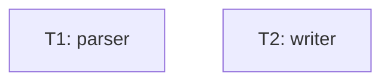

# Tasks — fixture ok-fid (emit-context.sh PASS 케이스)

2 task 모두 test_command + valid ac.

## 의존 그래프



```yaml
tasks:
  - id: T1
    depends_on: []
    inputs: [src/parser.sh]
    outputs: [src/parser.sh, scripts/tests/test-parser.sh]
    ac: [AC-1]
    test_command: "bash scripts/tests/test-parser.sh"
  - id: T2
    depends_on: []
    inputs: [src/writer.sh]
    outputs: [src/writer.sh, scripts/tests/test-writer.sh]
    ac: [AC-2]
    test_command: "bash scripts/tests/test-writer.sh"
```
