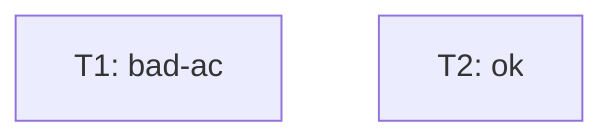

# Tasks — fixture bad-ac (emit-context.sh fail-fast 케이스)

T1 의 ac: [AC-99] — AC-99 가 acceptance-criteria.md 에 부재.

## 의존 그래프



```yaml
tasks:
  - id: T1
    depends_on: []
    inputs: [src/alpha.sh]
    outputs: [src/alpha.sh, scripts/tests/test-alpha.sh]
    ac: [AC-99]
    test_command: "bash scripts/tests/test-alpha.sh"
  - id: T2
    depends_on: []
    inputs: [src/beta.sh]
    outputs: [src/beta.sh, scripts/tests/test-beta.sh]
    ac: [AC-1]
    test_command: "bash scripts/tests/test-beta.sh"
```
