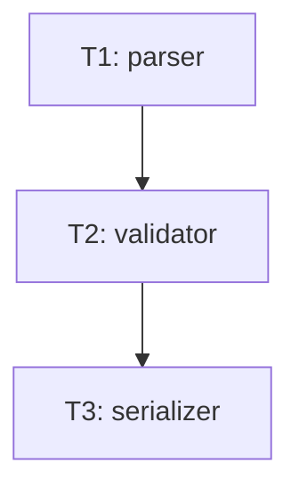

# Tasks — fixture 04: 직선 chain T1→T2→T3 (leaf 1개만)

## 의존 그래프



```yaml
tasks:
  - id: T1
    depends_on: []
    inputs: []
    outputs: [src/parser.sh]
    ac: [AC-1]
  - id: T2
    depends_on: [T1]
    inputs: [src/parser.sh]
    outputs: [src/validator.sh]
    ac: [AC-2]
  - id: T3
    depends_on: [T2]
    inputs: [src/validator.sh]
    outputs: [src/serializer.sh]
    ac: [AC-3]
```

기대: `find_independent_batch` → `[]` (T1만 절대 leaf, 단독).
