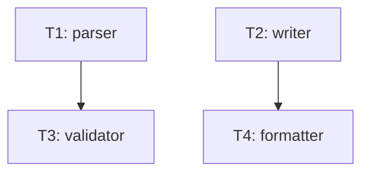

# Tasks — fixture 05: diamond (T1·T2 leaf disjoint + T3·T4 leaf disjoint)

## 의존 그래프



```yaml
tasks:
  - id: T1
    depends_on: []
    inputs: []
    outputs: [src/parser.sh, scripts/tests/test-parser.sh]
    ac: [AC-1]
  - id: T2
    depends_on: []
    inputs: []
    outputs: [src/writer.sh, scripts/tests/test-writer.sh]
    ac: [AC-2]
  - id: T3
    depends_on: [T1]
    inputs: [src/parser.sh]
    outputs: [src/validator.sh]
    ac: [AC-3]
  - id: T4
    depends_on: [T2]
    inputs: [src/writer.sh]
    outputs: [src/formatter.sh]
    ac: [AC-4]
```

기대: `find_independent_batch` → `[T1, T2]` (절대 leaf 2개, outputs disjoint).
v0.4a 보수적 식별: T3·T4 (동일 부모 안 공유, 각자 다른 부모) 는 v0.4b 확장.
