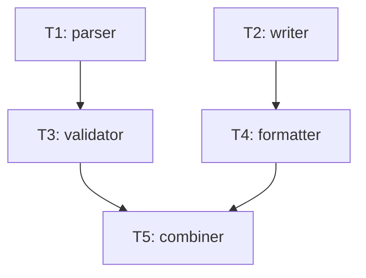

# Tasks — fixture 07: three-wave chain (T1·T2 → T3·T4 → T5)
#
# Wave 1: T1, T2 (absolute leaf, outputs disjoint)
# Wave 2: T3(depends T1) · T4(depends T2) — ready after wave 1
# Wave 3: T5(depends T3·T4) — ready after wave 2
#
# find_ready("") = T1, T2
# find_ready("T1 T2") = T3, T4
# find_ready("T1 T2 T3 T4") = T5
# find_ready("T1 T2 T3 T4 T5") = empty

## 의존 그래프



```yaml
tasks:
  - id: T1
    depends_on: []
    inputs: []
    outputs: [src/parser.sh]
    ac: [AC-1]
  - id: T2
    depends_on: []
    inputs: []
    outputs: [src/writer.sh]
    ac: [AC-2]
  - id: T3
    depends_on: [T1]
    inputs: [src/parser.sh]
    outputs: [src/validator.sh]
    ac: [AC-3]
  - id: T4
    depends_on: [T2]
    inputs: [src/writer.sh]
    outputs: [src/formatter.sh]
    ac: [AC-4]
  - id: T5
    depends_on: [T3, T4]
    inputs: [src/validator.sh, src/formatter.sh]
    outputs: [src/combiner.sh]
    ac: [AC-5]
```

기대: `find_ready` 다단계 wave 검증용. wave 1→2→3 순차 수렴.
