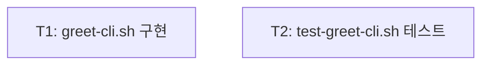

<!-- FID: <FID> -->
<!-- OWNER_COMMAND: /tasks -->
<!-- MUTABLE_BY: /implement (상태 마킹만) -->
<!-- reference_upstream: github/spec-kit tasks-template.md -->
<!-- layer: Lifecycle-Artifact -->

# greet-cli 태스크 목록 — <FID>

> 각 태스크는 TDD 5 스텝을 따릅니다.

**관련 플랜**: `.specops/<FID>/plan.md`
**관련 AC**: AC-1, AC-2, AC-3

---

## 태스크 1: greet-cli.sh 구현

**파일**:
- Create: `.specops/<FID>/greet-cli.sh`

**관련 AC**: AC-1, AC-2, AC-3

- [x] **스텝 1: 실패하는 테스트 작성** (test-greet-cli.sh — 아직 greet-cli.sh 없음)
- [x] **스텝 2: 테스트 실패 확인** (greet-cli.sh 미존재 → FAIL)
- [x] **스텝 3: 최소 구현** (greet-cli.sh 생성)
- [x] **스텝 4: 테스트 통과 확인** (3 케이스 PASS)
- [x] **스텝 5: 완료**

---

## 태스크 2: test-greet-cli.sh 단위 테스트

**파일**:
- Create: `.specops/<FID>/test-greet-cli.sh`

**관련 AC**: AC-1, AC-2, AC-3

- [x] **스텝 1~5: 완료**

---

## 진행 상태

총 태스크 수: 2
완료: 2 / 2
차단: 0

## 의존 그래프



```yaml
tasks:
  - id: T1
    depends_on: []
    inputs: []
    outputs: [.specops/<FID>/greet-cli.sh]
    ac: [AC-1, AC-2, AC-3]
    test_command: "bash .specops/<FID>/test-greet-cli.sh"
  - id: T2
    depends_on: []
    inputs: [.specops/<FID>/greet-cli.sh]
    outputs: [.specops/<FID>/test-greet-cli.sh]
    ac: [AC-1, AC-2, AC-3]
    test_command: "bash .specops/<FID>/test-greet-cli.sh"
```

---

*작성: e2e-test-ko · <날짜> · FID: <FID> · 생성 커맨드: /e2e-test*
