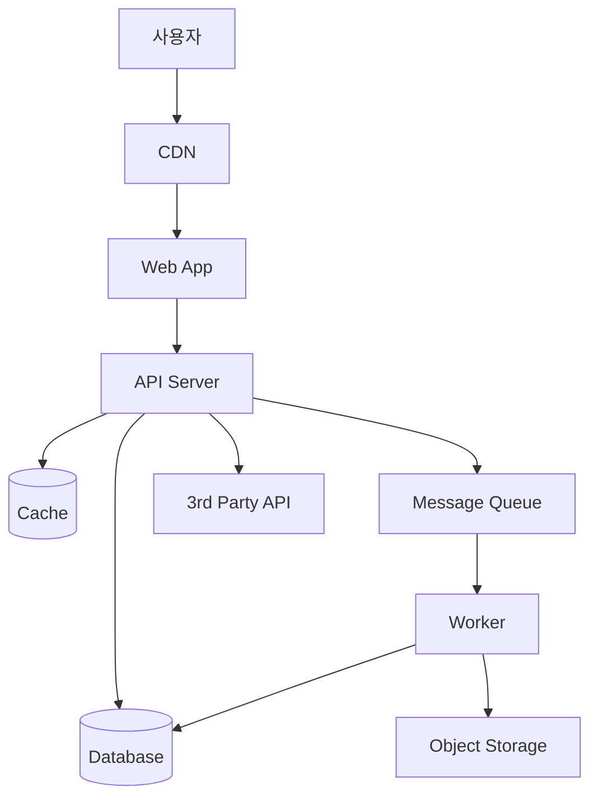

<!-- OWNER_COMMAND: /init-project -->
<!-- layer: Project-Memory -->

# <PROJECT_NAME> 전체 아키텍처

> 한국 SI 표준 "전체 아키텍처". `/init-project` Phase 8b 가 1회 생성.
> 시스템 컴포넌트·통신·배포·외부 의존 마스터. 프론트/백엔드 상세는 별도 문서.

## 1. 시스템 컴포넌트

| 컴포넌트 | 역할 | 기술 | 비고 |
|---|---|---|---|
| Web | 사용자 UI | <React / Vue / Next.js> | `frontend-architecture.md` 참조 |
| API | 비즈니스 로직 + 데이터 접근 | <NestJS / Spring / FastAPI> | `backend-architecture.md` 참조 |
| DB | 영구 저장소 | <PostgreSQL / MySQL / MongoDB> | `data-model.md` 참조 |
| Cache | 세션·핫데이터 | <Redis / Memcached> | <목적: 세션 / 응답 캐시> |
| MQ | 비동기 작업 | <RabbitMQ / SQS / Kafka> | <목적: 이메일 / 배치> |
| Storage | 파일 저장 | <S3 / GCS / 로컬> | <업로드 정책> |

## 2. 컴포넌트 간 통신

| From → To | 프로토콜 | 인증 | 비고 |
|---|---|---|---|
| Web → API | <REST / GraphQL / tRPC> | <JWT / Session Cookie> | `api-spec.md` 참조 |
| API → DB | <SQL / ORM> | DB 사용자 인증 | 커넥션 풀 관리 |
| API → Cache | <Redis 프로토콜> | password 또는 IAM | TTL 정책 |
| API → MQ | <AMQP / SQS API> | IAM | 재시도·DLQ |
| API → Storage | <S3 API> | IAM | presigned URL |
| API → 3rd party | <REST / Webhook> | <OAuth / API Key> | 본 §4 외부 의존 참조 |

## 3. 배포 환경

| 환경 | 인프라 | 도메인 | 비고 |
|---|---|---|---|
| 로컬 (Local) | docker-compose | localhost | 개발자 워크스테이션 |
| 스테이징 (Staging) | <K8s / VM> | staging.<domain> | QA / 시연 |
| 프로덕션 (Prod) | <K8s / VM / Serverless> | <domain> | 사용자 트래픽 |

배포 도구: <ArgoCD / Helm / Terraform / GitHub Actions>

## 4. 외부 의존성

| 서비스 | 용도 | SLA | 비용 모델 |
|---|---|---|---|
| <서비스 1> | <인증 / 결제 / 분석> | <99.9%> | <월정액 / 사용량> |
| <서비스 2> | <이메일 / SMS> | <99.5%> | <건당> |

## 5. 시스템 다이어그램

## 6. 비기능 영역 매핑

| NFR | 아키텍처 결정 |
|---|---|
| 성능 | Cache + CDN + DB 인덱스 |
| 가용성 | Multi-AZ 배포 + Health check |
| 보안 | API Gateway + WAF + TLS |
| 확장성 | Stateless API + Auto-scaling |

## 7. 참조

- 상위: `.specops/memory/requirements.md` §3 NFR
- 하위: `.specops/memory/{frontend, backend}-architecture.md`, `api-spec.md`, `data-model.md`
- 헌법: `.specops/memory/constitution.md`

---

*작성: <작성자> · <YYYY-MM-DD> · 생성: /init-project (Phase 8b)*
