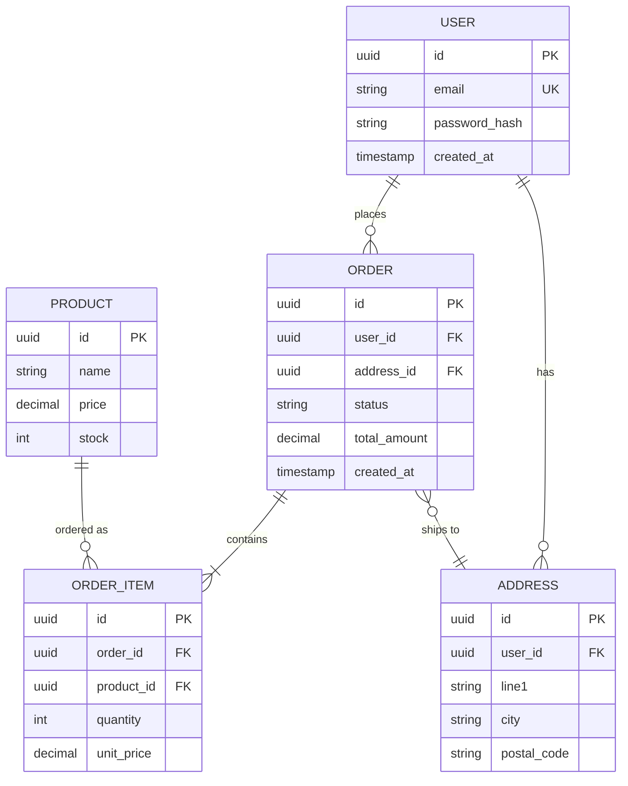

<!-- OWNER_COMMAND: /init-project -->
<!-- layer: Project-Memory -->

# <PROJECT_NAME> 테이블 설계서 (Data Model)

> 한국 SI 표준 "테이블 설계서". `/init-project` Phase 8e 가 1회 생성 (DB 사용 시).
> ERD + 엔티티 표 + 인덱스 + 제약 + 마이그레이션 도구 마스터.

> ⚠️ **§2 ERD·§3 엔티티 표의 `users`/`orders`/`products` 등은 작성 방법을 보여주는 예시(e-commerce 샘플)이며 본 프로젝트 도메인과 무관하다. 실제 엔티티로 전부 교체하라.**

## §1. DB 종류

- **유형**: <PostgreSQL / MySQL / SQLite / MongoDB / localStorage / IndexedDB>
- **하이브리드**: 주 저장소 + 보조 복수 표기 허용 (예: `PostgreSQL + localStorage(캐시)`) — 기존 값 덮어쓰기 금지, `+` 로 병기
- **버전**: <버전>
- **호스팅**: <RDS / Cloud SQL / 자체 호스팅>

## §2. ERD (Entity-Relationship Diagram)

## §3. 핵심 엔티티 표

| 테이블 | 역할 | 주요 컬럼 | 관계 |
|---|---|---|---|
| `users` | 사용자 계정 | `id`, `email`, `password_hash`, `created_at` | 1:N orders, 1:N addresses |
| `orders` | 주문 | `id`, `user_id`, `status`, `total_amount` | N:1 user, 1:N order_items |
| `order_items` | 주문 항목 | `id`, `order_id`, `product_id`, `quantity`, `unit_price` | N:1 order, N:1 product |
| `products` | 상품 카탈로그 | `id`, `name`, `price`, `stock` | 1:N order_items |
| `addresses` | 사용자 배송지 | `id`, `user_id`, `line1`, `city`, `postal_code` | N:1 user |

## §4. 인덱스 정책

조회 패턴 기반:

| 인덱스 | 테이블 | 컬럼 | 유형 | 근거 |
|---|---|---|---|---|
| `idx_users_email` | users | `email` | UNIQUE | 로그인 조회 |
| `idx_orders_user_created` | orders | `user_id, created_at DESC` | composite | 사용자별 주문 목록 |
| `idx_orders_status` | orders | `status` | btree | 상태별 필터 (admin 대시보드) |
| `idx_order_items_order` | order_items | `order_id` | btree | 주문 상세 JOIN |
| `idx_products_name_trgm` | products | `name` | GIN trigram | 상품 검색 (PostgreSQL) |

## §5. 제약사항

- **PK**: 모든 테이블 `uuid` (gen_random_uuid 또는 ULID)
- **FK**: ON DELETE 정책 명시 (CASCADE / RESTRICT / SET NULL)
- **UNIQUE**: `users.email`, 비즈니스 키
- **CHECK**: `orders.total_amount >= 0`, `products.stock >= 0`, `order_items.quantity > 0`
- **NOT NULL**: 필수 필드는 모두 NOT NULL + DEFAULT 명시

## §6. 마이그레이션 도구

- **도구**: <Prisma Migrate / TypeORM / Alembic / Flyway / sqlx-cli>
- **명명 규약**: `<YYYYMMDDHHMMSS>_<description>.sql` (timestamp 우선)
- **롤백 정책**: 모든 forward 는 reverse 동반 (가능한 경우). 제거 시 deprecate 단계
- **CI 검증**: PR 마다 schema 변경 자동 적용 + 테스트

## §7. 백업·복구

- **백업 주기**: 일일 full + 시간별 incremental
- **보관**: 30 일 + 월별 1 년 보관
- **복구 RPO/RTO**: RPO < 1h, RTO < 4h

## §8. 데이터 보호

- **암호화 at-rest**: DB 레벨 (TDE) + 디스크 암호화
- **암호화 in-transit**: TLS 1.2+
- **민감 컬럼**: `password_hash` (bcrypt cost 12+), PII 는 별도 암호화 (KMS)
- **GDPR / 개인정보보호법**: 사용자 삭제 요청 시 cascade + 30 일 후 hard delete

## §9. 참조

- 상위: `.specops/memory/architecture.md` §1 컴포넌트 (DB)
- 백엔드: `.specops/memory/backend-architecture.md` §6 데이터 접근
- IF: `.specops/memory/api-spec.md`

---

*작성: <작성자> · <YYYY-MM-DD> · 생성: /init-project (Phase 8e)*
