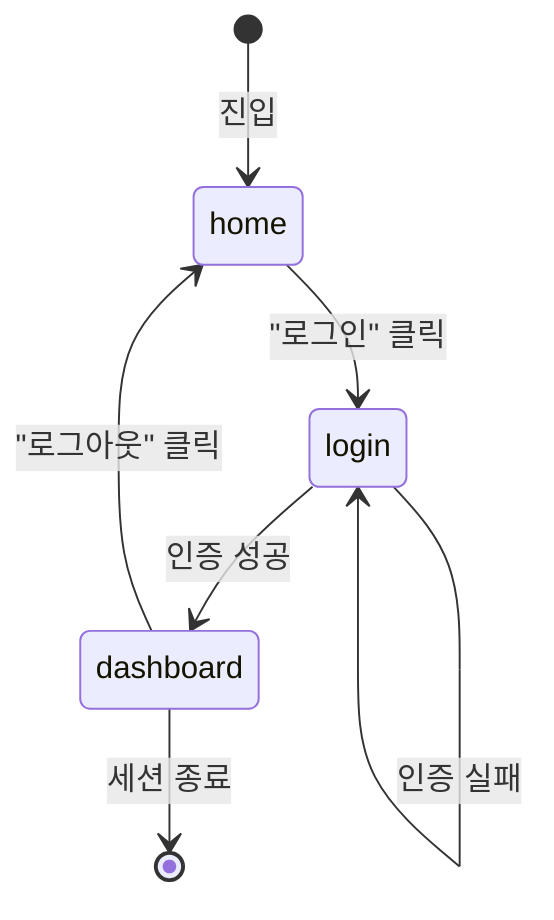

<!-- OWNER_COMMAND: /start-project -->
<!-- layer: Project-Memory -->

# <PROJECT_NAME> 화면 목록 마스터

> 한국 SI 표준 "화면설계서" 의 마스터. `/start-project` Phase 8g (또는 Phase 7 화면 입력 시) 가 1회 생성.
> 화면별 상세는 `screens/<name>.md` + `screens/<name>.html` 참조 (specifying-ko Step 5.5 또는 `/design-screen` 으로 갱신).

## 1. 화면 목록

`/start-project` Phase 7 가 사용자 화면 목록 입력을 받아 자동 채움:

| name | 제목 | 목적 | 상세 스펙 | 미리보기 |
|---|---|---|---|---|
| home | 홈 | 진입점 — 주요 액션 | [screens/home.md](../../screens/home.md) | [screens/home.html](../../screens/home.html) |
| login | 로그인 | 사용자 인증 | [screens/login.md](../../screens/login.md) | [screens/login.html](../../screens/login.html) |
| dashboard | 대시보드 | 인증 후 메인 — 사용자 데이터 요약 | [screens/dashboard.md](../../screens/dashboard.md) | [screens/dashboard.html](../../screens/dashboard.html) |

> Phase 7 입력 비웠다면 본 표 placeholder. 추후 `/design-screen <name>` 또는 `/start "<UI 기능>"` 진입 시 specifying-ko Step 5.5 가 신규 화면 추가.

## 2. 화면 흐름 (Mermaid stateDiagram)

## 3. 공통 영역

모든 화면이 공유하는 UI 영역 (헤더·푸터·네비게이션):

| 영역 | 컴포넌트 | DESIGN.md 참조 |
|---|---|---|
| 헤더 | 로고, 상단 네비게이션, 사용자 메뉴 | DESIGN.md §4 Button + Card |
| 사이드바 (선택) | 1차 네비게이션 | DESIGN.md §4 |
| 푸터 | 저작권, 링크 | DESIGN.md §2 Caption |

## 4. 반응형 정책

- **모바일** (< 640px): 사이드바 → 햄버거 메뉴, 1열 레이아웃
- **태블릿** (640~1024px): 사이드바 접힘, 2열 레이아웃
- **데스크톱** (> 1024px): 사이드바 펼침, 3열 레이아웃

## 5. 인증 가드

| 화면 | 공개 | 인증 필요 | 권한 필요 |
|---|---|---|---|
| home | ✅ | — | — |
| login | ✅ | — | — |
| dashboard | — | ✅ | user |
| (admin/*) | — | ✅ | admin |

## 6. 디자인 시스템 일관성

본 마스터의 모든 화면은 다음을 자동 준수:

- 색상: `DESIGN.md` §1 Color System 의 CSS 변수 (`--color-primary` 등) 1:1 적용
- 타이포: `DESIGN.md` §2 Typography 의 Heading/Body/Caption 등급
- 컴포넌트: `DESIGN.md` §4 Components 의 `.btn`, `.input`, `.card` 클래스 우선 사용
- AI Usage Guidelines: `DESIGN.md` §6 인용

## 7. 참조

- 디자인 시스템: `DESIGN.md`
- 화면별 상세: `screens/*.md` + `screens/*.html`
- 프론트 아키텍처: `.specops/memory/frontend-architecture.md`
- 화면 설계 도구: `commands/design-screen.md` (`/design-screen <name>` 으로 추가/수정)

---

*작성: <작성자> · <YYYY-MM-DD> · 생성: /start-project (Phase 7 또는 8g)*
