<!-- OWNER_COMMAND: /init-project -->
<!-- layer: Project-Memory -->

# <PROJECT_NAME> 화면 목록 마스터

> 한국 SI 표준 "화면설계서" 의 마스터. `/init-project` Phase 7 가 화면 **이름 목록만** 기록.
> 화면별 상세 `screens/<name>.md` + `.html` 은 `/start-all` Phase 2.5 · specifying-ko Step 5.5(신규) · `/design-screen` 으로 생성.

## 1. 화면 목록

`/init-project` Phase 7 가 사용자 화면 목록 입력을 받아 자동 채움:

| name | 제목 | 목적 | 상세 스펙 | 미리보기 |
|---|---|---|---|---|
<!-- screens-table:start -->
<!-- screens-table:end -->

> **본 표는 빈 상태로 시작한다** — 화면이 실제로 생길 때 `/init-project` Phase 7·`/design-screen`·`/start-all` Phase 2.5 가 행을 채운다.
> 예시 행을 미리 넣지 않는 이유: 이 표는 **화면 목록 마스터**라 존재하지 않는 `screens/*.md` 를 가리키는 행이 남으면 Phase 2.5-A UI 표면 검출·`design-reviewer-ko` 정합 검사가 **유령 화면을 실 화면으로 읽는다**(20260806 실측 — `/design-screen` append 경로에서 예시 2행 잔존).

작성 형식 참고 — 행 1건의 컬럼 순서만 표기한다 (**샘플이며 표 문법으로 쓰지 않는다**. 파이프로 시작하는 샘플 줄은 도구가 실제 행으로 오인할 수 있다):

```text
name(영숫자/-/_) → 제목 → 목적(1줄) → [screens/NAME.md](../../screens/NAME.md) → [screens/NAME.html](../../screens/NAME.html)
예) dashboard → 대시보드 → 인증 후 메인, 사용자 데이터 요약
```

## 2. 화면 흐름 (Mermaid stateDiagram)

> ⚠️ **예시 흐름** — 아래는 작성 방법을 보여주는 샘플이며 **§1 실제 화면 목록과 자동 동기화되지 않는다**. §1 의 화면으로 전이도를 **직접 교체**하라(존재하지 않는 화면 참조 금지).

```mermaid
stateDiagram-v2
  [*] --> <화면A> : 진입
  <화면A> --> <화면B> : 액션
  <화면B> --> <화면A> : 복귀
  <화면B> --> [*] : 종료
```



## 3. 공통 영역

모든 화면이 공유하는 UI 영역 (헤더·푸터·네비게이션):

| 영역 | 컴포넌트 | DESIGN.md 참조 |
|---|---|---|
| 헤더 | 로고, 상단 네비게이션, 사용자 메뉴 | DESIGN.md §4 Button + Card |
| 사이드바 (선택) | 1차 네비게이션 | DESIGN.md §4 |
| 푸터 | 저작권, 링크 | DESIGN.md §2 Caption |

## 4. 반응형 정책

- **모바일** (< 640px): 사이드바 → 햄버거 메뉴, 1열 레이아웃
- **태블릿** (640~1024px): 사이드바 접힘, 2열 레이아웃
- **데스크톱** (> 1024px): 사이드바 펼침, 3열 레이아웃

## 5. 인증 가드

> ⚠️ **예시** — §1 실제 화면 목록으로 **교체**하라 (아래 행은 샘플이며 §1 과 자동 동기화되지 않는다).

| 화면 | 공개 | 인증 필요 | 권한 필요 |
|---|---|---|---|
| <공개 화면> | ✅ | — | — |
| <인증 화면> | — | ✅ | user |
| (admin/*) | — | ✅ | admin |

## 6. 디자인 시스템 일관성

본 마스터의 모든 화면은 다음을 자동 준수:

- 색상: `DESIGN.md` §1 Color System 의 CSS 변수 (`--color-primary` 등) 1:1 적용
- 타이포: `DESIGN.md` §2 Typography 의 Heading/Body/Caption 등급
- 컴포넌트: `DESIGN.md` §4 Components 의 `.btn`, `.input`, `.card` 클래스 우선 사용
- AI Usage Guidelines: `DESIGN.md` §6 인용

## 7. 참조

- 디자인 시스템: `DESIGN.md`
- 화면별 상세: `screens/*.md` + `screens/*.html`
- 프론트 아키텍처: `.specops/memory/frontend-architecture.md`
- 화면 설계 도구: `commands/design-screen.md` (`/design-screen <name>` 으로 추가/수정)

---

*작성: <작성자> · <YYYY-MM-DD> · 생성: /init-project (Phase 7 또는 8g)*
