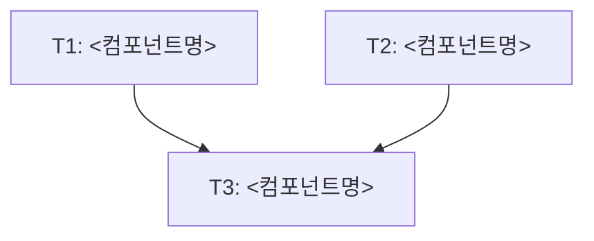

<!-- FID: <YYYYMMDD-kebab-slug> -->
<!-- OWNER_COMMAND: /tasks -->
<!-- MUTABLE_BY: /implement (상태 마킹만) -->
<!-- reference_upstream: github/spec-kit tasks-template.md -->
<!-- layer: Lifecycle-Artifact -->

# <기능명> 태스크 목록 — <FID>

> 각 태스크는 TDD 5 스텝(RED → 검증 → GREEN → 검증 → COMMIT)을 따릅니다. `/implement`가 체크박스를 마킹합니다.

**관련 플랜**: `.specops/<FID>/plan.md`
**관련 AC**: AC-1, AC-2, ...

---

## 태스크 1: <컴포넌트 이름>

**파일**:
- Create: `src/<경로>.py`
- Test: `tests/test_<경로>.py`

**관련 AC**: AC-1

- [ ] **스텝 1: 실패하는 테스트 작성**

```python
def test_<행동>():
    result = <함수>(<입력>)
    assert result == <기대>
```

- [ ] **스텝 2: 테스트 실패 확인**

실행: `pytest tests/test_<경로>.py::test_<행동> -v`
기대: FAIL — `<함수>` 정의되지 않음

> FAIL 출력 원문을 기록한다 — RED 실측 출력 증거(요약행+FAIL 라인 ≤10줄), 구현 보고·evidence 인용용

- [ ] **스텝 3: 최소 구현**

```python
def <함수>(<입력>):
    return <기대>
```

- [ ] **스텝 4: 테스트 통과 확인**

실행: `pytest tests/test_<경로>.py::test_<행동> -v`
기대: PASS

- [ ] **스텝 5: 커밋**

```bash
git add tests/test_<경로>.py src/<경로>.py
git commit -m "feat(<scope>): <무엇을>

<왜 — 2~3줄>

관련 AC: AC-1"
```

---

## 태스크 2: <컴포넌트 이름>

**파일**:
- Modify: `src/<경로>.py:<라인>`
- Test: `tests/test_<경로>.py`

**관련 AC**: AC-2

- [ ] **스텝 1: ...**
- [ ] **스텝 2: ...**
- [ ] **스텝 3: ...**
- [ ] **스텝 4: ...**
- [ ] **스텝 5: ...**

---

## 태스크 N: <파괴적 작업 — 문지기 체크>

⚠️ **사용자 승인 필요** — 이 태스크는 되돌리기 어려운 변경을 포함합니다.

**파일**:
- Delete: `기존/삭제대상.py`

**확인 사항**:
- [ ] 이 파일을 참조하는 다른 코드가 없는가?
- [ ] 삭제 전 git diff로 마지막 확인했는가?
- [ ] 사용자가 명시 승인했는가?

- [ ] **스텝 1: ...**

---

## 진행 상태

총 태스크 수: <N>
완료: 0 / <N>
차단: 0

## 의존 그래프 (v0.4a 의무)

> `decomposing-ko` 가 작성. `implementing-ko` 가 본 섹션을 파싱해 leaf 자동 라우팅.
> Mermaid (사람용) + YAML (기계용 단일 소스 진실) 병기. 충돌 시 YAML 우선.
> 검증: `bash scripts/dag/parse-dag.sh` 의 `dag::find_independent_batch` 가 stderr WARN 없으면 PASS.



```yaml
review_mode: end-loaded   # 기본 — A만 wave 후 FID 단위 B·C 각 1회. 레거시: per-task
tasks:
  - id: T1
    test_command: "bash scripts/tests/test-<file1>.sh"   # 필수 — emit-context.sh 게이트 (미기재 시 exit 1). plain bash 단일 명령, compound(연쇄·파이프) 금지 — run-verification whitelist. verify 계층 fallback 은 과거 산출물 하위호환용
    depends_on: []
    inputs: []
    outputs: [src/<file1>.sh, scripts/tests/test-<file1>.sh]
    ac: [AC-1]
  - id: T2
    test_command: "bash scripts/tests/test-<file2>.sh"
    depends_on: []
    inputs: []
    outputs: [src/<file2>.sh, scripts/tests/test-<file2>.sh]
    ac: [AC-2]
  - id: T3
    test_command: "bash scripts/tests/test-<file3>.sh"
    depends_on: [T1, T2]
    inputs: [src/<file1>.sh, src/<file2>.sh]
    outputs: [src/<file3>.sh, scripts/tests/test-<file3>.sh]
    ac: [AC-3]
```

**필드 의미**:
- `review_mode`: `end-loaded`(기본·부재 시 동일) | `per-task`(레거시 opt-in). implementing-ko가 소비
- `id`: 태스크 식별자 (T1, T2, ...) — `## 태스크 N` 헤더와 일치
- `depends_on`: 본 태스크 시작 전 완료 필요한 태스크 id 배열 ([] 면 절대 leaf)
- `inputs`: 본 태스크가 **읽기**만 하는 파일 (다른 태스크 outputs 가능)
- `outputs`: 본 태스크가 생성·수정하는 파일 — 다른 leaf 와 disjoint 시 병렬 후보
- `ac`: 본 태스크가 충족하는 AC ID 배열 (acceptance-criteria.md 참조)

**예시 fixture**: `scripts/tests/dag/fixtures/tasks-md/01-two-leaves-disjoint.md` (T1·T2 절대 leaf disjoint → 병렬 가능).

## 참조

- `skills/tdd-ko/SKILL.md` — TDD 5 스텝
- `skills/writing-plans-ko/SKILL.md` — 바이트-사이즈 규칙
- `skills/sprint-contracts-ko/SKILL.md` — AC 매핑
- `skills/decomposing-ko/SKILL.md` — 본 템플릿 작성 책임 (HARD-GATE 의무)
- `scripts/dag/parse-dag.sh` — DAG 파서 (v0.4a W1)

---

*작성: <작성자> · <날짜> · FID: <FID> · 생성 커맨드: /tasks*
